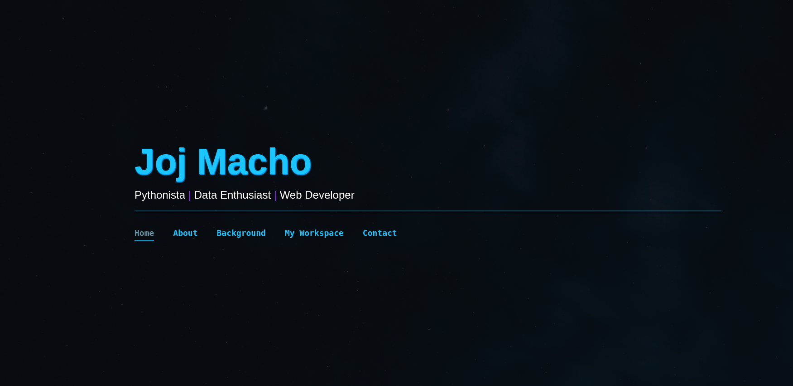
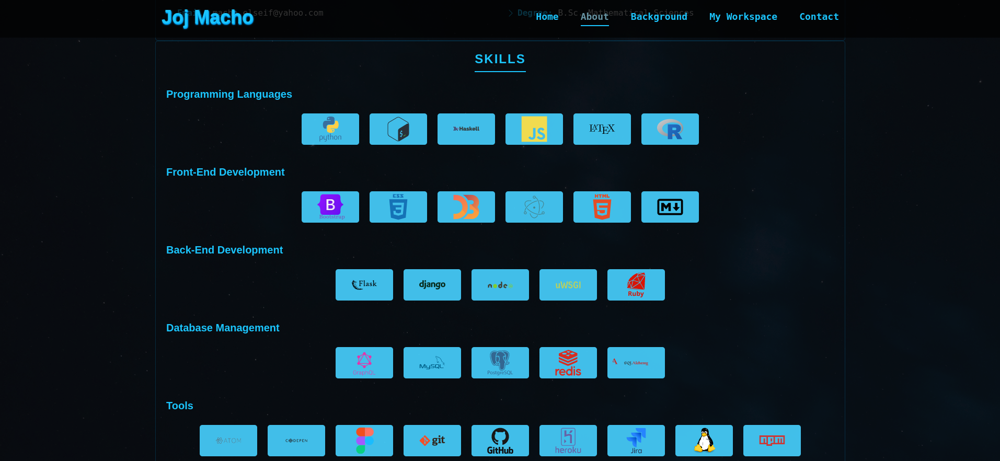
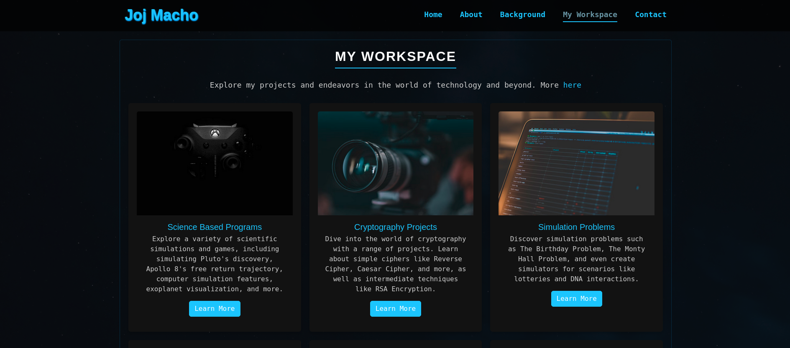
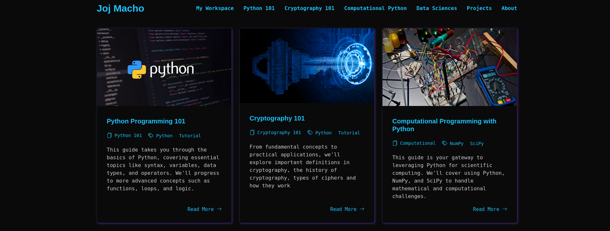
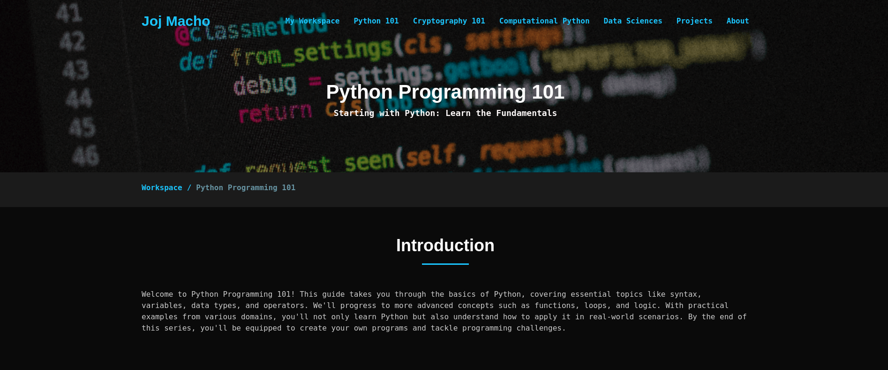
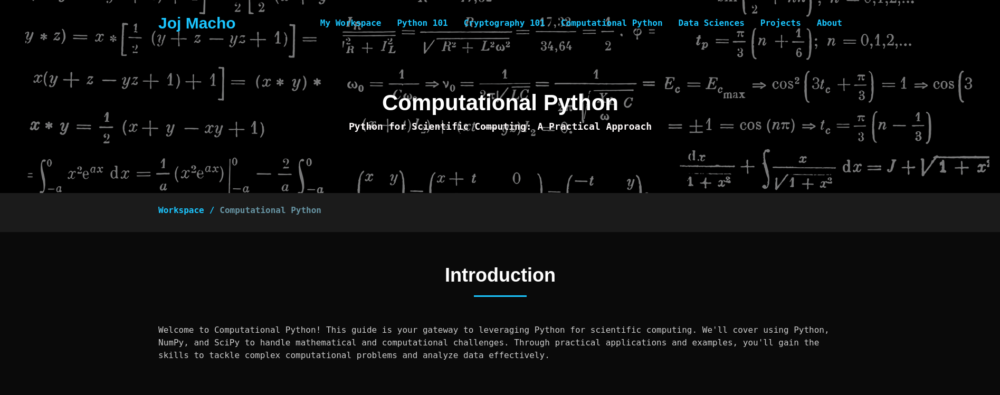

# My-Portfolio-Site

Welcome to my portfolio website repository! This project showcases my work and projects, offering a glimpse into my skills and experience. The website is built using HTML, CSS, and JavaScript.

## Overview

This repository houses the source code for my portfolio website. The site consists of a portfolio page and a workspace page. The portfolio page highlights key projects and works as a landing space, while the workspace page provides a deeper dive into my projects and creations.

## Portfolio Outputs

Here are some samples of my portfolio outputs:

### Main Portfolio Page

Sample of the main header of the portfolio website.

  

Sample of about me page and projects in the portfolio.

  
  

### Workspace Page

Sample of workspace front page covering various categories.

  

Sample of Python Programming 101 and Computational Programming with Python sections on workspace.

  
  

## Technologies Used
- HTML
- CSS
- JavaScript

## License 📝

This repository is licensed under the [MIT License](LICENSE).

## Contact 📬

For inquiries, reach out to me at macho.elseif@yahoo.com.

Feel free to explore the repository to learn more about how this portfolio site was created using these technologies. Happy browsing! 🌟