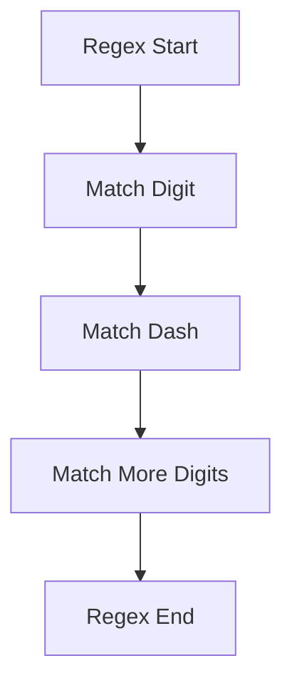

Regular expressions (regex) are a powerful tool for working with strings in Python. They allow you to search for patterns, validate data, and extract specific information.

## Basics of Regex

In Python, the `re` module provides a set of functions for working with regular expressions.

### Matching a Pattern

The simplest regex pattern is to match an exact string. For example, the pattern `r"hello"` will match any occurrence of the string "hello" in the input.

```python
import re

pattern = r"hello"
text = "hello world"
result = re.search(pattern, text)

if result:
    print("Pattern found!")
```

## Common Regex Patterns

Here are some common patterns used in Python:

- `\d`: any digit (0-9)
- `\w`: any alphanumeric character
- `\s`: any whitespace character

Example:

```python
pattern = r"\d{3}-\d{2}-\d{4}"
text = "My SSN is 123-45-6789."
result = re.search(pattern, text)

if result:
    print(f"SSN found: {result.group()}")
```

### References and Grouping

You can also use references and grouping in regex. Groups are defined using parentheses, and references can be made using `\1`, `\2`, etc.

```python
pattern = r"(\d{3})-(\d{2})-(\d{4})"
text = "SSN: 123-45-6789"
result = re.search(pattern, text)

if result:
    print(f"Area Code: {result.group(1)}")
```

### Regex Structure



## Conclusion

Learning regular expressions can drastically improve your ability to handle and process strings in Python.

