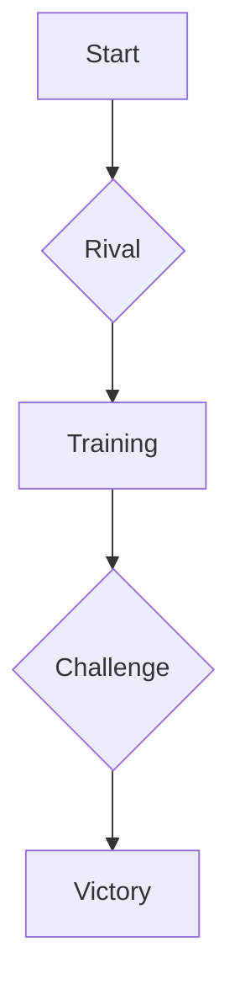

In this post, we will look into how modern shounen anime blend action, friendship, and self-discovery.

## Friendship and Rivalry

Many shounen anime have a theme of friendship, often shown through the protagonist's relationships with their friends and rivals. This dynamic can drive character development, as seen in series like *Naruto* and *Fairy Tail*.

_Friendship or rivalry? The dynamic between Naruto and Sasuke._

## The Hero's Journey

The hero's journey is a common narrative structure in anime. The protagonist often starts as an underdog, gains powers, faces challenges, and ultimately confronts a major antagonist.

> "A hero is not measured by the size of his strength, but by the strength of his heart."
> — *Hercules* (1997)

## Character Development

Character arcs are a significant part of the shounen genre. Protagonists often face internal struggles, overcoming weaknesses to achieve their goals.

## Conclusion

The evolution of shounen anime reflects the changing interests of its audience, but its main themes of growth, friendship, and perseverance remain the same.

