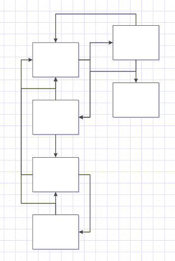

In the preceding tutorials, we have focused on executing statements sequentially. However, in both programming and everyday scenarios, we often encounter situations requiring decisions based on specific conditions or the repetitive execution of statements for various objects. Control flow in programming determines the order of statement execution within a code, and it primarily consists of two structures: branching statements (conditional statements) and looping structures (iterating statements).

* toc
{:toc}

## Understanding Branching Statements and Looping Structures

---

Branching statements in Python enable the execution of specific blocks of instructions when certain conditions are satisfied. These blocks are identified by indentation, following the off-side notation for coding. The commonly used branching statements are:

- `if-else` statement
- `if-elif-else` statement


if condition:
    # Block for True condition
else:
    # Block for False condition


  

During branching, when conditions are met, designated blocks of instructions are executed. It is crucial to maintain consistent indentation, using four spaces, to ensure correct code execution.

On the other hand, looping structures facilitate the repeated execution of code segments until a specific condition is met. These looping statements include:

- `for` loop
- `while` loop


for item in iterable:
    # Block of code to be repeated for each item in the iterable

while condition:
    # Block of code to be repeated until the condition is no longer true


Similar to branching, looping in Python is denoted by indentation and a colon (:) symbol. Consistent indentation is essential for proper code execution.

#### Code Indentation Best Practices

Indentation is crucial for Python's readability, but it requires careful attention to whitespace usage. Always use four spaces for indentation, as recommended by PEP 8, the style guide for Python code. While using tabs exclusively is possible, spaces are preferred.

Ensure proper editor configuration, differentiating between the tab character ('\t') and the Tab key. The tab character should be configured to show 8 spaces to match language semantics, especially in cases of accidental mixed indentation. Editors can automatically convert tabs to spaces, and configuring the Tab key to insert four spaces is recommended.

In the upcoming sections, we will delve into conditional statements and looping structures, providing insights into creating dynamic and efficient programs.

## Making Decisions in Python: Conditional Statements

---

Conditional statements in Python allow programs to make decisions based on specific conditions, allowing for the execution of different actions depending on whether a condition evaluates to true or false. Python provides several conditional statements for this purpose.

### Flow Control and Blocks

In Python, flow control statements consist of a condition followed by a block of code known as a clause. Conditions are expressions that evaluate to true or false, and direct the flow of execution. The blocks of code are defined by indentation, following specific rules:

- Blocks begin when the indentation increases.
- Blocks can contain other blocks.
- Blocks end when the indentation decreases to zero or matches a containing block's indentation.

### Conditional `if` Statements

The `if` statement is one of the fundamental flow control statements. It executes a specific block of code if the associated condition evaluates to true; otherwise, the block is skipped. The structure of an `if` statement includes:

- The `if` keyword
- A condition (an expression that evaluates to true or false)
- A colon (`:`)
- An indented block of code (`if` clause)

The syntax for an `if` statement is as follows:


if condition:
    # Code to execute if the condition is true


Let's see the syntax and usage of `if` statements with an example:


name = 'Admin'
if name == 'Admin':
    print('Hello, Admin.')
print('Done.')

# Output:
# Hello, Admin.
# Done.


The above code checks if the variable `name` is equal to 'Admin'. If the condition is true, the indented code block following the `if` statement is executed.

### Conditional `if-else` Statements

An `if` statement can be followed by an `else` statement, allowing us to specify an alternative action when the condition evaluates to false. The `else` clause is executed only if the `if` statement's condition is false. The structure of an `if-else` statement includes:

- The `if` keyword
- A condition
- A colon (`:`)
- An indented block of code (`if` clause)
- The `else` keyword
- A colon (`:`)
- An indented block of code (`else` clause)

The syntax for an `if-else` statement is as follows:


if condition:
    # Code to execute if the condition is true
else:
    # Code to execute if the condition is false


The condition in the `if` statement is an expression that evaluates to either `True` or `False`. If the condition is true, the code block following the `if` statement is executed. Otherwise, if the condition is false, the code block following the `else` statement is executed.

Let's see an example of an `if-else` statement:


name = 'Jon'
if name == 'Admin':
    print('Hello, Admin.')
else:
    print('You are not the Admin. Who the hell are you?!')
print('Done.')

# Output:
# You are not the Admin. Who the hell are you?!
# Done.


In the above code, if the condition `name == 'Admin'` evaluates to true, the `if` clause is executed. Otherwise, the `else` clause is executed.

### Conditional `if-elif-else` Statements

For scenarios where we have multiple conditions to evaluate, we can use `if-elif-else` statements. The `elif` keyword is short for "else if" and allows us to test additional conditions. The structure of an `if-elif-else` statement includes:

- The `if` keyword
- A condition
- A colon (`:`)
- An indented block of code (`if` clause)
- The elif keyword
- A condition
- A colon (`:`)
- An indented block of code (`elif` clause)
- (Optional) Additional `elif` clauses
- (Optional) The `else` keyword
- A colon (`:`)
- An indented block of code (`else` clause)

The syntax for an `if-elif-else` statement is as follows:


if condition_1:
    # Code to execute if condition_1 is true
elif condition_2:
    # Code to execute if condition_1 is false and condition_2 is true
elif condition_3:
    # Code to execute if condition_1 and condition_2 are false, and condition_3 is true
else:
    # Code to execute if all conditions are false


The conditions are evaluated in order, from top to bottom. The code block corresponding to the first condition that evaluates to true will be executed. If none of the conditions are true, the code block in the `else` statement (if present) will be executed.

Here's an example of an `if-elif-else` statement:


score = 75

if score >= 90:
    grade = 'A'
elif score >= 80:
    grade = 'B'
elif score >= 70:
    grade = 'C'
else:
    grade = 'D'

print(f'Your grade is {grade}.')

# Output:
# Your grade is C.


In this example, the program evaluates the value of the variable score and assigns a corresponding grade based on the conditions specified. If the score is 75, the output will be "Your grade is C".

It is important to note the order of the `elif` statements. The conditions are evaluated in order, and the first true condition will trigger its corresponding block of code.

### Testing Multiple Conditions

While `if-elif-else` chains are useful when we need only one condition to pass, there are situations where we want to check all conditions of interest. In such cases, we can use a series of simple `if` statements without `elif` or `else` blocks. This approach allows us to act on every condition that evaluates to true.

Here's an example to demonstrate testing multiple conditions:


value = 10
if value > 5:
    print('Value is greater than 5')
if value > 7:
    print('Value is greater than 7')
if value > 9:
    print('Value is greater than 9')

# Output:
# Value is greater than 5
# Value is greater than 7
# Value is greater than 9


In the above example, each `if` statement is evaluated independently, and the corresponding block of code is executed if the condition is true.

### Nested if-elif-else Statements

Nested `if` statements occur when one `if-elif-else` structure is nested inside another. While nesting should be avoided when possible to improve code readability, it can be useful in certain scenarios. The level of nesting is determined by the indentation.

Here's an example of nested `if-elif-else` statements:


age = 15
if age > 12:
    if age < 20:
        print('You are in the teenage years')
    else:
        print('You have crossed the teenage years')
else:
    print('You will reach the teenage years soon')

# Output
# You are in the teenage years


In the above example, the outer `if` statement checks if the `age` is greater than 12. If true, it enters the nested `if` statement to check if the `age` is less than 20. If both conditions are true, the corresponding block of code is executed.

It's important to note that nested `if-elif-else` statements can lead to code complexity and reduced readability. Whenever possible, it's advisable to use logical operators instead of deep nesting to improve code maintainability.

### Ternary Operator

The ternary operator provides a concise way to write conditional expressions in a single line of code. It allows us to make a decision and choose between two expressions based on a condition. The syntax for the ternary operator is as follows:


expression_1 if condition else expression_2


The conditional expression should always evaluate to either true or false. If the condition evaluates to true, `expression_1` is executed; otherwise, `expression_2` is executed. The use of parentheses for the conditional expression is optional but can enhance readability.

Here's an example that demonstrates the ternary operator:


>>> a = 10
>>> b = 5
>>> result = 'a is greater' if a > b else 'b is greater'
>>> print(result)
a is greater


In this example, we compare the values of variables `a` and `b`. If `a` is greater than `b`, the expression `'a is greater'` is assigned to the variable `result`. Otherwise, if `a` is not greater than `b`, the expression `'b is greater'` is assigned to `result`. The value of `result` is then printed, which in this case is `'a is greater'`.

The ternary operator can also be used to assign a variable to the result of the expression:


>>> a = 10
>>> b = 5
>>> max_value = a if a > b else b
>>> print(max_value)
10


In this example, we use the ternary operator to assign the maximum value between `a` and `b` to the variable `max_value`. If `a` is greater than `b`, `a` is assigned to `max_value`; otherwise, if `a` is not greater than `b`, `b` is assigned to `max_value`. The value of `max_value` is then printed, which in this case is `10`.

Additionally, tuples can be used to implement a ternary operator:


>>> condition = True
>>> result = (1, 2)[condition]
>>> print(result)
2


In this example, we use a tuple to implement the ternary operator. The tuple `(1, 2)` represents two possible values that can be assigned based on the condition. If the `condition` is true, the value at index 1 (which is `2`) is assigned to `result`; otherwise, if the `condition` is false, the value at index 0 (which is `1`) is assigned to `result`. The value of `result` is then printed, which in this case is `2`.

The ternary operator provides a compact and readable way to make decisions and assign values based on conditions, reducing the need for lengthy `if-else` statements. It is especially useful in situations where the decision-making logic is straightforward and can be expressed concisely.

## Repeating Actions: Loops in Python

---

Loops are fundamental to programming, enabling the repetition of actions and iteration over data collections. Python provides two primary looping structures: the `for` loop and the `while` loop. In this section, we'll delve into these loops, exploring their syntax, applications, and control flow.

### For Loop Statements

The `for` loop is used for iterating over a sequence, such as a list, tuple, or string, or for repeating a specific action a predetermined number of times. Its structure comprises:

- The `for` keyword
- A variable to store each item in the sequence
- The `in` keyword
- A sequence to iterate over
- A colon (`:`)
- An indented block of code

Let's explore a `for` loop with an example


fruits = ['apple', 'banana', 'cherry']
for fruit in fruits:
    print(f'Fruit: {fruit}')

# Output:
# Fruit: apple
# Fruit: banana
# Fruit: cherry


In the above code, the `for` loop iterates over each item in the `fruits` list. The variable `fruit` stores each item, and the indented block of code is executed for each iteration.

The `for` loop is a powerful tool for iterating over collections and performing operations on each item. It simplifies the process of handling sequences and reduces the need for manual indexing.

#### Iterating with `range()` and `enumerate()`

To perform an action a specific number of times, we can use the `range()` function in conjunction with a `for` loop. The `range()` function generates a sequence of numbers for iteration. It takes up to three arguments: start, stop, and step values. Here's an example:


for num in range(1, 11):
    print(num)

# Output:
# 1
# 2
# 3
# 4
# 5
# 6
# 7
# 8
# 9
# 10


In this example, `range(1, 11)` generates a sequence from 1 to 10 (inclusive). The output displays numbers from 1 to 10.

The `enumerate()` function is another useful tool when iterating over a sequence. It provides both the index and the value of each item in the sequence, allowing for more flexibility in handling data.
Here's an example that demonstrates the usage of `enumerate()`:


fruits = ['apple', 'banana', 'cherry']
for index, fruit in enumerate(fruits):
    print(f'Fruit #{index}: {fruit}')

# Output
# Fruit #0: apple
# Fruit #1: banana
# Fruit #2: cherry


In this code, the `enumerate()` function is used to iterate over the `fruits` list and provide both the index and the fruit name.

Using `enumerate()` grants access to both the index and value simultaneously, useful in various scenarios.

### While Loop Statements

The `while` loop is used when we want to repeatedly execute a block of code as long as a given condition remains true. It's particularly useful when we don't know in advance how many times the loop should execute. Its structure comprises:

- The `while` keyword
- A condition
- A colon (`:`)
- An indented block of code

Here's an example:


count = 0
while count < 5:
    print(f'Count: {count}')
    count += 1

# Output:
# Count: 0
# Count: 1
# Count: 2
# Count: 3
# Count: 4


In the above code, the `while` loop iterates as long as the condition `count &lt; 5` remains true. The block of code inside the loop is executed repeatedly, incrementing the value of `count` until the condition is false.

The `while` loop provides a flexible way to repeat actions based on a condition. It's important to ensure that the condition eventually becomes false to prevent infinite loops.

#### Controlling Loop Execution with `break` and `continue` Statements

Sometimes, we may need to modify the flow of a loop based on certain conditions. In such cases, we can use the `break` and `continue` statements.

The `break` statement terminates the loop prematurely, immediately exiting it, and continuing with the statement following the loop. An example:


fruits = ['apple', 'banana', 'cherry', 'date', 'elderberry']
for fruit in fruits:
    if fruit == 'date':
        break
    print(f'Fruit: {fruit}')

# Output:
# Fruit: apple
# Fruit: banana
# Fruit: cherry


In the above code, the loop iterates over the `fruits` list. When the condition `fruit == 'date'` is met, the `break` statement is executed, and the loop is terminated.

The `continue` statement, on the other hand, is used to skip the rest of the code inside the loop for the current iteration and move on to the next iteration.


numbers = [1, 2, 3, 4, 5]
for num in numbers:
    if num % 2 == 0:
        continue
    print(f'Number: {num}')

# Output:
# Number: 1
# Number: 3
# Number: 5


In the above code, the loop iterates over the `numbers` list. When encountering an even number (i.e., `num % 2 == 0`), the `continue` statement is executed, and the remaining code inside the loop for that iteration is skipped.

By using `break` and `continue`, we can have more control over the flow of the loop and skip or terminate the loop based on specific conditions.

#### Avoiding Infinite Loops and Ensuring Loop Termination

Infinite loops are loops that do not have a termination condition or have a condition that never becomes false. They can cause a program to hang or consume excessive resources, leading to undesirable outcomes. It's crucial to avoid infinite loops and ensure that our loops eventually terminate.

To prevent infinite loops, we should carefully design the loop's condition to become false at some point. It's essential to consider all possible scenarios and ensure that the loop terminates in each case.

Here's an example of a well-structured `while` loop with a termination condition:


x = 1
while x <= 5:
    print(x)
    x += 1

# Output:
# 1
# 2
# 3
# 4
# 5


In this example, the loop iterates as long as the value of `x` is less than or equal to 5. The value of `x` is incremented by 1 with each iteration, ensuring that the condition will eventually become false, terminating the loop.

Manually interrupt execution with `Ctrl+C `if you find yourself in an infinite loop while running a program.

It's important to be cautious and thoroughly test your loops to ensure that they terminate under all circumstances. Reviewing the logic of your loop and verifying that the termination condition is correctly defined will help you avoid unintended infinite loops and ensure the proper execution of your program.

#### Nested Loops: Iterating Within Iterations

Nested loops are loops that are placed inside another loop. They allow us to iterate within iterations, performing more complex operations or accessing nested data structures. Any type of loop can be nested under any other loop, such as a `for` loop inside a `for` loop, a `for` loop inside a `while` loop, or a `while` loop nested inside a `for` loop.

Nested loops are commonly used when we need to iterate over multiple dimensions or combinations of data. Here's an example:


for i in range(1, 4):
    print('i =', i)
    for j in range(4, 7):
        print('  j =', j)

# Output:
# i = 1
#   j = 4
#   j = 5
#   j = 6
# i = 2
#   j = 4
#   j = 5
#   j = 6
# i = 3
#   j = 4
#   j = 5
#   j = 6


In this example, a `for` loop is nested inside another `for` loop. The outer loop iterates over the numbers 1, 2, and 3, while the inner loop iterates over the numbers 4, 5, and 6.

While nested loops allow performing operations on each combination of outer and inner loop variables, be cautious, especially with large data sets or complex operations. Too many nested loops or inefficient algorithms can lead to slower execution times.

## Putting It All Together: Practical Examples of Control Flow

---

Now that we understand how if statements and while loops work, let's explore some practical examples of using control flow statements to solve programming problems and implement conditional and iterative logic in real-world scenarios.

### Solving Programming Problems Using Control Flow

Control flow statements play a crucial role in solving various programming problems. Whether it's determining the maximum value in a list, validating user input, or implementing algorithms, control flow allows us to make decisions and perform actions accordingly.

For example, finding the maximum value in a list can be achieved with a combination of `if` statements and a variable to track the maximum value while iterating over the list:


numbers = [5, 2, 8, 3, 1]
max_value = numbers[0]

for num in numbers:
    if num > max_value:
        max_value = num

print(f'The maximum value is: {max_value}')

# Output:
# The maximum value is: 8


Here, we initialize `max_value` with the first element of the list, then iterate over the remaining elements, updating `max_value` when encountering a larger number.

### Implementing Conditional and Iterative Logic in Real-World Scenarios

Control flow statements are not limited to solving programming problems; they are also widely used in real-world scenarios to implement conditional and iterative logic. For instance, consider an e-commerce application that calculates the total price of a customer's shopping cart based on discounts and promotions.


cart_total = 600
discount = 0

if cart_total >= 1000:
    discount = 0.1
elif cart_total >= 500:
    discount = 0.05

final_price = cart_total - (cart_total * discount)
print(f'Final price after discount: ${final_price}')

# Output:
# Final price after discount: $570.0


In this example, we use `if` and `elif` statements to check the value of `cart_total` and determine the appropriate discount based on the total amount spent by the customer. The final price is then calculated by subtracting the discount from the cart total.

### More Examples

Feel free to browse my [GitHub page](https://github.com/joj-macho){:target='_blank'} for more comprehensive programs:

- **Unit Converter Program:** [Link to Program](https://github.com/joj-macho/Pythological-Playground/tree/main/converter){:target='_blank'}
  - Converts lengths, masses, or temperatures based on user input.
  - Uses a series of `if-elif-else` statements for user input and for converting units.

- **Indentation Animation Program:** [Link to Program](https://github.com/joj-macho/Pythological-Playground/tree/main/indentation-animation){:target='_blank'}
  - Creates an animation of indentation using asterisks (*).
  - The indentation level oscillates between increasing and decreasing, forming a rhythmic pattern of asterisk lines.
  - Demonstrates using indentation and uses `if-else` statements to check the value to determine whether to increase or decrease the indentation.
  - Uses loops that continue indefinitely, creating a back-and-forth motion of the asterisks with changing indentation.
  - Uses infinite loops, and if the user interrupts the program by pressing Ctrl+C (`KeyboardInterrupt`), the program catches the exception and calls `sys.exit()` to terminate the program.

You can find more programs that implement branching statements and looping structures in my [Python Playground](https://github.com/joj-macho/Pythological-Playground){:target='_blank'} Repository.

## Summary

---

Great job! You've completed the tutorial on Python flow control. You now know how to make decisions, create loops, and structure your code for various scenarios. Understanding control structures is a critical skill for developing sophisticated Python programs. With this knowledge, you're well-prepared to move on to [Python Functions](/workspace/python/functions), the building blocks of code.