Visualizing data is a pivotal aspect of conveying scientific ideas effectively, especially when dealing with large datasets. Python, with its versatile libraries, excels at creating insightful visualizations, and one of the most powerful tools for this purpose is Matplotlib.

## Getting Started with Matplotlib

---

Matplotlib is a widely-used Python library designed for creating captivating visualizations. It provides a rich set of tools for transforming raw data into informative graphics, making it an essential asset for data exploration and presentation. Matplotlib's interface is intuitive, resembling that of MATLAB, a popular toolkit for applied mathematics and computation.

### Installing and Importing Matplotlib

Before diving into Matplotlib, you need to install it using pip:


pip install matplotlib


After installation, you can import Matplotlib into your Python script or Jupyter notebook:


import matplotlib.pyplot as plt


### An Interactive Session with PyPlot

Let's begin with an interactive session to explore basic Matplotlib features. After importing Matplotlib, use the `plot` command to create a simple plot:


>>> import matplotlib.pyplot as plt
>>> plt.plot([1, 2, 3, 2, 3, 4, 3, 4, 5])
[<matplotlib.lines.Line2D object at 0x7d6b604cd9f0>]
>>> plt.show()
>>>


Here, the `plot` function is used to plot x-y datasets. If the x array is omitted, the function uses the default indices $0, 1, \ldots, N-1$ for the x-axis, where $N$ is the size of the y array. This provides a quick way to graphically examine a dataset.

To explore more advanced features, such as plotting multiple datasets, using symbols and lines, labeling axes, adding titles, legends, and controlling colors, refer to the official Matplotlib documentation: [Matplotlib Documentation](http://matplotlib.org/index.html).

<figure>
    

     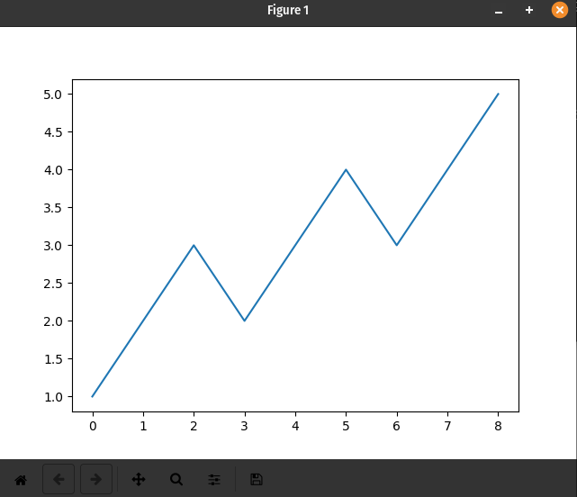
     <figcaption>Simple Interactive Plot Window</figcaption>
    

</figure>

The resulting plot window will display a line connecting the data points by default. As you become more familiar with Matplotlib, you'll discover its vast capabilities for creating diverse and intricate visualizations.

## Basic Plots and Charts

---

The core 2D plotting function in Matplotlib is `plt.plot(x, y)`. This function takes two arrays, `x` and `y`, and visualizes the points they represent. Both arrays must have the same number of elements. The resulting plot forms a curve with x values on the horizontal axis and y values on the vertical axis. The smoothness of the plot increases with the number of elements in the arrays.

### Creating Line Plots

Generating a simple line plot is straightforward. Given data in two vectors, `x` and `y`, the following code accomplishes this:


import matplotlib.pyplot as plt

# Data
x = [1, 2, 3, 4, 5]
y = [2, 4, 6, 8, 10]

# Line plot
plt.plot(x, y)
plt.xlabel('X-axis Label')
plt.ylabel('Y-axis Label')
plt.title('Simple Line Plot')

plt.show()


<figure>
    

     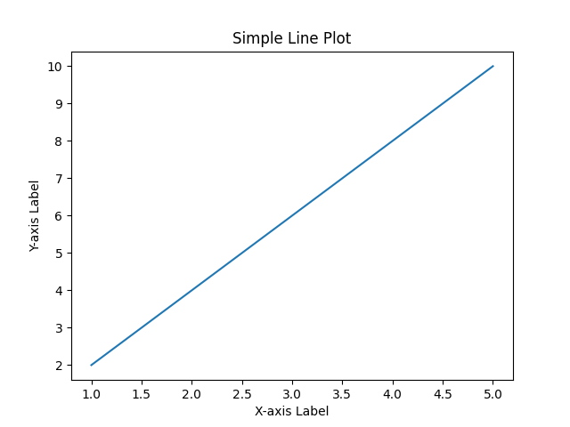
     <figcaption></figcaption>
    

</figure>

Upon executing the plot command, a new window displaying the plot will emerge. Python, in the absence of specific formatting instructions, autonomously decides aspects like axes, step sizes, and line color. You can exercise control over these by using line specifiers—an optional parameter for the plot function—to manipulate line color, style, and data markers.

You can plot functions in Python by calculating the values of an equation for a specific set of input points. Consider the equation:

$$y = \left(\frac{1}{2}\right)^{-0.5x} \cos(8x)$$


import matplotlib.pyplot as plt
import numpy as np

# Data
x = np.arange(-5, 5.0001, 0.01)
y = 0.5**(-0.5*x) * np.cos(8*x)

# Line plot
plt.plot(x, y)
plt.xlabel('X-axis')
plt.ylabel('Y-axis')
plt.title('Function Plot')

plt.show()


The sensitivity of function plots to the number of points in the "x" vector is evident. A change in the point distance, such as altering the range from `x = np.arange(-5, 5.0001, 0.01)` to `x = np.arange(-5, 5.0001, 0.3)`, significantly impacts the resulting plot. It is crucial to carefully choose the point density to accurately represent the intended function. Be mindful of adjusting this distance, as demonstrated by the noticeable difference in the plot on the right.

  <figure style="display: inline-block; margin-right: 20px;">
    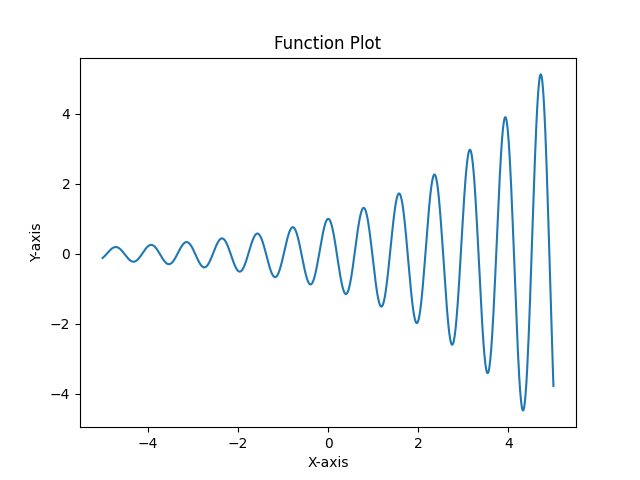
    <figcaption>Smooth Plot</figcaption>
  </figure>
  <figure style="display: inline-block;">
    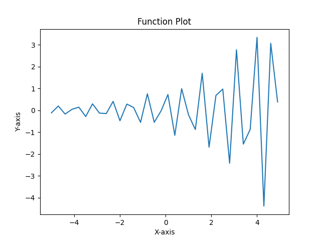
    <figcaption>Not so Smooth Plot</figcaption>
  </figure>

This script demonstrates how to create plots efficiently using Matplotlib. While making this plot, Matplotlib automatically makes choices, like figure size and line color. To customize these choices, include more arguments in function calls and use new functions to control additional properties of the plot.

### Creating Bar Charts

Bar charts are an effective way to visually represent and compare categorical data. Here's a simple example of how to create a bar chart using Matplotlib:

  <figure style="display: inline-block; margin-right: 20px; text-align: left; width: 600px;">
  <pre><code>
import matplotlib.pyplot as plt

# Data
categories = ['Category A', 'Category B', 'Category C', 'Category D']
values = [10, 20, 15, 25]

# Bar chart
plt.bar(categories, values)
plt.xlabel('Categories')
plt.ylabel('Values')
plt.title('Simple Bar Chart')

plt.show()
</code></pre>
  <figcaption>Generating a simple bar chart in Python using Matplotlib.</figcaption>
  </figure>
  
  <figure style="display: inline-block;">
    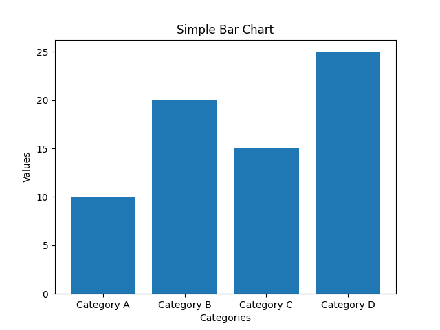
    <figcaption>Output bar chart visualizing categorical data.</figcaption>
  </figure>

This code snippet defines categorical data in the form of `categories` and their corresponding `values`. The `plt.bar` function is then used to generate a bar chart, and additional specifications like labels and titles are included for clarity. The resulting bar chart is displayed on the right.

### Generating Scatter Plots

Scatter plots are useful for visualizing the relationship between two continuous variables. Here's an example:

  <figure style="display: inline-block; margin-right: 20px; text-align: left; width: 600px;">
  <pre><code>
import matplotlib.pyplot as plt

# Data
x = [1, 2, 3, 4, 5]
y = [2, 4, 6, 8, 10]

# Scatter plot
plt.scatter(x, y)
plt.xlabel('X-axis Label')
plt.ylabel('Y-axis Label')
plt.title('Simple Scatter Plot')

plt.show()
</code></pre>
  <figcaption>Generating a simple scatter plot in Python using Matplotlib.</figcaption>
  </figure>
  
  <figure style="display: inline-block;">
    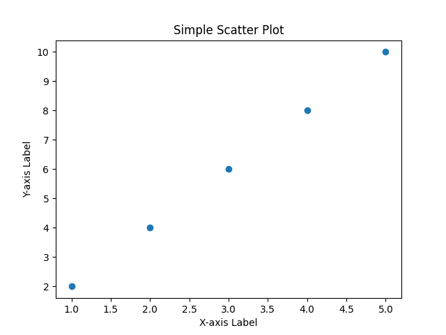
    <figcaption>Output scatter plot.</figcaption>
  </figure>

This code creates a scatter plot by specifying continuous variables `x` and `y`. The `plt.scatter` function is then used to generate the scatter plot. The resulting visualization is displayed on the right, illustrating how the values in `x` and `y` correlate. Scatter plots are valuable for identifying patterns, trends, or clusters in data points.

### Plotting Histograms

Histograms are employed to illustrate the distribution of a dataset. Create a histogram using the following code:

  <figure style="display: inline-block; margin-right: 20px; text-align: left; width: 600px;">
  <pre><code>
import matplotlib.pyplot as plt

# Data
data = [1, 2, 2, 3, 3, 3, 4, 4, 5, 5, 5, 5]

# Histogram
plt.hist(data, bins=5)
plt.xlabel('Values')
plt.ylabel('Frequency')
plt.title('Simple Histogram')

plt.show()
</code></pre>
  <figcaption>Creating a simple histogram in Python using Matplotlib.</figcaption>
  </figure>
  
  <figure style="display: inline-block;">
    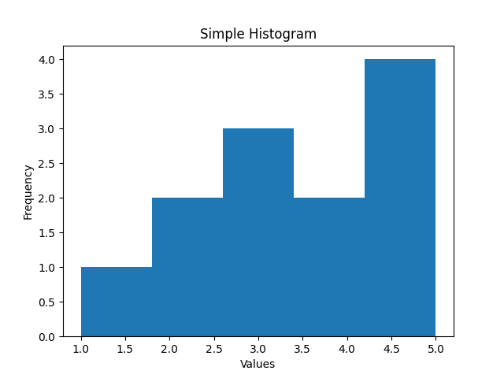
    <figcaption>Output histogram illustrating the distribution of the dataset.</figcaption>
  </figure>

The `plt.hist` function generates a histogram with specified data and bins. The resulting histogram is displayed on the right. The resulting histogram is displayed on the right, providing a visual summary of the frequency of values in the dataset. Histograms are beneficial for understanding the underlying distribution of numerical data, revealing patterns such as symmetry, skewness, or multimodality. 

### Visualizing 3D Plots

Matplotlib supports 3D plotting for visualizing complex data. Here's an example of a 3D surface plot:

  <figure style="display: inline-block; margin-right: 20px; text-align: left; width: 600px;">
  <pre><code>
import matplotlib.pyplot as plt
import numpy as np

# Data
x = np.linspace(-5, 5, 100)
y = np.linspace(-5, 5, 100)
x, y = np.meshgrid(x, y)
z = np.sin(np.sqrt(x**2 + y**2))

# 3D surface plot
fig = plt.figure()
ax = fig.add_subplot(111, projection='3d')
ax.plot_surface(x, y, z, cmap='viridis')
ax.set_xlabel('X-axis')
ax.set_ylabel('Y-axis')
ax.set_zlabel('Z-axis')
ax.set_title('3D Surface Plot')

plt.show()
</code></pre>
  <figcaption>Creating a 3D surface plot in Python using Matplotlib.</figcaption>
  </figure>
  
  <figure style="display: inline-block;">
    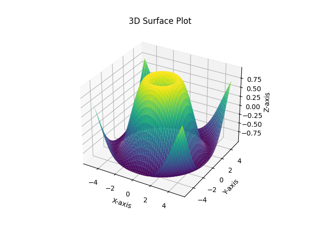
    <figcaption>Output 3D surface plot for visualizing complex data.</figcaption>
  </figure>

This code creates a 3D surface plot using Matplotlib's capabilities for visualizing complex, three-dimensional data. The example utilizes the `numpy` library to generate data for the `x`, `y`, and `z` coordinates. The `plt.figure()` and `add_subplot` functions are used to set up a 3D subplot. The `plot_surface` function then generates the 3D surface plot based on the provided data. This type of plot is particularly valuable when visualizing functions or datasets that involve three variables. The resulting 3D surface plot is displayed on the right, offering a comprehensive view of the complex relationships within the data.

For more examples and customization options, explore the [Matplotlib Gallery](http://matplotlib.org/gallery.html){:target='_blank'}.

## Customizing Plot Appearance

---

When working with Matplotlib, customizing the appearance of your plots is crucial for effectively conveying information. Let's explore various customization options and best practices.

### Titles and Labels

In engineering and science, it's customary to provide plots with both titles and axis labels to ensure clarity. You can achieve this using the `title`, `xlabel`, and `ylabel` functions. For example:


import matplotlib.pyplot as plt
import numpy as np

# Data points
x = np.linspace(-3, 3, 100)
y = np.exp(-x**2)

# Create a plot
plt.plot(x, y)

# Add title and labels
plt.title('Exponential Decay: $y = e^{-x^2}$')
plt.xlabel('X-axis')
plt.ylabel('Y-axis')

# Display the plot
plt.show()


See output below in "Standard Plot".

### Figure Size

Adjusting the size of the figure is also common, especially when creating complex plots. You can do this by creating a figure object and resizing it:


fig = plt.figure(figsize=(8, 6))
# ... rest of the plotting code ...


### Predefined Styles

Matplotlib offers predefined styles that automatically change the overall appearance of your plots. To view available styles:


>>> import matplotlib.pyplot as plt
>>> print(plt.style.available)
['Solarize_Light2', '_classic_test_patch', '_mpl-gallery', '_mpl-gallery-nogrid', 'bmh', 'classic', 'dark_background', 'fast', 'fivethirtyeight', 'ggplot', 'grayscale', 'seaborn-v0_8', 'seaborn-v0_8-bright', 'seaborn-v0_8-colorblind', 'seaborn-v0_8-dark', 'seaborn-v0_8-dark-palette', 'seaborn-v0_8-darkgrid', 'seaborn-v0_8-deep', 'seaborn-v0_8-muted', 'seaborn-v0_8-notebook', 'seaborn-v0_8-paper', 'seaborn-v0_8-pastel', 'seaborn-v0_8-poster', 'seaborn-v0_8-talk', 'seaborn-v0_8-ticks', 'seaborn-v0_8-white', 'seaborn-v0_8-whitegrid', 'tableau-colorblind10']


You can apply a style using `plt.style.use`. For example to apply the dark background style you would use `plt.style.use('dark_background')`

The `dark_background` style is particularly useful when working in low-light environments or when aiming for a visually appealing, modern look. Consider the following code:


import matplotlib.pyplot as plt
import numpy as np

# Apply dark background style
plt.style.use('dark_background')

# Data points
x = np.linspace(-3, 3, 100)
y = np.exp(-x**2)

# Create a plot
plt.plot(x, y)

# Add title and labels
plt.title('Exponential Decay: $y = e^{-x^2}$')
plt.xlabel('X-axis')
plt.ylabel('Y-axis')

# Display the dark plot
plt.show()


The preference for dark plots is rooted in reduced eye strain and improved focus in dimly lit conditions. In the comparison below, the left plot is the standard appearance, while the right plot adopts the `dark_background` style:

  <figure style="display: inline-block; margin-right: 20px;">
    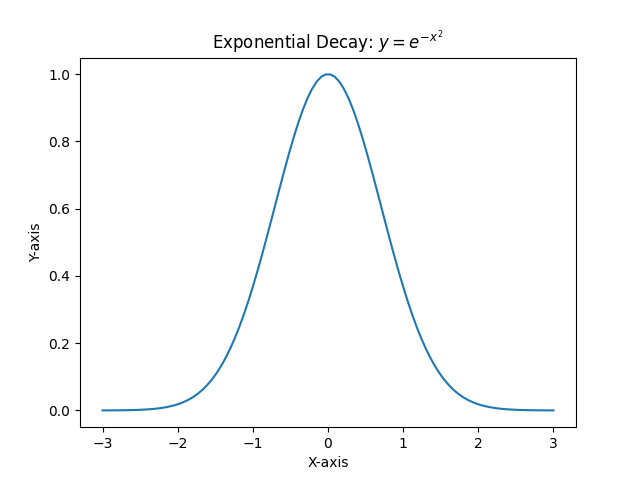
    <figcaption>Standard Plot</figcaption>
  </figure>
  <figure style="display: inline-block;">
    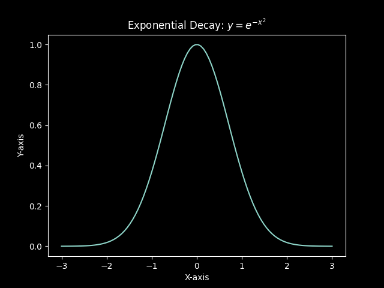
    <figcaption>Dark Plot</figcaption>
  </figure>

From this point onward, I will be using the `dark_background` style for a visually appealing and consistent look.

### Adding Gridlines, Axis Titles, and a Plot Title


import matplotlib.pyplot as plt
import numpy as np

# Apply dark background style
plt.style.use('dark_background')

# Data points
x = np.linspace(-3, 3, 100)
y = np.exp(-x**2)

# Create a plot
plt.plot(x, y, label='$e^{-x^2}$')

# Add title and labels
plt.title('Exponential Decay: $y = e^{-x^2}$')
plt.xlabel('X-axis')
plt.ylabel('Y-axis')

plt.grid(True)  # Adding gridlines
plt.legend()    # Adding legend

# Display the plot
plt.show()


The generated plot will look like this:

<figure>
    

     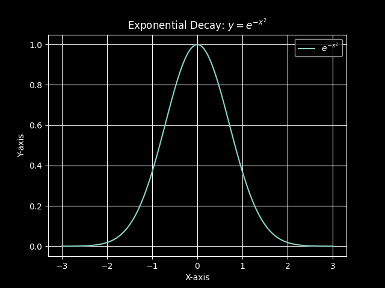
      <figcaption>Plot of the function \(y = e^{-x^2}\) with gridlines, axis titles, and a legend.</figcaption>
    

</figure>

In this example, we've introduced gridlines using `plt.grid(True)`. The `xlabel`, `ylabel`, and `title` functions add axis titles and a plot title, respectively. The `legend` function is used to label the plotted series.

### Customizing Properties of Lines and Markers


import matplotlib.pyplot as plt
import numpy as np

# Apply dark background style
plt.style.use('dark_background')

# Data points
x = np.linspace(-3, 3, 100)
y = np.exp(-x**2)

# Create plots
plt.plot(x, y, label='Default Line')  # Default line style
plt.plot(x, y + 0.2, linestyle='--', color='red', label='Dashed Line')  # Custom line style and color
plt.scatter(x, y - 0.2, marker='o', color='green', label='Data Points')  # Adding data points with custom marker and color

# Add title and labels
plt.title('Exponential Decay: $y = e^{-x^2}$')
plt.xlabel('X-axis')
plt.ylabel('Y-axis')

plt.legend()  # Adding legend

# Display the plot
plt.show()


The generated plot will look like this:

<figure>
    

     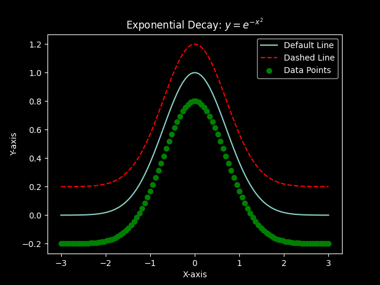
      <figcaption>Customized line styles, colors, and markers for the exponential decay plot.</figcaption>
    

</figure>

This example showcases customizing line styles, colors, and markers. You can control these properties using the `linestyle`, `color`, and `marker` parameters.

You can use the shorthand notation `c` for color.

**Table of Color Codes**

<table class="table table-dark table-responsive table-sm table-striped table-hover caption-top">
    <caption>Color Codes and Descriptions</caption>
    <thead>
        <tr>
            <th scope="col">Color Code</th>
            <th scope="col">Description</th>
        </tr>
    </thead>
    <tbody class="table-group-divider">
        <tr>
            <td><code>b</code></td>
            <td>Blue</td>
        </tr>
        <tr>
            <td><code>g</code></td>
            <td>Green</td>
        </tr>
        <tr>
            <td><code>r</code></td>
            <td>Red</td>
        </tr>
        <tr>
            <td><code>c</code></td>
            <td>Cyan</td>
        </tr>
        <tr>
            <td><code>m</code></td>
            <td>Magenta</td>
        </tr>
        <tr>
            <td><code>y</code></td>
            <td>Yellow</td>
        </tr>
        <tr>
            <td><code>k</code></td>
            <td>Black</td>
        </tr>
        <tr>
            <td><code>w</code></td>
            <td>White</td>
        </tr>
    </tbody>
</table>

In certain situations, we may want to employ a different style of line, such as a dashed line. This is often used to distinguish one plotted curve from another. We can achieve this by adding a linestyle specification to the plot command.

**Table of Linestyle Choices and Codes**

<table class="table table-dark table-responsive table-sm table-striped table-hover caption-top">
    <caption>Linestyle Choices and Codes</caption>
    <thead>
        <tr>
            <th scope="col">Linestyle Code</th>
            <th scope="col">Description</th>
        </tr>
    </thead>
    <tbody class="table-group-divider">
        <tr>
            <td><code>'-'</code></td>
            <td>Solid Line</td>
        </tr>
        <tr>
            <td><code>'--'</code></td>
            <td>Dashed Line</td>
        </tr>
        <tr>
            <td><code>':'</code></td>
            <td>Dotted Line</td>
        </tr>
        <tr>
            <td><code>'-.'</code></td>
            <td>Dash-Dot Line</td>
        </tr>
    </tbody>
</table>

You can use the shorthand notation `ls` for linestyle.

**Table of Marker Codes**

<table class="table table-dark table-responsive table-sm table-striped table-hover caption-top">
    <caption>Marker Codes and Descriptions</caption>
    <thead>
        <tr>
            <th scope="col">Marker Code</th>
            <th scope="col">Description</th>
        </tr>
    </thead>
    <tbody class="table-group-divider">
        <tr>
            <td><code>'.'</code></td>
            <td>Point Marker</td>
        </tr>
        <tr>
            <td><code>','</code></td>
            <td>Pixel Marker</td>
        </tr>
        <tr>
            <td><code>'o'</code></td>
            <td>Circle Marker</td>
        </tr>
        <tr>
            <td><code>'v'</code></td>
            <td>Triangle Down</td>
        </tr>
        <tr>
            <td><code>'^'</code></td>
            <td>Triangle Up</td>
        </tr>
        <tr>
            <td><code>'&lt;'</code></td>
            <td>Triangle Left</td>
        </tr>
        <tr>
            <td><code>'&gt;'</code></td>
            <td>Triangle Right</td>
        </tr>
        <tr>
            <td><code>'1'</code></td>
            <td>Tri Down Marker</td>
        </tr>
        <tr>
            <td><code>'2'</code></td>
            <td>Tri Up Marker</td>
        </tr>
        <tr>
            <td><code>'3'</code></td>
            <td>Tri Left Marker</td>
        </tr>
        <tr>
            <td><code>'4'</code></td>
            <td>Tri Right Marker</td>
        </tr>
        <tr>
            <td><code>'s'</code></td>
            <td>Square Marker</td>
        </tr>
        <tr>
            <td><code>'p'</code></td>
            <td>Pentagon Marker</td>
        </tr>
        <tr>
            <td><code>'*'</code></td>
            <td>Star Marker</td>
        </tr>
        <tr>
            <td><code>'h'</code></td>
            <td>Hexagon Marker 1</td>
        </tr>
        <tr>
            <td><code>'H'</code></td>
            <td>Hexagon Marker 2</td>
        </tr>
        <tr>
            <td><code>'+'</code></td>
            <td>Plus Marker</td>
        </tr>
        <tr>
            <td><code>'x'</code></td>
            <td>X Marker</td>
        </tr>
        <tr>
            <td><code>'D'</code></td>
            <td>Diamond Marker</td>
        </tr>
        <tr>
            <td><code>'d'</code></td>
            <td>Thin Diamond Marker</td>
        </tr>
        <tr>
            <td><code>'|'</code></td>
            <td>Vertical Line Marker</td>
        </tr>
        <tr>
            <td><code>'_'</code></td>
            <td>Horizontal Line Marker</td>
        </tr>
    </tbody>
</table>

### Combining Markers and Lines


import matplotlib.pyplot as plt
import numpy as np

# Apply dark background style
plt.style.use('dark_background')

# Data points
x = np.linspace(-3, 3, 100)
y = np.exp(-x**2)

# Create plots
plt.plot(x, y, 'bo-', label='Blue Line with Circles')  # Blue line with circles
plt.plot(x, y + 0.2, 'rx--', label='Red Dashed Line with Crosses')  # Red dashed line with crosses

# Add title and labels
plt.title('Exponential Decay: $y = e^{-x^2}$')
plt.xlabel('X-axis')
plt.ylabel('Y-axis')

plt.legend()  # Adding legend

# Display the plot
plt.show()


The generated plot will look like this:

<figure>
    

     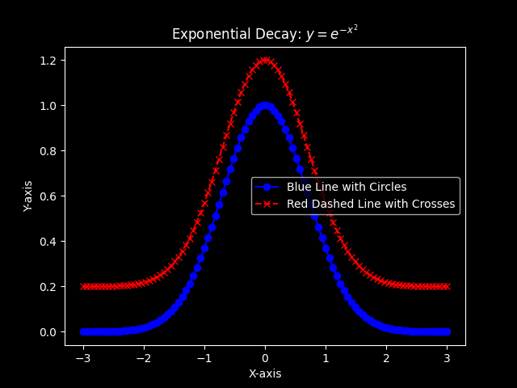
      <figcaption>Combined markers and lines in the plot.</figcaption>
    

</figure>

Here, we've combined markers and lines in the same plot. The format string `'bo-'` specifies a blue line with circles, while `'rx--'` denotes a red dashed line with crosses.

### Plotting More Than One Series and Adding a Legend


import matplotlib.pyplot as plt
import numpy as np

# Apply dark background style
plt.style.use('dark_background')

# Data points
x = np.linspace(-3, 3, 100)
y = np.exp(-x**2)
y_2 = np.exp(-(x - 2)**2/2)

# Create plots
plt.plot(x, y, label='$e^{-x^2}$')
plt.plot(x, y_2, label='$e^{-(x-2)^2/2}$')

# Add title and labels
plt.title('Multiple Series Plots')
plt.xlabel('X-axis')
plt.ylabel('Y-axis')

plt.legend()  # Adding legend

# Display the plot
plt.show()


The generated plot will look like this:

<figure>
    

     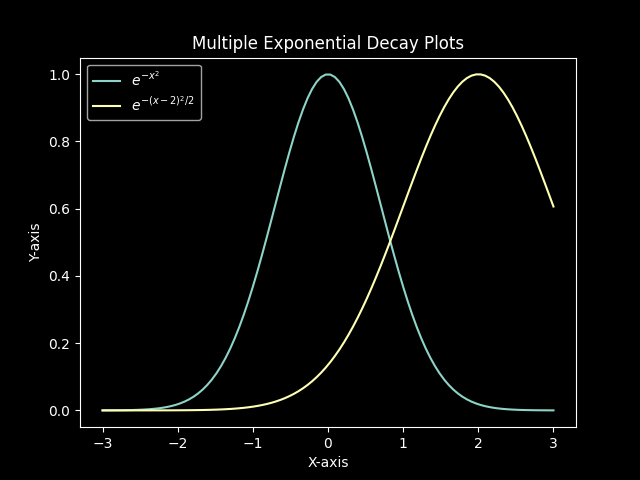
      <figcaption>Plotting two series (exponential decay and squared function) and adding a legend.</figcaption>
    

</figure>

This example demonstrates plotting two series and adding a legend to differentiate between them.

### Adjusting Axis Limits and Adding an Axis on the Right


import matplotlib.pyplot as plt
import numpy as np

# Apply dark background style
plt.style.use('dark_background')

# Data points
x = np.linspace(-3, 3, 100)
y = np.exp(-x**2)

# Create plots
plt.plot(x, y, label='$e^{-x^2}$')

# Adjusting axis limits
plt.xlim(-2, 2)
plt.ylim(0, 2)

# Adding an axis on the right
plt.twinx()
plt.plot(x, y**2, 'r--', label='Squared Function')

# Add title and labels
plt.title('Axis Limits and Secondary Axis')
plt.xlabel('X-axis')
plt.ylabel('Y-axis')

plt.legend(loc='upper left')  # Adding legend

# Display the plot
plt.show()


The generated plot will look like this:

<figure>
    

     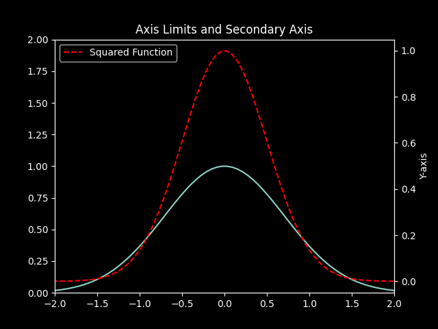
      <figcaption>Customized axis limits and a secondary y-axis on the right.</figcaption>
    

</figure>

Here, we've customized the axis limits and added a secondary y-axis on the right with the squared function.

### Multiple Plots on a Single Figure Object


import matplotlib.pyplot as plt
import numpy as np

# Apply dark background style
plt.style.use('dark_background')

# Data points
x = np.linspace(-3, 3, 100)
y = np.exp(-x**2)

# Creating subplots
fig, axs = plt.subplots(2, 2, figsize=(10, 8))

# Main Title
fig.suptitle('Multiple Plots on a Single Figure', fontsize=16)

# Plot 1
axs[0, 0].plot(x, y, label='$e^{-x^2}$')
axs[0, 0].set_title('Exponential Decay: $e^{-x^2}$')
axs[0, 0].set_xlabel('X-axis')
axs[0, 0].set_ylabel('Y-axis')

# Plot 2
axs[0, 1].plot(x, y**2, 'r--', label='Squared Function')
axs[0, 1].set_title('Squared Function: $e^{-(x^2)^2}$')
axs[0, 1].set_xlabel('X-axis')
axs[0, 1].set_ylabel('Y-axis')

# Plot 3
axs[1, 0].scatter(x, y, marker='o', color='green', label='Data Points')
axs[1, 0].set_title('Scatter Plot of Exponential Decay')
axs[1, 0].set_xlabel('X-axis')
axs[1, 0].set_ylabel('Y-axis')

# Plot 4
axs[1, 1].hist(np.random.randn(1000), bins=30, color='purple', alpha=0.7, label='Histogram')
axs[1, 1].set_title('Histogram of Random Data')
axs[1, 1].set_xlabel('Values')
axs[1, 1].set_ylabel('Frequency')

# Adjusting layout
plt.tight_layout()

# Display the plot
plt.show()


The generated plot will look like this:

<figure>
    

     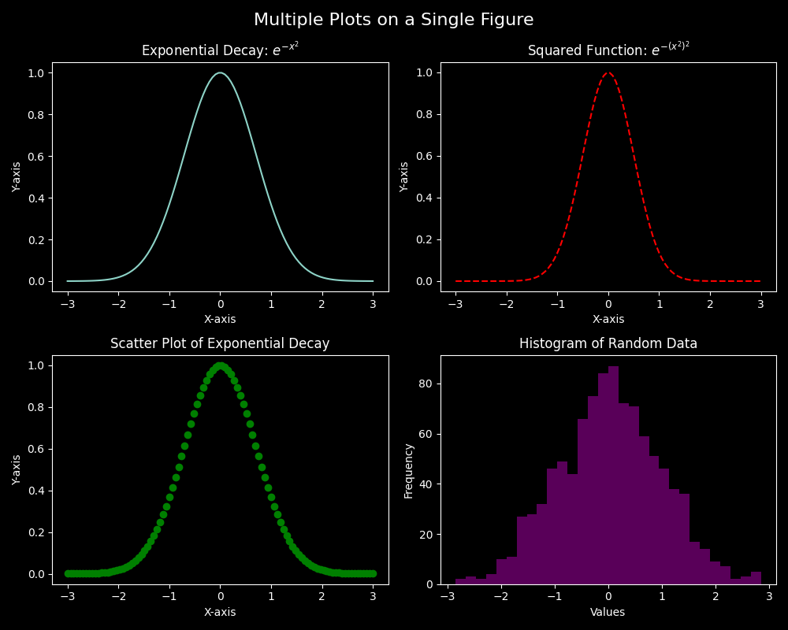
      <figcaption>Multiple subplots within a single figure</figcaption>
    

</figure>

In this example, we've created multiple subplots within a single figure, each showcasing different aspects of customization.


# Save the current figure
plt.savefig('plot.png', dpi=300, bbox_inches='tight')


These examples provide a glimpse into the extensive customization capabilities of Matplotlib. Experimenting with various parameters and styles allows you to create visually compelling and informative plots tailored to your specific needs. For more examples and customization options, explore the [Matplotlib Gallery](http://matplotlib.org/gallery.html){:target='_blank'}.

### Saving Plots

Saving your plots in different file formats is a crucial step in sharing your visualizations with others or incorporating them into documents and presentations. Matplotlib provides the `savefig` function to facilitate this process. Here's an example of how you can use it:


import matplotlib.pyplot as plt
import numpy as np

# Data points
x = np.linspace(-3, 3, 100)
y = np.exp(-x**2)

# Create a plot
plt.plot(x, y, label='$e^{-x^2}$')

# Add title and labels
plt.title('Exponential Decay: $y = e^{-x^2}$')
plt.xlabel('X-axis')
plt.ylabel('Y-axis')

# Display the legend
plt.legend()

# Save the current figure as a PNG file with a resolution of 300 dpi
plt.savefig('exponential_decay_plot.png', dpi=300, bbox_inches='tight')

# Save the same figure as a PDF file
plt.savefig('exponential_decay_plot.pdf', format='pdf', bbox_inches='tight')

# Save the same figure as an SVG file
plt.savefig('exponential_decay_plot.svg', format='svg', bbox_inches='tight')

# Display the plot
plt.show()


In this example, the `savefig` function is used to save the current figure in three different file formats: PNG, PDF, and SVG. The `dpi` parameter sets the resolution (dots per inch) for the PNG file, and `bbox_inches='tight'` ensures that the entire plot is included in the saved image.

Feel free to customize the file format and options based on your specific requirements. This capability is particularly useful when you need to include your visualizations in reports, articles, or presentations.

### More Customization and Techniques

#### Color Maps and Colormaps

Demonstrate how to use different color maps for visualizing data. You can create a heatmap or surface plot to showcase the effects of different colormaps.


import matplotlib.pyplot as plt
import numpy as np

# Apply dark background style
plt.style.use('dark_background')

# Generate data for a heatmap
data = np.random.rand(10, 10)

# Create a heatmap with a specific colormap
plt.imshow(data, cmap='viridis', interpolation='nearest')
plt.colorbar()

# Add title and labels
plt.title('Heatmap with Viridis Colormap')
plt.xlabel('X-axis')
plt.ylabel('Y-axis')

# Display the plot
plt.show()


#### Animations

Show how to create animated plots using the `FuncAnimation` class. This could include simple animations like updating a line plot over time.


import matplotlib.pyplot as plt
import numpy as np
from matplotlib.animation import FuncAnimation

# Apply dark background style
plt.style.use('dark_background')

# Generate data for animation
x = np.linspace(0, 2 * np.pi, 100)
fig, ax = plt.subplots()
line, = ax.plot(x, np.sin(x))

# Animation update function
def update(frame):
    line.set_ydata(np.sin(x + frame / 10))
    return line,

# Create animation
ani = FuncAnimation(fig, update, frames=range(100), interval=50)
plt.show()


#### Interactive Plots

Introduce interactive plots using tools like `mplcursors` or `plotly` to create interactive charts.


import matplotlib.pyplot as plt
import numpy as np
import mplcursors

# Apply dark background style
plt.style.use('dark_background')

# Generate data
x = np.linspace(0, 10, 100)
y = np.sin(x)

# Create an interactive plot with cursor
fig, ax = plt.subplots()
ax.plot(x, y, label='Sine Curve')
ax.set_title('Interactive Sine Curve')
ax.set_xlabel('X-axis')
ax.set_ylabel('Y-axis')
mplcursors.cursor(hover=True)

plt.show()


## Practical Applications and Use Cases

---

Let's explore some practical applications and use cases of Matplotlib, along with code snippets and examples.

### Data Visualization in Scientific Research

In scientific research, Matplotlib is frequently employed to visualize experimental results, simulation data, and scientific phenomena. Below is an example of visualizing the trajectory of a projectile motion:


import matplotlib.pyplot as plt
import numpy as np

# Simulate projectile motion
g = 9.8  # Acceleration due to gravity
theta = np.radians(45)  # Launch angle in degrees
v0 = 20  # Initial velocity

# Time points
t_max = 2 * v0 * np.sin(theta) / g
t = np.linspace(0, t_max, 100)

# Projectile motion equations
x = v0 * np.cos(theta) * t
y = v0 * np.sin(theta) * t - 0.5 * g * t**2

# Plot the trajectory
plt.plot(x, y)
plt.title('Projectile Motion')
plt.xlabel('Horizontal Distance (m)')
plt.ylabel('Vertical Distance (m)')
plt.grid(True)
plt.show()


### Signal Processing and Fourier Analysis

Matplotlib is useful for visualizing signals and their frequency components. Here's an example of a signal and its Fourier transform:


import matplotlib.pyplot as plt
import numpy as np
from scipy.fftpack import fft, ifft

# Generate a signal
fs = 1000  # Sampling frequency
t = np.linspace(0, 1, fs, endpoint=False)  # Time vector
f = 5  # Frequency of the signal
signal = np.sin(2 * np.pi * f * t)

# Compute Fourier transform
fourier_transform = fft(signal)
frequencies = np.fft.fftfreq(len(fourier_transform), 1/fs)

# Plot the signal and its Fourier transform
plt.subplot(2, 1, 1)
plt.plot(t, signal)
plt.title('Original Signal')

plt.subplot(2, 1, 2)
plt.plot(frequencies, np.abs(fourier_transform))
plt.title('Fourier Transform')
plt.xlabel('Frequency (Hz)')

plt.tight_layout()
plt.show()


### Machine Learning Model Evaluation

When working with machine learning models, Matplotlib can be used to visualize model performance, including confusion matrices, ROC curves, and learning curves. Here's an example of a ROC curve:


import matplotlib.pyplot as plt
from sklearn.datasets import make_classification
from sklearn.model_selection import train_test_split
from sklearn.linear_model import LogisticRegression
from sklearn.metrics import roc_curve, auc

# Generate synthetic data
X, y = make_classification(n_samples=1000, n_features=20, random_state=42)

# Split the data
X_train, X_test, y_train, y_test = train_test_split(X, y, test_size=0.2, random_state=42)

# Train a logistic regression model
model = LogisticRegression()
model.fit(X_train, y_train)

# Get predicted probabilities
y_probs = model.predict_proba(X_test)[:, 1]

# Compute ROC curve and AUC
fpr, tpr, _ = roc_curve(y_test, y_probs)
roc_auc = auc(fpr, tpr)

# Plot ROC curve
plt.plot(fpr, tpr, color='darkorange', lw=2, label='ROC curve (AUC = {:.2f})'.format(roc_auc))
plt.plot([0, 1], [0, 1], color='navy', lw=2, linestyle='--')
plt.xlabel('False Positive Rate')
plt.ylabel('True Positive Rate')
plt.title('Receiver Operating Characteristic (ROC) Curve')
plt.legend(loc='lower right')
plt.show()


## Summary

---

Congratulations on mastering the basics of data visualization with Matplotlib! As you continue your Python journey, consider exploring further applications and integration with web development using Flask in [Introduction to Web Development with Flask](/workspace/python/python-flask).