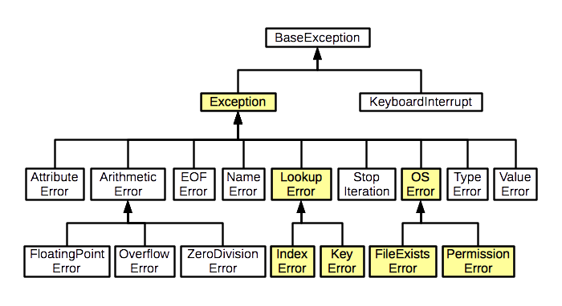
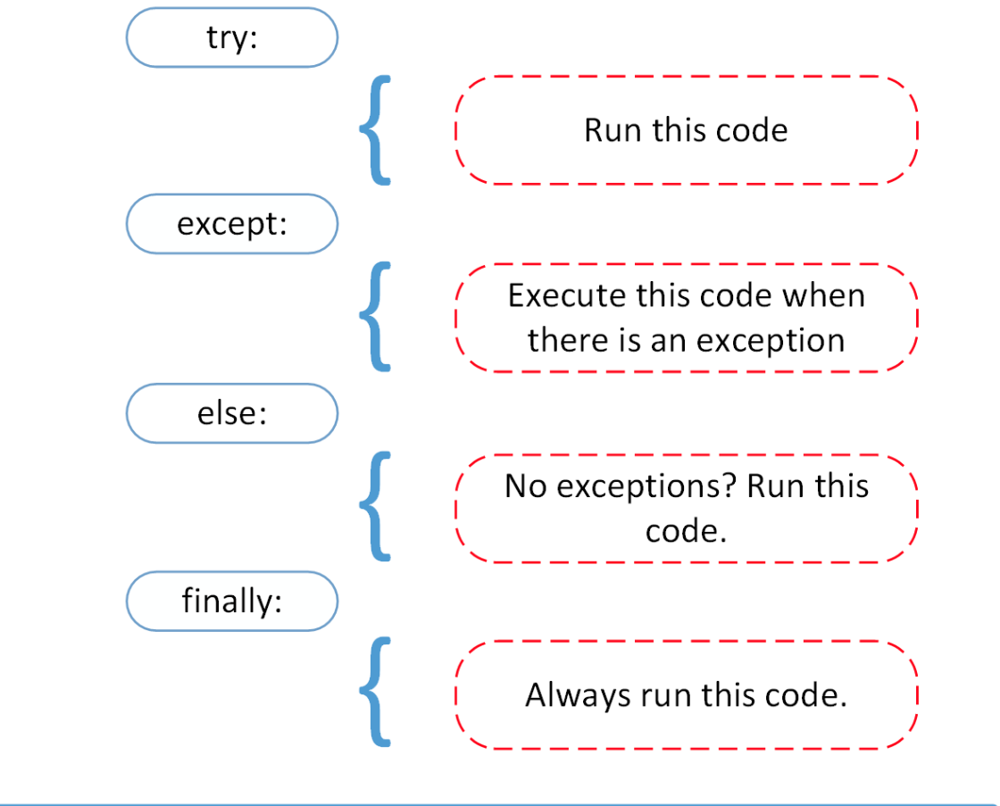

As you continue on your coding journey, errors are inevitable. Computers are less forgiving than humans when it comes to syntactic rules, and making mistakes or attempting illegal operations in Python can lead to exceptions, halting program execution and displaying error messages. This tutorial will guide you through the fundamentals of error handling in Python, allowing you to write code that is more resilient and user-friendly.

* toc
{:toc}

## Understanding Exceptions

---

An exception in programming refers to an interruption in normal processing, typically caused by an error condition. These interruptions can be raised by one part of the program and handled by another part. This definition is sourced from [Wiktionary](https://en.wiktionary.org/wiki/exception){:target='_blank'}.

<figure>
    

     
     <figcaption><a href="https://www.bridgemi.com/michigan-government/broken-human-toll-michigans-unemployment-fraud-saga" target="_blank">Image Source</a></figcaption>
    

</figure>

An exception in Python occurs when an error disrupts the normal flow of program execution. When such an error is encountered, Python "raises an exception", producing an object that represents the error. If not promptly addressed, exceptions can terminate a program, displaying an error message. However, with proper error handling, developers gain the ability to catch and manage these exceptions, offering opportunities to fix issues, retry operations, provide helpful error messages, or suppress errors.

Let's start by examining what exceptions look like in Python and how to interpret their accompanying messages.

### Common Error Types

In Python, errors can manifest in two primary types: **syntax errors** and **exceptions**.

#### Syntax Errors

Syntax errors are the most common and fundamental type of error, occurring when a programmer breaks any syntax rule. These errors lead to a halt in program execution. Here's an example that produces a syntax error:


>>> print 'Hello, World!'
  File "<stdin>", line 1
    print 'Hello, World!'
    ^^^^^^^^^^^^^^^^^^^^^
SyntaxError: Missing parentheses in call to 'print'. Did you mean print(...)?


In this example, the absence of parentheses in the `print` statement violates Python's syntax rules, resulting in a `SyntaxError`.

#### Exceptions

Exceptions, as defined above, cause a deviation from the normal flow of the program due to specific events occurring internally. Unlike syntax errors, exceptions are detected during the program's execution.

Errors are an integral part of the coding process, and traceback reports provide valuable information. The final line of a traceback includes the error type and a concise explanation. For better understanding, it's often beneficial to search for this line on search engines, as it may yield more user-friendly explanations than the official documentation.

#### In-built Python Exception Classes

<figure>
    

     
     <figcaption><a href="https://devstory.net/11421/python-exception-handling" target="_blank">Image Source</a></figcaption>
    

</figure>

Understanding the types of errors encountered by the interpreter aids in debugging. The table below highlights common error types, and a more comprehensive list is available in the [Python Documentation](https://docs.python.org/3/library/exceptions.xhtml){:target='_blank'}.

<table class="table table-dark table-responsive table-sm table-striped table-hover caption-top">
    <caption>Common Python Errors</caption>
    <thead>
        <tr>
            <th scope="col">Error Type</th>
            <th scope="col">Description</th>
        </tr>
    </thead>
    <tbody class="table-group-divider">
        <tr>
            <td><code>SyntaxError</code></td>
            <td>Raised if there are any syntax errors in the Python code.</td>
        </tr>
        <tr>
            <td><code>KeyboardInterrupt</code></td>
            <td>Raised when the user interrupts the running program (e.g., with CTRL-C).</td>
        </tr>
        <tr>
            <td><code>TypeError</code></td>
            <td>Raised when an operation or function tries to act on an object of the wrong type.</td>
        </tr>
        <tr>
            <td><code>ValueError</code></td>
            <td>Raised when an operation or function tries to act on an argument that is the right type, but the wrong value.</td>
        </tr>
        <tr>
            <td><code>ZeroDivisionError</code></td>
            <td>Raised when trying to divide by zero.</td>
        </tr>
        <tr>
            <td><code>KeyError</code></td>
            <td>Raised when a key is not found in a dictionary.</td>
        </tr>
        <tr>
            <td><code>AttributeError</code></td>
            <td>Raised when accessing or assigning to a class attribute that doesn’t exist.</td>
        </tr>
        <tr>
            <td><code>ImportError</code></td>
            <td>Raised when an import statement isn’t able to find a package, module, or a name within the module.</td>
        </tr>
        <tr>
            <td><code>IndexError</code></td>
            <td>Raised when an index (subscript) is out of range for a sequential collection, such as a list or tuple.</td>
        </tr>
        <tr>
            <td><code>NameError</code></td>
            <td>Raised when a name is not found in the local or global scope.</td>
        </tr>
        <tr>
            <td><code>RuntimeError</code></td>
            <td>A catch-all for any error that doesn’t fit into other categories.</td>
        </tr>
    </tbody>
</table>

These are some of the built-in exception classes most commonly encountered while coding in Python. For a comprehensive list of exception types in Python, refer to the official Python documentation.

## Python Exception Handling: The `try`, `except`, and `finally` Blocks

---

Exception handling in Python is a crucial concept that allows developers to gracefully handle errors and exceptions that may occur during the execution of a program. The core of Python's exception handling revolves around the use of `try`, `except`, and optionally `finally` blocks.

<figure>
    

     
     <figcaption> Image Source: <a href="https://realpython.com/python-exceptions/" target="_blank">RealPython</a></figcaption>
    

</figure>

### The `try` and `except` Blocks

In Python, the `try` block is where you encapsulate code that might raise an exception. On encountering an exception, the execution of the `try` block is interrupted, and the control is transferred to the `except` block. The `except` block is responsible for catching the exception and executing the statements specified within it. This mechanism prevents programs from crashing abruptly, providing an opportunity to handle exceptions in a controlled manner.

Consider the following example, where division by zero could lead to a `ZeroDivisionError`:


try:
    # Code that may raise an exception
    result = 42 / 0
except ZeroDivisionError:
    # Code to handle the specific exception
    print('Cannot divide by zero!')

# Output:
# Cannot divide by zero!


In this example, the `try` block attempts the division operation that may raise a `ZeroDivisionError`. The `except` block catches and handles the specific exception (`ZeroDivisionError`) by printing a corresponding message.

#### The `try` block

The `try` block encompasses the code that you anticipate might cause an exception. If an exception occurs during the execution of this code, the control is transferred to the `except` block. If no exception occurs, the entire `try` block is executed, and the `except` block is skipped.

#### The `except` block

The `except` block follows the `try` block and contains exception cleanup code. This code defines how to handle the specific exception that occurred. It could involve printing a message, triggering an event, or storing information in a database.

You can specify the name of the exception class after the `except` keyword to handle a specific type of exception. If no exception class is provided, the `except` block catches all exceptions.

It's important to note that if an exception occurs in the `try` block, the code statements after the line causing the exception are not executed within the `try` block. The execution then proceeds to the `except` block. Once the `except` block is executed, the code statements after it are executed as part of normal program flow.


try:
    # Code that may raise an exception
    result = 42 / 0
except ZeroDivisionError:
    # Code to handle the specific exception
    print('Cannot divide by zero!')

print('Execution complete.')

# Output:
# Cannot divide by zero!
# Execution complete.


##### Catching Multiple Exceptions

In Python, you can efficiently handle different exception scenarios by catching multiple exception types. This feature is particularly useful when you anticipate various exceptions might occur in different situations, and you want to tailor your response to each specific case.

**Using a Tuple in `except` Block:** You can catch multiple exceptions using a tuple within the `except` block. Here's a straightforward example:


try:
    value = int('abc')
except (ValueError, TypeError):
    print('Invalid conversion!')

# Output:
# Invalid conversion!


In this example, if either a `ValueError` or a `TypeError` occurs during the int conversion, the `except` block is executed, printing an "Invalid conversion!" message. This approach allows you to handle a group of exceptions collectively.

**Multiple `except` Blocks:**

Handling multiple exceptions can also be achieved with multiple `except` blocks, each dedicated to a specific type of exception. Here's an illustration:


try:
    result = int('0x1') / 0
except (ValueError, TypeError):
    print('Invalid conversion!')
except ZeroDivisionError:
    print('Cannot divide by zero!')

# Output:
# Invalid conversion!


In this case, the first `except` block catches `ValueError` and `TypeError`, while the second `except` block is specialized for handling `ZeroDivisionError`. This structure allows you to address distinct exception types with customized responses.

**Handling Multiple Exceptions with a Generic Block:**

In Python, when handling multiple exceptions with `except` blocks, it's good practice to include a generic `except` block at the end. This allows you to capture unexpected runtime exceptions, providing a safety net for situations that might not have been anticipated.

Here's an example:


try:
    result = int('0x1') / 0
except (ValueError, TypeError):
    print('Invalid conversion!')
except ZeroDivisionError:
    print('Cannot divide by zero!')
except:
    print('An unexpected runtime exception occurred.')

# Output:
# Invalid conversion!


In this scenario, the first `except` block catches `ValueError` and `TypeError`, the second except block handles `ZeroDivisionError`, and the final `except` block serves as a catch-all for any unforeseen runtime exceptions.

### The `else` Block

In Python's exception handling, the `else` block provides a way to execute code when no exceptions are raised in the `try` block. It complements the `try` and `except` blocks by allowing you to specify code that should run only if the `try` block executes successfully without any exceptions.

Here's an example to illustrate the usage of the `else` block:


try:
    result = 42 / 2
except ZeroDivisionError:
    print('Cannot divide by zero!')
else:
    print(f'Result: {result}')

# Output:
# Result: 21.0


In this example:

- The `try` block attempts to perform the division operation `10 / 2`, which is valid and won't raise a `ZeroDivisionError`.
- Since no exception occurs in the `try` block, the `else` block is executed, printing the result.

Including an `else` block is optional, and it provides a clean way to separate the code that should run when there are no exceptions. This can enhance the readability of your code and make it more maintainable.

**Best Practices:**

- Use the `else` block for code that should run specifically when no exceptions are encountered.
- Keep the `else` block concise and focused on actions related to successful execution.
- Utilize the `else` block to make your exception handling logic more expressive and readable.

### The `finally` Block

The `finally` block is an essential part of exception handling. When dealing with exceptions using the `try` and `except` blocks, you can include a `finally` block at the end. The code within the `finally` block is guaranteed to be executed, regardless of whether an exception occurred or not. This makes it suitable for tasks that should be performed in any case, such as closing file resources, terminating database connections, or providing a conclusive message before the program exits.

The basic syntax for using the finally block is as follows:


try:
    # Code that may raise exceptions
    result = int('0x1') / 0
except (ValueError, TypeError):
    print('Invalid conversion!')
except ZeroDivisionError:
    print('Cannot divide by zero!')
finally:
    # Code in the finally block is always executed
    print('Finally block executed.')

# Output:
# Invalid conversion!
# Finally block executed.


In this example, the `finally` block contains code that is executed no matter what happens in the `try` and `except` blocks. Even if an exception occurs, the `finally` block will run before the program exits.

#### Common Use Cases

**Resource Cleanup:**


try:
    file = open('example.txt', 'r')
    # Code that may raise exceptions while working with the file
except FileNotFoundError:
    print('File not found!')
finally:
    # Close the file resource in the finally block
    file.close() if 'file' in locals() else None


**Database Connection Closure:**


try:
    # Code that may raise exceptions while interacting with the database
except DatabaseError:
    print('Error accessing the database!')
finally:
    # Close the database connection in the finally block
    db_connection.close() if 'db_connection' in locals() else None


**Graceful Program Exit:**


try:
    # Code that may raise exceptions during program execution
except Exception as e:
    print(f'An unexpected error occurred: {e}')
finally:
    # Display a farewell message in the finally block
    print('Program execution complete.')


Including the `finally` block ensures that critical tasks are handled, promoting cleaner resource management and providing a graceful exit from the program.

### The `else` Clause

The `else` clause is executed if the code in the `try` block doesn't raise any exceptions:


try:
    value = int('42')
except ValueError:
    print('Invalid conversion.')
else:
    print(f'Conversion successful: {value}')

# Output:
# Conversion successful: 42


In this example, if the conversion from the string "42" to an integer succeeds without raising a `ValueError`, the `else` block is executed, printing a "Conversion successful" message. This clause provides an opportunity to execute code when no exceptions occur, enhancing the flexibility of exception handling.

## Raising Exceptions in Python

---

In Python, you can deliberately raise exceptions to signal that an error or unexpected condition has occurred. This allows you to control the flow of your program and communicate specific issues to the user or developer. The `raise` statement is used to raise exceptions at any point in your code.

The basic syntax for raising an exception is as follows:


raise ExceptionType('Optional error message')


- **ExceptionType:** Specifies the type of exception to be raised. This could be a built-in exception like `ValueError`, `TypeError`, or a custom exception.
- **Optional error message:** Provides additional information about the exception. It is a good practice to include a descriptive message for better understanding.

Here's an example of how you can raise exceptions:


def divide_numbers(a, b):
    if b == 0:
        raise ValueError('Cannot divide by zero')
    return a / b

try:
    result = divide_numbers(42, 0)
except ValueError as ve:
    print(f'Error: {ve}')

# Output:
# Error: Cannot divide by zero


In this example, the `divide_numbers` function raises a `ValueError` if the divisor (`b`) is zero. The `try-except` block catches the exception and prints the error message.

Example: Raising a Built-in Exception


def open_file(file_path):
    if not file_path.endswith('.txt'):
        raise FileNotFoundError('File must have a .txt extension')
    # Code to open and process the file

# Example usage
try:
    open_file('example.md')
except FileNotFoundError as fnfe:
    print(f'Error: {fnfe}')

# Output:
# Error: File must have a .txt extension


Here, the `open_file` function raises a `FileNotFoundError` if the file path does not end with ".txt". The `try-except` block handles the exception and prints the error message.

### Raising Custom Exceptions

You can also define your custom exception classes by inheriting from the `Exception` class. This allows you to create more meaningful exceptions tailored to your application's needs.


class CustomError(Exception):
    def __init__(self, message='A custom error occurred.'):
        self.message = message
        super().__init__(self.message)

try:
    raise CustomError('This is a custom exception.')
except CustomError as ce:
    print(f'Custom Error: {ce}')

# Output:
# Custom Error: This is a custom exception.


In this case, a custom exception `CustomError` inherits from `Exception`, and the `raise` statement is used to raise an instance of this exception. The `except` block then catches and prints information about the custom exception.

### Exception Propagation

In Python, exceptions not caught in a function propagate up the call stack until they are caught by an appropriate `except` block. This mechanism allows errors to be handled at higher levels of the program, providing a centralized way to manage exceptional situations.

Consider the following example:


def func_a():
    value = 10 / 0

def func_b():
    try:
        func_a()
    except ZeroDivisionError:
        print('Caught an exception in func_b.')

func_b()


In this example:

1. The `func_a` function contains a division by zero operation, which raises a `ZeroDivisionError`. However, this exception is not caught within `func_a`.

2. The `func_b` function calls `func_a` within a `try` block. Since `func_a` raises a `ZeroDivisionError`, the `except` block in `func_b` catches this exception, preventing it from propagating further.

3. As a result, the message "Caught an exception in func_b." is printed, indicating that the `ZeroDivisionError` raised in `func_a` was successfully caught and handled within the calling function `func_b`.

This example demonstrates how exceptions propagate up the call stack. If an exception is not caught at the immediate level where it occurs, the Python interpreter looks for an appropriate `except` block in the calling functions until it finds one or until the exception reaches the top-level of the program. If the exception reaches the top-level without being caught, the program terminates, and an error message is displayed.

## Practical Applications and Use Cases

---

### Handling File Not Found

Handling file-related operations is a common use case for error handling. The `try` block attempts to open a file, and if the file is not found, a `FileNotFoundError` is caught in the `except` block, providing a clear message for the user.


try:
    with open('nonexistent_file.txt', 'r') as file:
        content = file.read()
except FileNotFoundError:
    print('File not found. Check the file path.')


### Database Connection

Error handling is crucial when dealing with database connections. In this example, a `try` block attempts to establish a connection to a MySQL database. If an error, specifically a `MySQLError`, occurs during the connection attempt, it is caught in the `except` block, and an informative error message is printed. The finally block ensures that the database connection is closed, whether the connection attempt is successful or not, preventing potential resource leaks.


import pymysql
from pymysql import MySQLError

try:
    # Attempting database connection
    connection = pymysql.connect(host='localhost', user='user', password='password', db='database')
except MySQLError as mysql_error:
    print(f'Database connection error: {mysql_error}')
finally:
    # Close the connection in the finally block to ensure cleanup
    if connection:
        connection.close()


### More Examples

Explore additional examples and comprehensive programs on my [GitHub page](https://github.com/joj-macho){:target='_blank'}. The repository contains various projects and programs showcasing different aspects of Python programming.

To explore a broader range of programs and projects, take a look at my [GitHub Repositories](https://github.com/joj-macho?tab=repositories){:target='_blank'}. There, you'll find a diverse collection of code, covering areas such as web development, data science, machine learning, and more.

For practical exercises and reinforcement of error handling concepts, check out the [Python Error Handling Exercises](https://github.com/joj-macho/Python-Exercise-Playground/blob/main/08_file_handling.ipynb){:target='_blank'}. These exercises are designed to provide hands-on practice, helping you solidify your understanding of error handling in Python.

## Summary

---

Congratulations! You've gained a solid understanding of error handling and exceptions in Python. This knowledge is crucial for writing reliable and maintainable code. Stay tuned for the next comprehensive guide on [Python File Handling](/workspace/python/file-handling), where you'll learn techniques for reading, writing, and manipulating data stored in various file formats. This skill is fundamental for building robust and practical Python applications.