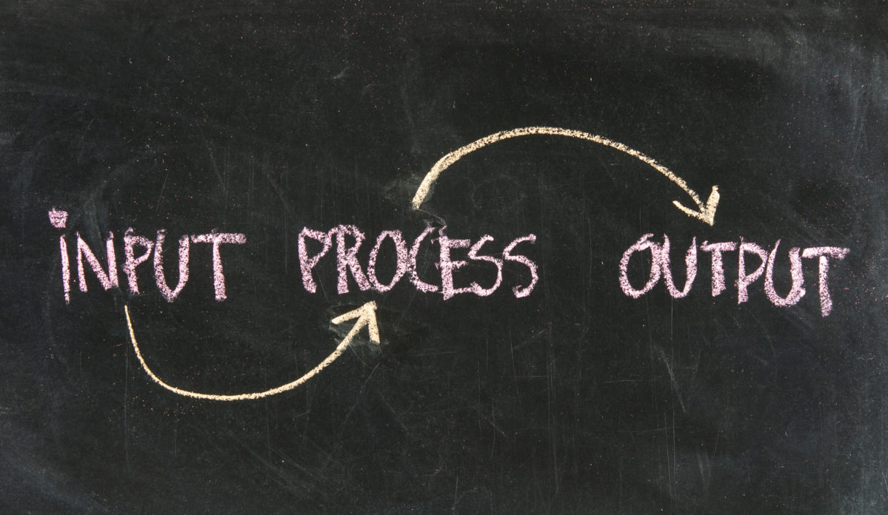

In programming, functions play a crucial role in making our code more organized, efficient, and reusable. These named blocks of code serve as mini-programs, enabling the division of code into smaller, manageable units. This tutorial delves into the concept of functions in Python, illustrating how they contribute to creating modular and reusable code.

* toc
{:toc}

## Functions as Equations

---

In the scientific context, equations are essential for representing various phenomena and establishing connections between variables. Similarly, functions in programming act as equations, enabling us to define relationships between inputs and outputs.

  

#### Declaring and Syntax: Defining the Equation

When expressing a relationship mathematically, you often define an equation by assigning variables, specifying mathematical operations, and articulating the relationship between inputs and outputs. In programming, functions mirror this concept, where the function name is declared, parameters (variables) are defined, and code is written to process inputs and produce desired outputs.

#### Parameters and Arguments: Input Values in the Equation

Just as variables act as placeholders for input values in equations, functions in programming use parameters to accept input values. When calling a function, arguments are provided, serving as input values processed by the function's internal logic.

#### Returning Values from Functions: Output of the Equation

Just as equations yield results, functions in programming can generate outputs or return values. After performing calculations or transformations on input data, a function produces a result. This result can be further utilized within the program or serve as a solution to a specific problem, analogous to how an equation's output provides valuable information in the scientific realm.

By treating functions as equations, a scientific mindset can be adopted in code development, with each function representing a distinct relationship or transformation.

## Function Declaration and Syntax

---

In Python, functions are defined using the `def` keyword, followed by the function name and a set of parentheses `()`. This section outlines the syntax and provides examples to illustrate the process.

Function Declaration Syntax:


def function_name(parameters):
    # Function body
    # Perform specific tasks
    # Return values if necessary


Here's an example of a simple function:


# Defining a function
def hello():
    print('Hello!')

# Calling the function
hello()

# Output:
# Hello!


In this example, we define a function named `hello()` that simply prints "Hello!". When we call the function using `hello()`, it executes the code inside the function's body, resulting in the output "Hello!".

#### Key Aspects of a Function

In a function, notice that:

- It starts with the keyword `def`.
- The function name follows the same rules as variable names (see [Python Definitions and Concepts](/workspace/python/definitions-and-concepts)).
- Parameters, if any, are specified within parentheses, separated by commas.
- A colon (`:`) at the end of the line is always required.
- The function body consists of indented statements.
- An optional return statement can be used to return values.

Functions in a program can come from three different sources:

- **From Python itself**: Numerous functions, like `print()` or `len()`, are integral parts of Python and are always available as built-in functions.
- **From Python's pre-installed modules**: Many useful functions, though used less often, are available in modules installed with Python. Using these functions requires additional steps.
- **Directly from our code**: We can write our functions, known as user-defined functions, freely within our code.

### Function Execution Flow

When a function is called, Python follows a specific flow: it jumps into the invoked function, executes its body, and then returns to the point after the invocation. It's crucial to have functions defined before calling them because Python reads code from top to bottom. Let's explore this with examples.


def my_function():
    print('Hello!')
    print('This is my function.')

my_function()
print('Bye!')

# Output:
# Hello!
# This is my function.
# Bye!


In this example, the function `my_function()` is defined and then called. When called, it executes the body of the function, i.e. prints "Hello!" and "This is my function.". After the function execution, Python moves to the next line, printing "Bye!". The flow is linear, starting from the top.

If the function call (`my_function()`) were placed before the function definition, Python would raise an error, specifically a `NameError: name 'my_function' is not defined`. This is because at the time of the function call, Python hasn't encountered the function definition yet. To avoid such errors, it's important to define functions before calling them.

**Caution: Avoiding Function-Variable Conflicts**: It is advisable to avoid having the same function and variable name. Here's why:


def my_function():
    print('This is my function')

my_function = 1
my_function()

# Output:
# TypeError: 'int' object is not callable


Observe that a function named `my_function` is defined, but then its name is assigned the value `1`. When attempting to call `my_function()`, Python raises a `TypeError` because the function name now refers to an integer, not a callable function. This can be resolved by using distinct names for functions and variables to prevent confusion and errors.

**Functions' Placement in Code**: Functions don't need to be placed at the top of the source file. Ensure functions are defined before calling them.


def main_function():
    print('This is the main function')
    first_function()
    print('Bye')

def my_function():
    print('This is my function')

main_function()

# Output:
# This is the main function
# This is my function
# Bye


In this example, `main_function()` calls `my_function()`, and both functions are defined before use, allowing error-free execution.

## Parameters and Arguments

---

Functions are powerful tools for performing tasks and operations. To make these functions flexible and adaptable, we use parameters and arguments to control their behavior and input.

A function's parameters are defined within the parentheses of the `def` statement. These parameters act as placeholders for the values the function will work with. When we call a function, we provide actual values, known as arguments, which customize the function's input for that specific invocation.

Consider the following example:


def hello(name):
    print(f'Hello, {name}!')

hello('Alice')
hello('Bob')

# Output:
# Hello, Alice!
# Hello, Bob!


In this case, the function `hello()` has a parameter `name`, and we customize its behavior by providing different arguments ('Alice' and 'Bob') during function calls.

It's essential to distinguish between parameters and arguments. Parameters are the variables listed in the function definition, while arguments are the values passed to the function during a call. In the example above, `name` is a parameter, and 'Alice' and 'Bob' are arguments.

### Types of Arguments

Python supports various ways of passing arguments to functions, including positional arguments, keyword arguments, and default values.

#### Positional Arguments

When you call a function, Python matches each argument based on their order in the function call. These are called positional arguments.

Here's an example:


def login_data(username, password):
    print(f'Username: {username}')
    print(f'Password: {password}')

login_data('Alice', 'alice123')
print()
login_data('Bob', 'boby1990')

# Output:
# Username: Alice
# Password: alice123

# Username: Bob
# Password: boby1990


In this example, we define a function named `login_data()` that takes two parameters: `username` and `password`. When we call the function `login_data()`, we provide a username and a password as arguments, in that order. For example, in the function call `login_data('Alice', 'alice123')`, the argument 'Alice' is assigned to the parameter `username`, and the argument 'alice123' is assigned to the parameter `password`. In the function body, these two parameters are used to display information about the login data being described.

#### Keyword Arguments

Keyword arguments allow passing arguments in any order by associating names with values.


def login_data(username, password):
    print(f'Username: {username}')
    print(f'Password: {password}')

login_data(username='Alice', password='alice123')
login_data(password='boby1990', username='Bob')


In this case, the order of the arguments doesn't matter because Python knows which parameter each argument should be matched with. Using keyword arguments can make your function calls more readable and less prone to errors, especially when dealing with functions that have multiple parameters.

#### Default Arguments

Default values for parameters make certain arguments optional. They provide a way to reduce complexity by assigning a default value if an argument is not provided.

We specify a default argument in the `def` statement, following the parameter name and an equal (`=`) sign. Here's an example:


def login_data(username='guest', password='guest123'):
    print(f'Username: {username}')
    print(f'Password: {password}')

login_data()
login_data(username='Alice')
login_data(password='boby1990')

# Output:
# Username: guest
# Password: guest123

# Username: Alice
# Password: guest123

# Username: guest
# Password: boby1990


In this example, the `login_data()` function has default values assigned to the parameters `username` and `password`. If no arguments are provided, default values are used. However, arguments can still override these defaults.

**Note**: When using default values, parameters without defaults should precede those with defaults in the function definition.

When calling a function, it's crucial to provide the correct number of arguments and match them to the corresponding parameters. Python raises errors when there are unmatched arguments.


def hello(name, greeting='Hello'):
    print(f'{greeting}, {name}!')

hello('Alice')
hello('Bob', 'Hi')
hello('Charlie', 'Hi', 'charlie321')

# Output:
# Hello, Alice!
# Hi, Bob!
# Traceback (most recent call last):
#   File "/home/joj-macho/Documents/python_examples/function_examples.py", line 6, in <module>
#     hello('Charlie', 'Hi', 'charlie321')
# TypeError: hello() takes from 1 to 2 positional arguments but 3 were given


The `hello()` function can be called with one or two arguments. If the number of arguments doesn't match the function definition, Python raises a `TypeError`.

##### Making an Argument Optional with Default Values

Default values for function parameters enable the creation of optional arguments. Users can choose whether or not to provide these arguments, enhancing the flexibility of function calls. Here's an example:


def hello(first_name, last_name, middle_name=''):
    if middle_name:
        name = f'Hello, {first_name} {middle_name} {last_name}!'
    else:
        name = f'Hello, {first_name} {last_name}!'

    return name

person_1 = hello('Alice', 'Lee')
person_2 = hello('Bob', 'Junior', 'Marley')

print(person_1)
print(person_2)

# Output:
# Hello, Alice Lee!
# Hello, Bob Junior Marley!


In this example, the `hello()` function has an optional `middle_name` parameter with an empty string as its default value. This allows users to decide whether to include a middle name in the full name greeting.

### Passing an Arbitrary Number of Arguments

For situations where the number of arguments is unknown, Python allows defining functions with a variable number of arguments using `*args` and `**kwargs`.

#### Arbitrary Positional Arguments - `*args`

The `*args` notation allows the function to accept any number of positional arguments, collecting them into a tuple.

Here's an example of a function that takes in an arbitrary number of numbers and calculates their average:


def calculate_average(*args):
    total = sum(args)
    average = total / len(args)
    return average

print(calculate_average(1, 2, 3))
print(calculate_average(2, 4, 6, 8))

# Output:
# 2.0
# 5.0


In this example, the `calculate_average()` function accepts any number of arguments and stores them in the `args` tuple.

#### Arbitrary Keyword Arguments - `**kwargs`

The `**kwargs` notation allows the function to accept any number of keyword arguments, collecting them into a dictionary.

Here's an example of a function that takes in arbitrary keyword arguments representing key-value pairs:


def display_info(**kwargs):
    for key, value in kwargs.items():
        print(f'{key}: {value}')

display_info(name='Alice', age=25, city='London')

# Output:
# name: Alice
# age: 25
# city: London


In this example, the `display_info()` function accepts any number of keyword arguments and stores them in the `kwargs` dictionary. The function iterates over the dictionary and prints each key-value pair.

## Returning Values from Functions

---

In Python, functions not only execute actions but can also produce results through the use of the `return` keyword. When a `return` statement is encountered, it immediately terminates the function's execution and sends a value back to the point of invocation. While not mandatory, a function not intended to produce a result will implicitly return `None` at the end.

### The `return` Statement

The `return` statement allows functions to explicitly specify a value to be returned. It consists of the `return` keyword followed by the value or expression that the function should return. This return value can be any valid Python object or expression.

Here's an example:


def add_numbers(a, b):
    sum_nums = a + b
    return sum_nums

result = add_numbers(3, 5)
print(result)

# Output:
# 8


In this example, the `add_numbers()` function returns the sum of two parameters using the `return` statement.

Returned values can be assigned to variables or used directly in expressions, allowing for further utilization within the program. This enhances code modularity and reusability. In the above `add_numbers()` function, the function returns the sum of the two parameters, `a` and `b`, which is then assigned to the variable `result` and printed.

### The `None` Value

In Python, `None` represents the absence of a value. It is the return value of functions that don't explicitly return anything. Functions like `print()` return `None`, signifying no specific output. The `None` value is a special constant and the only value of the `NoneType` data type.


def hello(name):
    print(f'Hello, {name}!')

result = hello('Alice')
print(result)

# Output:
# Hello, Alice!
# None


In this example, the `hello()` function prints a greeting but returns `None`. Python automatically adds a `return None` statement to functions without an explicit return.

## Variable Scope

---

In Python, functions (including lambdas) and comprehensions uniquely define their own scope, distinguishing them as the only structures in the language with this feature. On the other hand, modules and classes do not have a scope in the strictest sense; rather, they possess their own namespace. When a scope concludes, all names defined within it are automatically deleted.

Variable scope in programming denotes the specific region of the code where a variable is defined and dictates its visibility or accessibility from different parts of the program.

### Levels of Scoping in Python

Python follows the LEGB rule (Local, Enclosing Function, Global, and Built-ins) to determine the scope resolution order for variables. This order defines where Python looks for a variable reference. Let's delve into each level of scoping:

#### Local (L) Scope

Variables defined within a function are considered local. They exist only within the function's block and are inaccessible outside it. After the function execution, local variables cease to exist.


def example_function():
    x = 10  # Local variable
    print(x)

example_function()
print(x)

# Output:
# 10
# NameError: name 'x' is not defined


The function `example_function` defines a local variable `x`. The `print(x)` statement outside the function raises an error because `x` is not defined in the global scope.

#### Enclosing Function (E) Scope

This scope refers to the outer function's scope if a function is nested within another function. The inner function has access to its variables as well as those of the outer function.


def outer_function():
    outer_variable = 'I am from outer'

    def inner_function():
        print(outer_variable)

    inner_function()

outer_function()  

# Output:
# I am from outer


In the above example, the function `inner_function` has access to the variable `outer_variable` from its enclosing function (`outer_function`). When `outer_function` is called, it executes `inner_function`, resulting in the output "I am from outer".

##### Utilizing `nonlocal` Keyword:

In situations involving nested functions, the `nonlocal` keyword is useful when you want to modify a variable in an enclosing (but non-global) scope.


def outer_function():
    x = 10

    def inner_function():
        nonlocal x
        x = 20

    inner_function()
    print(x)

outer_function()

# Output:
# 20


The `nonlocal` keyword indicates that the variable `x` being modified is in the enclosing scope, not a local variable in the inner function. This distinction is valuable for managing variables in nested functions.

#### Global (G) Scope

Variables defined at the top level of a script or module are global. They are accessible throughout the entire module or script. While global variables are permissible, it's advised to use them sparingly to maintain code readability and maintainability.


global_variable = 20  # Global variable

def another_function():
    print(global_variable)

another_function()  

# Output:
# 20


Here, the `global_variable` is defined globally and accessible within the function `another_function`.

Modifying a Global Variable from Within a Function:


global_variable = 20  # Global variable

def modify_global():
    global global_variable
    global_variable = 30

modify_global()
print(global_variable) 

# Output:
# 30


The function `modify_global` uses the `global` keyword to modify the global variable, resulting in the output `30` when `print(global_variable)` is called.

#### Built-ins (B) Scope

The outermost scope includes Python's built-in names like `print`, `len`, and `str`. These names are universally accessible from any part of the code. Python provides a rich set of built-in functions that cover a wide range of tasks, from basic input/output to complex data manipulations.


# The len() function calculates the length of a sequence
numbers = [1, 2, 3, 4, 5]
length = len(numbers)
print('Length of numbers:', length) 

# Output:
# Length of numbers: 5

# The str() function converts a number to a string
integer_value = 42
string_value = str(integer_value)
print('Converted String:', string_value) 

# Output:
# Converted String: 42

# Combining Built-ins with Local and Global Scopes
global_variable = 100

def example_function():
    # Using a built-in function within a function
    local_variable = 50
    result = max(global_variable, local_variable)  # max() is a built-in function
    print('Maximum value:', result)

example_function() 

# Output:
# Maximum value: 100

# Built-in functions can be used in conjunction with variables from different scopes
combined_string = str(global_variable) + str(length)
print('Combined String:', combined_string)  

# Output:
# Combined String: 1005


The above demonstrates the direct use of built-in functions like `len()`, and `str()` without the need for explicit imports. These functions operate seamlessly within the Built-ins (B) scope. The second part of the example above illustrates how built-in functions can be combined with variables from different scopes. The `max()` function, a built-in function, is used within the `example_function()`. Additionally, the `str()` function is used to concatenate the global variable and the length variable, showcasing the interplay between local, global, and built-in scopes.

### Using the `main()` Function

Encapsulating the main code of a program into a function called `main()` is a common practice, especially for more extensive programs. This approach enhances code organization and readability by removing the main logic from the global scope.

The `main()` function can be defined anywhere in the program, but it's often placed near the start or end for clarity. When both your code and function names are readable, having `main()` at the beginning serves as a concise summary of the program's functionality.

Let's explore a program that utilizes a `main()` function:


# Define the main function
def main():
    print('Welcome to the Python Program!')
    user_name = input('Enter your name: ')
    greet_user(user_name)
    perform_calculation(5, 7)
    print('Program execution complete.')

# Additional functions used in the main function
def greet_user(name):
    print(f'Hello, {name}!')

def perform_calculation(a, b):
    result = a + b
    print(f'The result of the calculation is: {result}')

if __name__ == '__main__':
    main()

# Output:
# Welcome to the Python Program!
# Enter your name: Joj
# Hello, Joj!
# The result of the calculation is: 12
# Program execution complete.


In this example, the `main()` function handles the logic of the program. It orchestrates various tasks by calling other functions. The structure not only enhances readability but also allows for clear modularization of different aspects of the program.

#### Benefits of Using `main()`

1. **Code Organization:** The main logic is confined within the `main()` function, providing a clear structure to the program.

2. **Readability:** By isolating the main code, the overall readability of the script is improved, making it easier for developers to understand the program's flow.

3. **Modularization:** Functions like `greet_user()` and `perform_calculation()` can be developed and tested independently, promoting modular code design.

4. **Testability:** The `main()` function becomes a natural logic for testing since it orchestrates the program's execution.

## Documenting Functions

---

In Python, documenting functions is a good practice to enhance code readability and provide valuable information about the purpose and usage of a function. This is commonly done using a docstring, which is a string literal placed as the first statement in a function.

### Using Docstrings

A docstring is delimited by three single or double quotes (`'''` or `"""`) and is placed immediately after the function definition. It serves as a concise yet informative description of what the function does, what parameters it expects, and what it returns.


def hello(name):
    '''Print a greeting to the user by name.'''
    print(f'Hello, {name}!')


In this example, the docstring for the `hello()` function provides a clear description: "Print a greeting to the user by name.". This documentation is valuable for anyone reading or using the code, as it offers insights into the function's purpose.

### Accessing Docstrings

Python provides a built-in function called `help()` that can be used to access the docstring of a function interactively. Simply pass the function name as an argument to `help()`.

Here's an example for accessing the above `hello()` function:


>>> help(hello)
Help on function hello in module __main__:

hello(name)
    Print a greeting to the user by name.


Executing `help(greet)` in an interactive Python environment would display the docstring for the `hello()` function.

### Writing Comprehensive Docstrings

For more complex functions or functions with multiple parameters, it's beneficial to provide detailed information in the docstring. Include explanations of each parameter, their data types, and any default values. Additionally, specify the type of value the function returns.


def calculate_average(*numbers):
    '''
    Calculate the average of a list of numbers.

    Parameters:
    * numbers (float): A variable number of numerical values.

    Returns:
    float: The average of the input numbers.
    '''
    total = sum_nums(numbers)
    average = total / len(numbers)
    return average


In this example, the docstring for the `calculate_average()` function not only describes its purpose but also details the expected parameter and return types.

By consistently documenting functions using docstrings, developers can create more maintainable and understandable code, facilitating collaboration and reducing the learning curve for others who interact with the codebase.

## Built-in Functions

---

Python provides a wealth of built-in functions that streamline various tasks in your code. You might already be familiar with some, such as `print()`, `len()`, `type()`, `list()`, `input()`, `round()`, and many others.

Let's explore a selection of frequently used built-in functions along with examples. For a comprehensive list and detailed descriptions, you can refer to the [official Python documentation](https://docs.python.org/3/library/functions.xhtml){:target='_blank'}.

### Commonly Used Built-in Functions

<table class="table table-dark table-responsive table-sm table-striped table-hover caption-top">
    <caption>Table: Frequently Used Built-in Functions in Python</caption>
    <thead>
        <tr>
            <th scope="col">Function</th>
            <th scope="col">Description</th>
            <th scope="col">Example</th>
        </tr>
    </thead>
    <tbody class="table-group-divider">
        <tr>
            <th scope="row"><code>print()</code></th>
            <td>Outputs a message or value to the console.</td>
            <td><code>print('Hello, World!')</code></td>
        </tr>
        <tr>
            <th scope="row"><code>len()</code></th>
            <td>Returns the length (number of items) of an object.</td>
            <td><code>length = len([1, 2, 3, 4])</code></td>
        </tr>
        <tr>
            <th scope="row"><code>type()</code></th>
            <td>Returns the type of an object.</td>
            <td><code>data_type = type(42)</code></td>
        </tr>
        <tr>
            <th scope="row"><code>range()</code></th>
            <td>Generates a sequence of numbers within a specified range.</td>
            <td><code>numbers = list(range(1, 6))</code></td>
        </tr>
        <tr>
            <th scope="row"><code>input()</code></th>
            <td>Reads a line from the console.</td>
            <td><code>name = input('Enter your name: ')</code></td>
        </tr>
        <tr>
            <th scope="row"><code>int()</code></th>
            <td>Converts a value to an integer.</td>
            <td><code>integer_value = int('42')</code></td>
        </tr>
        <tr>
            <th scope="row"><code>str()</code></th>
            <td>Converts a value to a string.</td>
            <td><code>text = str(3.14)</code></td>
        </tr>
        <tr>
            <th scope="row"><code>list()</code></th>
            <td>Converts an iterable to a list.</td>
            <td><code>my_list = list((1, 2, 3))</code></td>
        </tr>
        <tr>
            <th scope="row"><code>max()</code></th>
            <td>Returns the largest item in an iterable or the largest of two or more arguments.</td>
            <td><code>maximum = max(4, 7, 1, 9)</code></td>
        </tr>
        <tr>
            <th scope="row"><code>min()</code></th>
            <td>Returns the smallest item in an iterable or the smallest of two or more arguments.</td>
            <td><code>minimum = min(5, 2, 8, 1)</code></td>
        </tr>
    </tbody>
</table>

Here are examples of Frequently Used Built-in Functions


>>> # 1. print()
>>> message = 'Python is amazing!'
>>> print(message)
Python is amazing!
>>> 
>>> # 2. len()
>>> numbers = [1, 2, 3, 4, 5]
>>> length = len(numbers)
>>> print(length)
5
>>> 
>>> # 3. range()
>>> numbers_range = range(5)
>>> print(list(numbers_range))
[0, 1, 2, 3, 4]
>>> 
>>> # 4. type()
>>> value = 42
>>> data_type = type(value)
>>> print(data_type)
<class 'int'>
>>> 
>>> # 5. max()
>>> numbers = [10, 5, 8, 20, 15]
>>> max_value = max(numbers)
>>> print(max_value)
20
>>> 
>>> # 6. min()
>>> min_value = min(numbers)
>>> print(min_value)
5
>>> 
>>> # 7. sum()
>>> sum_value = sum(numbers)
>>> print(sum_value)
58
>>> 
>>> # 8. sorted()
>>> sorted_numbers = sorted(numbers)
>>> print(sorted_numbers)
[5, 8, 10, 15, 20]
>>> 
>>> # 9. input()
>>> user_input = input('Enter something: ')
Enter something: Hello!
>>> print(user_input)
Hello!
>>> 
>>> # 10. format()
>>> name = 'John'
>>> age = 30
>>> message = 'My name is {}, and I am {} years old.'.format(name, age)
>>> print(message)
My name is John, and I am 30 years old.


These examples showcase the versatility of Python's built-in functions. Feel free to explore and experiment with these functions to enhance your coding experience.

## Advanced Python Functions

*Note: A comprehensive tutorial covering the following content is available. Check out the [Advanced Python Functions tutorial](/workspace/python/advanced-functions){:target='_blank'} for an in-depth exploration.*

### Recursion

Recursion occurs when a function calls itself. This technique is beneficial when you need to repeat the entire logic of a function, offering an alternative to loops. Consider the following example:


def countdown(n):
    if n <= 0:
        print('Lift off!')
    else:
        print(n)
        countdown(n - 1)

countdown(5)

# Output:
# 5
# 4
# 3
# 2
# 1
# Lift off!


In this example, the `countdown` function calls itself recursively to achieve the countdown effect. Keep in mind that the effective maximum recursion depth in CPython is typically 997. 

### Closures

Closures involve creating a function that builds and returns another function, known as a closure. These closures enclose one or more nonlocal names, essentially acting as a "function factory". Consider the following example:


def outer_function(x):
    def inner_function(y):
        return x + y
    return inner_function

closure_instance = outer_function(10)
result = closure_instance(5)

# Output:
# <function outer_function.<locals>.inner_function at 0x71471684bf60>
# 15


Here, `outer_function` returns `inner_function`, creating a closure. The closure retains access to the nonlocal variable `x`, showcasing the power of closures.

### Lambdas

Lambdas are anonymous functions composed of a single expression. The structure includes a parameter list on the left side of the colon and a return expression on the right. Here's an example below:


multiply = lambda x, y: x * y
result = multiply(3, 4)
print(result)

# Output:
# 12


In this instance, the lambda function `multiply` takes two arguments and returns their product. Lambdas are particularly useful for short, on-the-fly operations.

### Decorators

Decorators enable you to modify the behavior of a function by wrapping it in an additional layer of logic. This offers a powerful way to extend functionality without rewriting the original function. Consider the following decorator example:


def my_decorator(func):
    def wrapper():
        print('Something is happening before the function is called.')
        func()
        print('Something is happening after the function is called.')
    return wrapper

@my_decorator
def say_hello():
    print('Hello!')

say_hello()

# Output:
# Something is happening before the function is called.
# Hello!
# Something is happening after the function is called.


In this example, the `my_decorator` function wraps the `say_hello` function, providing additional functionality before and after its execution.

Ready to delve deeper? Check out the [Advanced Python Functions tutorial](/workspace/python/advanced-functions) for an in-depth exploration of recursion, closures, lambdas, and decorators, and take your Python programming skills to the next level.

## Practical Applications and Use Cases

---

Understanding Python functions is essential for writing flexible and maintainable code. Here are practical applications and use cases for mastering Python functions:

- **Code Reusability and Modularity**: When building large-scale applications, you often need to encapsulate functionality within functions. Functions enable you to encapsulate a block of code that performs a specific task. This promotes code reuse and modularity, making it easier to maintain and update your codebase.


def calculate_discount(price):
    discount_rate = 0.1  # Local variable
    discounted_price = price - (price * discount_rate)
    return discounted_price

print(calculate_discount(100))


Variable scoping allows you to create local variables within functions, preventing unintended interference with other parts of the program.

- **Data Processing and Analysis**: Functions are crucial for processing and analyzing data. You can create functions to encapsulate algorithms, making data manipulation more readable and manageable.


def average(numbers):
    '''Calculate the average of a list of numbers.'''
    return sum(numbers) / len(numbers)

data = [10, 15, 20, 25, 30]
print(average(data))


- **Web Development: Backend Logic**: In web development, functions handle backend logic, processing user requests, interacting with databases, and generating dynamic content.


def get_user_data(user_id):
    '''Retrieve user data from the database.'''
    # Database query logic here
    return user_data

user_id = 123
user_info = get_user_data(user_id)


- **Automation Scripts**: Functions are the building blocks of automation scripts. They allow you to structure your code to perform specific tasks, making automation more efficient.


def backup_files(source_folder, destination):
    '''Copy files from source to destination for backup.'''
    # Copy files logic here

source_folder = '/path/to/data'
backup_location = '/path/to/backup'
backup_files(source_folder, backup_location)


- **Machine Learning and Data Science**: Functions play a vital role in machine learning pipelines and data science workflows. They encapsulate data preprocessing steps, model training, and evaluation.


def train_model(training_data):
    '''Train a machine learning model.'''
    # Model training logic here
    return trained_model

data = load_data('dataset.csv')
model = train_model(data)


- **GUI Applications: Event Handling**: In graphical user interface (GUI) applications, functions handle events like button clicks or menu selections. They provide the logic for what should happen in response to user actions.


def button_click_handler():
    '''Handle button click event.'''
    # Button click logic here

create_button('Click me', on_click=button_click_handler)


- **Game Development: Game Logic**: Functions are employed to define game logic, such as character movement, collision detection, and scoring. They contribute to organizing complex game systems.


def check_collision(player, obstacles):
    '''Check for collisions between the player and obstacles.'''
    # Collision detection logic here
    return collided

player_position = (x, y)
obstacles = load_obstacles()
if check_collision(player_position, obstacles):
    game_over()


### More Examples

Feel free to browse my [GitHub page](https://github.com/joj-macho){:target='_blank'} for more comprehensive programs.

Discover more programs that use functions in my [Python Playground](https://github.com/joj-macho/Pythological-Playground){:target='_blank'} repository. For a broader range of programs, you can explore my [GitHub Repositories](https://github.com/joj-macho?tab=repositories){:target='_blank'}. For hands-on practice and reinforcement of these concepts, check out the [Python Functions Exercises](https://github.com/joj-macho/Python-Exercise-Playground/blob/main/07_functions.ipynb){:target='_blank'}.

## Summary

---

Great job! You've successfully grasped the essentials of Python functions, the building blocks of code organization. Functions allow you to break down complex tasks into more manageable units. Through this tutorial, you've acquired the skills to create, call, and pass data to functions, a key capability for developing structured and reusable code.

As you continue your exploration of Python, the next logical step is to dive into [Python Modules and Packages](/workspace/python/python-modules). This will enable you to organize and manage your code on a larger scale, fostering modular and collaborative development practices.