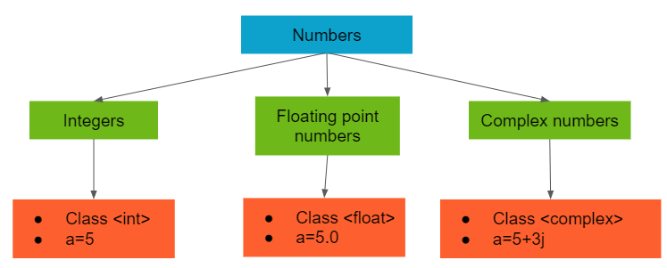

Numbers are the backbone of programming, facilitating various tasks such as keeping score in games, representing data in visualizations, or handling financial calculations in web applications. Python, being a versatile language, provides several ways to handle numeric data. This tutorial will explore numeric data types in Python and provide practical examples and use cases for each data type. This tutorial will also discuss the potential limitations and challenges associated with numeric data types and provide best practices for handling type errors and exceptions.

* toc
{:toc}

<figure>
    

     
     <figcaption>Numbers in Python. Image source: <a href="https://mohitmehlawat.medium.com/numbers-in-python-a09249a2ffa4" target="_blank">Medium</a></figcaption>
    

</figure>

## Integers (`int`)

---

Integers are whole numbers, including the negatives, without any decimal points. They are ideal for representing counts, quantities, or any discrete values in Python. Internally, Python represents integers using either 4 or 8 bytes of computer memory, allowing for a specific range of values to be stored efficiently. Integers (`int`) in Python store whole numbers, and they are always signed, meaning they can be positive or negative. Unlike some other programming languages, Python integers have no maximum value, providing flexibility in representing large numbers.

Integer Representation includes:

- **Decimal Base**: Integers use a decimal base (base-10) by default, like `42` or `-1`.
- **Other Bases**: They can also be specified in binary (e.g., `0b101010`), octal (`0o52`), or hexadecimal (`0x2A`).

To declare an integer variable in Python, use the following syntax: `variable_name = integer_value`. Here's an example illustrating integer initialization:


>>> x = 42
>>> y = -1
>>> z = 0
>>> print(type(x), type(y), type(z))
<class 'int'> <class 'int'> <class 'int'>


### Arithmetic Operations with Integers

Integers support various arithmetic operations, including addition (`+`), subtraction (`-`), multiplication (`*`), and division (`/`). These operations can be performed on integer variables, resulting in integer values.


>>> 2 + 3
5
>>> 3 - 2
1
>>> 2 * 3
6
>>> 3 / 2
1.5


Exponents, represented by `**`, are used for raising integers to a specific power:


>>> 2 ** 3
8
>>> 2 ** 4
16


Python provides two types of division for integers: regular division (`/`) and floor division (`//`). Regular division yields a floating-point result, while floor division returns the largest integer less than or equal to the regular division result.


>>> 7 / 3
2.3333333333333335
>>> 7 // 3
2


The modulo operator (`%`) calculates the remainder of the division between two integers, and it finds utility in various tasks, such as checking for even or odd numbers or cycling through value sequences.


>>> 7 % 2
1
>>> 148 % 2
0
>>> 15 % 7
1


When 7 is divided by 2, the remainder is 1, therefore, the number 7 is odd. When 148 is divided by 2, there is no remainder (even number). 

If you need both floor division (`//`) and modulo (`%`) on the same operands, Python provides the `divmod()` function, returning the results in a tuple. For example, `divmod(a, b)` is equivalent to `(a // b, a % b)`.


>>> 7 // 3
2
>>> 7 % 3
1
>>> divmod(7, 3)
(2, 1)


Mathematical expressions in Python follow a set of precedence rules, and operations within the same precedence level are evaluated from left to right. Expressions enclosed in parentheses are always performed first. Below is a table illustrating the precedence of various mathematical operations:

<table class="table table-dark table-responsive table-sm table-striped table-hover caption-top">
    <caption>Table: Mathematical Operator Precedence in Python</caption>
    <thead>
        <tr>
            <th scope="col">Precedence</th>
            <th scope="col">Operator</th>
            <th scope="col">Description</th>
        </tr>
    </thead>
    <tbody class="table-group-divider">
        <tr>
            <th scope="row">1</th>
            <td><code>( )</code></td>
            <td>Grouping with Parentheses</td>
        </tr>
        <tr>
            <th scope="row">2</th>
            <td><code>**</code></td>
            <td>Exponentiation </td>
        </tr>
        <tr>
            <th scope="row">3</th>
            <td><code>-x, +x</code></td>
            <td>Negation (Unary)</td>
        </tr>
        <tr>
            <th scope="row">4</th>
            <td><code>*, /, //, %</code></td>
            <td>Multiplication, Division, Floor Division, Modulus</td>
        </tr>
        <tr>
            <th scope="row">5</th>
            <td><code>+, -</code></td>
            <td>Addition, Subtraction</td>
        </tr>
    </tbody>
</table>

Here's an example of precedence in action:


>>> (2 + 3) * (4 - 1)
15
>>> 4 ** 2 + (9 - 5) / 4 * 5
21.0


- `(2 + 3) * (4 - 1)`: The expression inside the parentheses is evaluated first, resulting in `5 * 3`, which equals 15.

- `4 ** 2 + (9 - 5) / 4 * 5`: Following the precedence, the expression starts with the subtraction inside the parentheses `(9 - 5)` which results in `4`. Then the exponentiation operation, `4 ** 2`, which equals `16`.  After that, division is performed on the result of the subtraction, `4 / 4`, yielding `1.0`. Finally, the multiplication by `5` is carried out, resulting in `5.0`. The last step involves adding the initial exponentiation result `16` to the final multiplication result `5.0`, which gives the overall answer of `21.0`.

In Python, spacing in expressions does not affect evaluation but enhances readability, helping developers quickly discern the operations' priority.

#### Bitwise Operators

Python also has bitwise operators, which allow manipulation of individual bits within integers. These operators perform operations at the bit level, offering powerful tools for certain programming tasks. Here are the main bitwise operators:

- **AND (`&`):** Performs a bitwise AND operation.
- **OR (`|`):** Performs a bitwise OR operation.
- **XOR (`^`):** Performs a bitwise XOR (exclusive OR) operation.
- **NOT (`~`):** Performs a bitwise NOT operation, inverting the bits.
- **Left Shift (`<<`):** Shifts the bits to the left by a specified number of positions.
- **Right Shift (`>>`):** Shifts the bits to the right by a specified number of positions.


>>> 5 & 3   # Binary: 0101 & 0011 = 0001
1
>>> 5 | 3   # Binary: 0101 | 0011 = 0111
7
>>> 5 ^ 3   # Binary: 0101 ^ 0011 = 0110
6 
>>> ~5      # Binary: ~0101 = 1010 (signed 2's complement representation)
-6
>>> 5 << 1  # Binary: 0101 << 1 = 1010
10 
>>> 5 >> 1  # Binary: 0101 >> 1 = 0010
2


These operators are particularly useful in scenarios where manipulation of individual bits is necessary, such as in low-level programming or when dealing with binary representations of data.

### Integer-Specific Methods

Python's `int` type comes with several methods that allow you to perform various operations and retrieve information about integers. Here are some common methods:

#### `int.bit_length()`

Returns the number of bits required to represent the integer in binary, excluding the sign and leading zeros.


>>> number = 42
>>> number.bit_length()
6


#### `int.to_bytes(length, byteorder, signed=False)`

Returns an array of bytes representing an integer. The length parameter specifies the number of bytes in the resulting array, and byteorder specifies the byte order.


>>> number = 42
>>> byte_array = number.to_bytes(2, byteorder='big')
>>> byte_array
b'\x00*'


### `int.from_bytes(bytes, byteorder, signed=False)`

Creates an integer from a given array of bytes. The byteorder parameter specifies the byte order.


>>> byte_array = b'\x00*'
>>> new_number = int.from_bytes(byte_array, byteorder='big')
>>> new_number
42


### `int.conjugate()`

Returns the complex conjugate of the integer. This method is useful when dealing with complex numbers.


>>> number = 42
>>> complex_number = complex(number, 3)
>>> complex_number
(42+3j)
>>> complex_number.conjugate()
(42-3j)


These are just a few examples of the methods available for integers in Python. Depending on your needs, you may find other methods provided by the `int` type in the Python documentation.

Integers are versatile and commonly used for various purposes, such as counting occurrences, representing indices in data structures, or measuring quantities in discrete units.

## Floating-Point Numbers (float)

---

Floating-point numbers, often referred to as floats, are a crucial numeric data type in Python that allows the representation of numbers with decimal parts. Unlike integers, floats can handle both whole numbers and fractions, making them suitable for scenarios where precision is essential, such as scientific calculations, financial modeling, and graphical representations.

Internally, Python uses double-precision IEEE 754 floating-point numbers to store float values, a format that comes with inherent limits and considerations. If you're interested in a deeper view on floating-point arithmetic, you can explore the article [What Every Computer Scientist Should Know About Floating-Point Arithmetic](https://docs.oracle.com/cd/E19957-01/806-3568/ncg_goldberg.html){:target='_blank'} by David Goldberg.

Creating a floating-point variable in Python is straightforward. You can use the following syntax: `variable_name = float_value`. Here's a simple example:


>>> pi = 3.14159
>>> radius = 2.5


In this example, `pi` and `radius` are float variables representing the mathematical constant $\pi$ (pi) and the radius of a circle, respectively. Floats play a vital role in a wide range of applications, offering the necessary precision for various computational tasks.

### Arithmetic Operations with Floating-Point Numbers

Floating-point numbers support standard arithmetic operations, similar to integers. These operations include addition (`+`), subtraction (`-`), multiplication (`*`), and division (`/`). Additionally, floating-point numbers allow for exponentiation (`**`) and modulus (`%`) operations.


>>> 0.1 + 0.1
0.2
>>> 0.2 - 0.1
0.1
>>> 2 * 0.1
0.2
>>> 0.3 / 0.1
2.9999999999999996


With floats, you get 15 to 17 digits of precision. However, small rounding errors may occur due to the universal CPU need to store digits in the binary number system, making floats not always perfectly accurate. For example, the operation `0.3 / 0.1` above results in an extra "2.9999999999999996" due to Python's handling of floating-point division.

#### Precision Challenges

One challenge with floating-point numbers is precision. Due to the way computers represent real numbers in binary, certain values cannot be precisely represented, leading to unexpected results in calculations. Precision and rounding issues can arise when working with floats, as computers have finite memory to represent these numbers. For instance:


>>> 0.1 + 0.2
0.30000000000000004
>>> 3 * 0.1
0.30000000000000004


This occurs because Python aims to represent the result as precisely as possible, which can be challenging given how computers internally store numbers.

Floating-point numbers have limited precision, and arithmetic operations may result in rounding errors. Consider using the `decimal` module for more precise decimal arithmetic.


>>> from decimal import Decimal
>>> 
>>> x = Decimal('0.1')
>>> y = Decimal('0.2')
>>> sum_result = x + y
>>> sum_result
Decimal('0.3')


The `decimal` module provides the `Decimal` type, offering higher precision. In this example, adding "0.1" and "0.2" results in the accurate value of "0.3". Using the `decimal` module is particularly crucial when precision is essential, such as in financial calculations.

For more information on floating-point accuracy, you can refer to the official Python documentation on [Floating Point Arithmetic: Issues and Limitations](https://docs.python.org/3/tutorial/floatingpoint.html?highlight=floating%20point%20numbers){:target='_blank'}. Additionally, details about the decimal module can be found [here](https://docs.python.org/3/library/decimal.html?highlight=floating%20point%20numbers){:target='_blank'}.

### Floating-Point-Specific Methods and Functions

Python provides useful functions and methods specifically designed for working with floating-point numbers. These can assist in rounding, formatting, and other operations. Here are a few examples:

#### `float.as_integer_ratio()`

Returns a pair of integers whose ratio is equal to the original floating-point number. This is useful for obtaining a rational representation of a floating-point value.


>>> my_float = 3.75
>>> ratio = my_float.as_integer_ratio()
>>> ratio
(15, 4)


`as_integer_ratio()` is used to obtain a pair of integers representing the ratio of the original floating-point number (`3.75`). The result `(15, 4)` indicates that the ratio is 15:4, which is equivalent to 3.75.

#### `float.is_integer()`

Checks if the floating-point number represents an integer. Returns `True` if the number is an integer, otherwise `False`.


>>> integer_check = 5.0
>>> result = integer_check.is_integer()
>>> result
True


The `is_integer()` method checks if the floating-point number (5.0 in this case) represents an integer. Since it does, the result is `True`.

#### `float.hex()`

Returns a string representation of the hexadecimal value of the floating-point number. This can be useful for serialization and unique identification.


>>> hex_representation = 3.14159.hex()
>>> hex_representation
'0x1.921f9f01b866ep+1'


The `hex()` method converts the floating-point number (`3.14159`) to its hexadecimal representation. The result is a string that uniquely identifies the floating-point value.

#### `float.fromhex(s)`

Converts a string representing a hexadecimal floating-point number back to its float equivalent.


>>> hex_string = '0x1.921f9f01b866ep+1'
>>> converted_float = float.fromhex(hex_string)
>>> converted_float
3.14159


Using `fromhex()`, the hexadecimal string (`0x1.921f9f01b866ep+1`) is converted back to its float equivalent (`3.14159`).

#### `round()`

Rounds a floating-point number to the nearest integer or to a specified number of decimal places.


>>> rounded_value = round(3.14159)
>>> rounded_value
3
>>>
>>> precise_rounding = round(3.14159, 2)
>>> precise_rounding
3.14


The `round()` function is applied to round `3.14159` to the nearest integer (resulting in `3`) and to two decimal places (resulting in `3.14`).

#### `abs()`

Returns the absolute value of a floating-point number.


>>> absolute_value = abs(-5.678)
>>> absolute_value
5.678


The `abs()` function calculates the absolute value, ensuring that the result is always non-negative (`5.678` in this case).

These methods and functions enhance the capabilities of working with floating-point numbers in Python, providing functionalities for representation, identification, and validation. Understanding these tools is crucial for precise and reliable handling of real numbers in various applications.

### Decimal and Fraction Numeric Types

In addition to integers and floating-point numbers, Python provides two additional numeric data types: `Decimal` and `Fraction`. These types cater to scenarios where precise handling of decimal numbers or fractions is crucial.

The `Decimal` type is suitable for representing fixed-point decimal numbers with high precision. To use `Decimal`, you need to import it from the `decimal` module. Here's an example:


>>> from decimal import Decimal
>>> decimal_number = Decimal('3.141592653589793238')
>>> decimal_number
Decimal('3.141592653589793238')


In this example, `Decimal('3.141592653589793238')` initializes a Decimal object with the value of $\pi$ to high precision.

The `Fraction` type, available in the `fractions` module, is designed for accurate representation of fractions. Here's an example:


>>> from fractions import Fraction
>>> fraction_number = Fraction(2, 3)
>>> fraction_number
Fraction(2, 3)
>>> print(fraction_number)
2/3


In this case, `Fraction(2, 3)` creates a Fraction object representing the fraction `2/3`.

## Complex Numbers

---

In addition to integers and floating-point numbers, Python supports complex numbers, a data type specifically designed for handling quantities with both real and imaginary components. Complex numbers find applications in various fields such as mathematics, physics, engineering, and signal processing.

In mathematics, an imaginary number involves the square root of negative one, denoted as $i$. While this concept may seem perplexing, especially when considering there's no real number multiplied by itself to yield negative one, imaginary numbers are integral to solving certain mathematical problems.

In Python, complex numbers are expressed as `a + bj`, where `a` is the real part, `b` is the imaginary part, and `j` represents the imaginary unit. To create a complex variable, use the syntax: `variable_name = complex(real_part, imaginary_part)`.


>>> z = complex(2, 3)
>>> z
(2+3j)


Alternatively, Python also recognizes complex numbers when they are created with the imaginary unit `j` and typically surrounds them in parentheses when printing:


>>> z = 2 + 3j
>>> z
(2+3j)


### Arithmetic Operations with Complex Numbers

Complex numbers support standard arithmetic operations, similar to integers and floats. These operations include addition (`+`), subtraction (`-`), multiplication (`*`), and division (`/`). Additionally, complex numbers allow for exponentiation (`**`) and modulus (`%`) operations.


>>> z = complex(2, 3)
>>> w = 1 + 2j
>>> z + w
(3+5j)
>>> z - w
(1+1j)
>>> z * w
(-4+7j)
>>> z / w
(1.6-0.2j)
>>> z ** 2
(-5+12j)


Additionally, complex numbers have specific operations such as calculating the complex conjugate and finding the absolute value.

### Complex-Specific Functions and Methods

Python provides functions and methods specifically designed for working with complex numbers, allowing you to manipulate both their real and imaginary parts, find the conjugate, calculate the absolute value, and more. These functionalities are accessible by importing the `cmath` module. Here are some common ones:

#### `real` and `imag`

The `real` attribute returns the real part of the complex number, while the `imag` attribute returns the imaginary part.


>>> z = complex(2, 3)
>>> z.real
2.0
>>> z.imag
3.0


#### `conjugate`

Returns the complex conjugate of a complex number.


>>> z = complex(2, 3)
>>> z.conjugate()
(2-3j)


The `conjugate()` method flips the sign of the imaginary part.

#### `cmath.phase()`

Returns the phase (angle) of a complex number in radians.


>>> import cmath
>>> z = complex(2, 3)
>>> cmath.phase(z)
0.982793723247329


The `phase()` function calculates the angle formed by the complex number in the complex plane.

#### `cmath.polar()`

Returns the polar coordinates (r, phi) of a complex number, where `r` is the magnitude and `phi` is the phase angle in radians.


>>> import cmath
>>> z = complex(2, 3)
>>> cmath.polar(z)
(3.605551275463989, 0.982793723247329)


The `polar()` function provides the magnitude and angle of the complex number in polar form.

#### `cmath.rect()`

Converts polar coordinates (magnitude, phase) to a complex number.


>>> import cmath
>>> z = complex(2, 3)
>>> cmath.rect(3.605551275463989, 0.982793723247329)
(2+3j)


The `rect()` function creates a complex number from its polar coordinates.

Other available functions include trigonometric functions, square root, and exponential functions:

#### `abs()`

Calculates the absolute value (magnitude) of a complex number.


>>> import cmath
>>> z = complex(2, 3)
>>> abs(z)
3.605551275463989


#### `sqrt()`

Calculates the square root of a complex number.


>>> import cmath
>>> z = complex(2, 3)
>>> cmath.sqrt(z)
(1.6741492280355401+0.8959774761298381j)


#### `exp()`

Calculates the exponential of a complex number.


>>> import cmath
>>> z = complex(2, 3)
>>> cmath.exp(z) 
(-7.315110094901103+1.0427436562359045j)


#### Trigonometric Functions


>>> import cmath
>>> z = complex(2, 3)
>>> 
>>> cmath.sin(z)
(9.15449914691143-4.168906959966565j)
>>> cmath.cos(z)
(-4.189625690968807-9.109227893755337j)
>>> cmath.atan(z)
(1.4099210495965755+0.22907268296853878j)


By using these complex-specific functions and methods, you can perform various calculations and manipulations on complex numbers.

## Working with Numeric Data in Python

---

### Type Casting

Type casting, also known as type conversion, is a method of converting the value of one data type to another data type. Python, being an object-oriented language, utilizes classes to define data types, allowing for type casting through the use of constructor functions of the respective data type classes.

#### Integer Conversion: `int()`

The `int()` function converts different data types into an integer. It can accept various input types, including:
- Integer literals
- Float literals
- String literals representing whole numbers.

Example:


>>> int(5.6)
5
>>> int('10')
10


#### Float Conversion: `float()`

The `float()` function converts different data types into a float number. It can accept various input types, including:
- Integer literals
- Float literals
- String literals representing integer or float numbers

Example:


>>> float(5)
5.0
>>> float('3.14')
3.14


#### String Conversion: `str()`

The `str()` function converts all data types into a string.

Example:


>>> str(42)
'42'
>>> str(3.14)
'3.14'


In Python, you can convert between different numeric data types using implicit or explicit type conversion. Implicit type conversion occurs automatically when Python converts a value from one type to another without any explicit instructions. Explicit type conversion, also known as type casting, involves manually converting a value from one type to another using specific functions or methods.

Here are some examples of Implicit and Explicit Type Conversion


>>> # Implicit type conversion
>>> x = 5
>>> y = 2.5
>>> x + y   # int + float = float
7.5
>>> 
>>> # Type casting to float
>>> integer_value = 42
>>> float(integer_value)
42.0
>>> 
>>> # Type casting to integer
>>> float_number = 3.14
>>> int(float_number)
3
>>> 
>>> # Type casting to complex
>>> real_part = 2
>>> imaginary_part = 3
>>> complex(real_part, imaginary_part)
(2+3j)


These examples demonstrate both implicit and explicit type conversion, showcasing how Python handles different data types and their conversions effectively.

### Working with Long Numbers

Python allows you to enhance the readability of long numbers using underscores and provides a convenient way to commify large numbers.

#### Underscores in Numbers

When working with long numbers, you can enhance their readability by grouping digits using underscores. Python allows you to use underscores as visual separators in numbers without affecting their values. Let's see this feature below:


>>> speed_of_light = 299_792_458
>>> print(speed_of_light)
299792458


In the example above, we defined the variable `speed_of_light` with underscores to group the digits. When we print the value, Python ignores the underscores and displays only the digits. This feature works for both integers and floats. Regardless of whether you group digits in threes or not, the value remains unchanged. For Python, "1000", "1_000", and "10_00" are all equivalent.

#### Commifying Numbers

In addition to using underscores to improve the readability of long numbers, you can further enhance their legibility by adding commas. This practice, often referred to as "commifying" numbers, makes large numerical values easier to interpret at a glance.

Python provides a straightforward way to add commas to numbers without altering their values. You can use the f-string formatting or the locale module, depending on your needs. Let's look at an example:


>>> population = 7_900_000_000
>>> formatted_population = f'{population:,}'
>>> print(formatted_population)
7,900,000,000


### Considerations and Challenges

When working with numeric data types, it's important to handle type errors and exceptions that may occur. Common type errors include attempting incompatible operations between different types or passing incorrect data types as arguments to functions or methods.
To handle type errors and exceptions effectively, consider the following best practices:

- Use proper type checking techniques to validate input data.
- Handle type-related exceptions using try-except blocks.
- Use appropriate type conversion methods to ensure compatibility between data types.
- Follow consistent coding conventions to minimize type-related issues.

Understanding the concepts of type conversion, type checking, and handling type errors is essential for robust programming and accurate numeric calculations in Python.

Working with numeric data types offers several advantages in programming:

- **Efficient Computations:** Numeric data types enable fast and efficient calculations, making them ideal for complex mathematical operations and simulations.
- **Precision and Accuracy:** Numeric data types provide different levels of precision, allowing you to handle decimal values and perform calculations with high accuracy.
- **Interoperability:** Numeric data types are widely used and compatible with various libraries and frameworks, facilitating seamless integration into different programming environments.

However, it's essential to consider some considerations and challenges when working with numeric data types:

- **Precision Limitations:** Floating-point numbers have inherent limitations in representing certain decimal values precisely, leading to rounding errors or unexpected results.
- **Type Conversion:** When working with different numeric data types, type conversion may be necessary to ensure compatibility and avoid errors. It's important to handle type conversions properly.
- **Overflow and Underflow:** Numeric data types have finite ranges, and calculations exceeding those ranges can result in overflow (values too large) or underflow (values too small) issues.

By being aware of these considerations and following best practices, you can effectively leverage the benefits of numeric data types while mitigating potential challenges.

## Practical Applications and Use Cases

---

Numbers have widespread applications in programming, whether it's keeping score in games, visualizing data, storing information in web applications, or tackling numerous other tasks. Python represents numbers as decimals, but source code also allows the usage of hexadecimal, octal, or binary notations. This flexibility proves especially useful when working in domains where specific number systems like hexadecimal are prevalent. By leveraging these alternative notations, programmers can seamlessly work with numbers without the need for constant translation between different representations.

### Real-World Scenarios Where Numeric Data Types Are Used

Numeric data types play a crucial role in a wide range of domains and real-world scenarios. Let's explore some examples of how numeric data types are utilized in different fields:

- **Finance:** Numeric data types are used to perform financial calculations, such as interest rate calculations, investment analysis, and currency conversions.
- **Engineering:** Numeric data types are essential for engineering calculations, such as structural analysis, electrical circuit simulations, and signal processing.
- **Physics:** Numeric data types are employed in scientific simulations, modeling physical phenomena, and solving complex mathematical equations.
- **Data Analysis:** Numeric data types are utilized in statistical analysis, data visualization, and machine learning algorithms to process and analyze large datasets.

### Examples Showcasing the Usage of Numeric Data Types

Let's dive into some code snippets that illustrate how numeric data types are applied in practice:


# Example 1: Financial Calculations
principal = 1000
rate = 0.05
time = 2
# Calculate simple interest
interest = principal * rate * time

# Example 2: Engineering Calculation
voltage = 12.5
current = 2.8
# Calculate power
power = voltage * current

# Example 3: Physics Simulation
mass = 5
acceleration = 9.8
# Calculate force using Newton's second law
force = mass * acceleration

# Example 4: Data Analysis
data = [1.5, 2.7, 3.9, 4.2, 5.6]
# Calculate average
average = sum(data) / len(data)


These examples demonstrate how numeric data types are used to solve specific problems in different domains. Numeric data types give you the power to perform calculations, manipulate data, and obtain meaningful insights.

### More Examples

Feel free to browse my [GitHub page](https://github.com/joj-macho){:target='_blank'} for more comprehensive programs:

- **BMI Calculator Program** [Link to Program](https://github.com/joj-macho/Pythological-Playground/tree/main/bmi-calculator){:target='_blank'}
    - This is a simple program to calculate Body Mass Index (BMI) based on the provided height and weight using a formula.
    - This program uses integers and floats and demonstrates how they can be converted vice versa.

- **Unit Converter Program:** [Link to Program](https://github.com/joj-macho/Pythological-Playground/tree/main/converter){:target='_blank'}
    - Converts lengths, masses, or temperatures based on user input using a formula.
    - This program demonstrates how you can use different numeric types to run calculations.

- **Number Guessing Game:** [Link to Program](https://github.com/joj-macho/Pythological-Playground/tree/main/pico-fermi-bagels){:target='_blank'}
    - A number guessing game, Bagels, which generates a random secret number and challenges the player to guess it within a limited number of attempts.
    - Demonstrates using integer numbers and random numbers from the `random()` module.

You can find more programs that handle numerical data types on my [Math & Science Playground](https://github.com/joj-macho/Math-Science-Playground){:target='_blank'} and [Computational Programming Playground](https://github.com/joj-macho/Computational-Programming-Playground){:target='_blank'} repositories. These repositories contain a collection of Python programs covering a wide array of mathematical and scientific concepts, including topics in numerical methods, linear algebra, differential equations, and more. For hands-on practice and reinforcement of these concepts, check out the [Python Numeric Data Types Exercises](https://github.com/joj-macho/Python-Exercise-Playground/blob/main/02_python_numbers.ipynb){:target='_blank'}.

## Summary

---

This tutorial covered Python's numeric types thoroughly, exploring integers, floats, and complex numbers. You now understand how to perform various operations, handle precision challenges, and convert between types. These skills lay a solid foundation for working with numbers in Python. Ready for more? Check out [Understanding Python Data Structures: Lists & Tuples Data Types](/workspace/python/lists-and-tuples) for the next step in your Python journey.