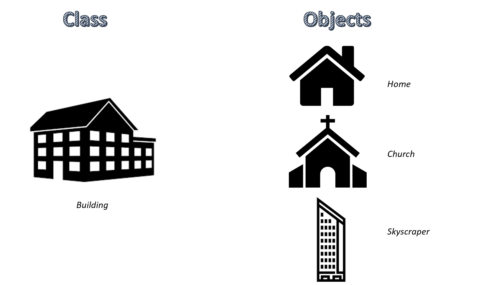

Transitioning from procedural programming to Object-Oriented Programming (OOP) in Python is a significant paradigm shift. OOP allows you to encapsulate data and functions into organized structures known as classes. These classes serve as blueprints, providing a systematic approach to code organization, enhancing efficiency, and promoting modularity. This tutorial introduces fundamental OOP concepts, guiding you through the creation and utilization of classes and objects, setting the stage for an enriched Python coding experience.

## Classes and Objects

---

In object-oriented programming, code organization revolves around classes and objects. A class serves as a blueprint, enabling the creation of objects, also referred to as instances in Python. To illustrate, envision having a blueprint for a building; while one blueprint is created, it can be employed to construct multiple distinct buildings. Each building maintains structural uniformity but may serve different purposes or have unique characteristics.

<figure>
    

     
     <figcaption>Image source: <a href="https://thecleverprogrammer.com/2020/12/21/classes-examples-with-python/" target="_blank">TheCleverProgrammer</a></figcaption>
    

</figure>


class Building:
    def __init__(self, type, location, height):
        self.type = type
        self.location = location
        self.height = height

    def display_details(self):
        print(f'Building Details: Type - {self.type}, Location - {self.location}, Height - {self.height}')

# Create instances of the Building class
my_home = Building('Home', 'Suburban', 'Two-story')
my_church = Building('Church', 'Urban', 'Tall spire')
my_skyscraper = Building('Skyscraper', 'City center', '100 floors')

# Display details of the buildings
my_home.display_details()
my_church.display_details()
my_skyscraper.display_details()


Classes and objects are fundamental concepts in object-oriented programming (OOP). They allow you to structure your code in a more organized and reusable way. In Python, everything is an object, and understanding how to create and use classes is crucial for building efficient and modular code.

### Understanding Classes

In OOP, a class functions as a blueprint or template for generating objects. Objects, in turn, represent instances of these classes. Classes define both the properties (attributes) and behaviors (methods) associated with instances of that type. Picture a class as a form template with blanks for information like name, age, etc. Objects, akin to completed forms, are instances filled with specific data.

### Creating a Simple RPG Character Class

Let's dive into a practical example by creating a class for characters in a role-playing game (RPG). For simplicity, we'll start with a basic `Character` class:


class Character:
    def __init__(self, name, health, attack_power):
        self.name = name
        self.health = health
        self.attack_power = attack_power

    def attack(self, target):
        target.health -= self.attack_power
        print(f'{self.name} attacks {target.name} for {self.attack_power} damage!')


A class typically includes an initializer method (`__init__`) to set the initial values of instance attributes. These attributes are the member variables existing in each instance. If your instance doesn't have instance attributes, there's no need to define `__init__`.

The initializer, recognized by its name `__init__`, must accept at least one argument, conventionally called `self`. This `self` argument refers to the instance the method is acting on. In our case, the initializer accepts additional arguments, such as `name`, `health`, and `attack_power`, which initialize the instance attributes. The `self.name` attribute, for instance, represents the character's name.

Key points about the `Character` class:
- It has three attributes: `name`, `health`, and `attack_power`.
- The `__init__` method initializes these attributes when an object is created.
- `self` refers to the instance of the class, allowing access to its attributes and methods.
- The `attack` method simulates an attack on another character, reducing the target's health.

According to PEP 8 Style Guide, class names should follow the CapWords convention.

### Creating Instances (Objects)

Objects consist of member variables (attributes) and member functions (methods). Creating instances transforms the conceptual class into tangible objects with unique attributes and behaviors.

Let's create instances of the `Character` class:


hero = Character('Goku', 100, 20)
enemy = Character('Cell', 150, 25)


When creating instances, the initializer is automatically called. Here, `hero` and `enemy` are objects of the `Character` class with unique values for `name`, `health`, and `attack_power`.

Printing the instances directly results in a representation showing their class (`Character`) and memory address. While this default representation may not offer insightful information, it emphasizes that `hero` and `enemy` are indeed objects of the `Character` class.


print(hero)  # Output: <__main__.Character object at 0x7f2db43218d0>
print(enemy) # Output: <__main__.Character object at 0x7f2db4321950>


You can access object properties using dot notation:


print(hero.name)     # Output: Goku
print(enemy.health)  # Output: 150


Here, `hero.name` retrieves the `name` attribute of the `hero` instance, displaying "Goku." Similarly, `enemy.health` accesses the `health` attribute of the `enemy` instance, yielding the value 150.

And you can call object methods like this:


hero.attack(enemy)   # Output: Goku attacks Cell for 20 damage!
print(enemy.health)  # Output: 130


Invoking the `attack` method on the `hero` instance triggers an attack on the enemy instance, reducing its health by the specified `attack_power`. This sequence demonstrates the interaction and manipulation of object attributes and methods within the context of the `Character` class.

### Class Attributes and Instance Variables

Variables belonging to a class or instance are attributes. Instance attributes are specific to each instance, while class attributes are shared among all instances. In the `Character` class, `name`, `health`, and `attack_power` are instance variables.

If a class attribute is needed, shared among all characters, it can be defined outside the `__init__` method:


class Character:
    version = '1.0' # Class attribute

    def __init__(self, name, health, attack_power):
        self.name = name
        self.health = health
        self.attack_power = attack_power

    def attack(self, target):
        target.health -= self.attack_power
        print(f'{self.name} attacks {target.name} for {self.attack_power} damage!')

# Creating instances of the Character class
hero = Character('Goku', 100, 20)
enemy = Character('Cell', 150, 25)

# Accessing class attribute
print(Character.version)  # Output: 1.0
print(hero.version)       # Output: 1.0
print(enemy.version)      # Output: 1.0

# Accessing attributes and calling methods
print(hero.name)     # Output: Goku
print(enemy.health)  # Output: 150

hero.attack(enemy)   # Output: Goku attacks Cell for 20 damage!
print(enemy.health)  # Output: 130


Here, `version` is a class attribute accessible by all instances, while `name` is an instance variable unique to each object.

### Methods in Python Classes

In Python classes, methods are functions defined within a class and operate on class instances. There are three types of methods: instance methods, class methods, and static methods.

#### Instance Methods

Instance methods are the most common type of methods. They operate on an instance of the class and have access to its attributes. The first parameter of an instance method is always `self`, representing the instance the method is invoked on.

Let's add an instance method to our `Character` class:


class Character:
    version = '1.0' # Class attribute

    def __init__(self, name, health, attack_power):
        self.name = name
        self.health = health
        self.attack_power = attack_power

    def attack(self, target):
        target.health -= self.attack_power
        print(f'{self.name} attacks {target.name} for {self.attack_power} damage!')

    def heal(self, amount):
        self.health += amount
        print(f'{self.name} heals for {amount} points!')
        
# Creating instances of the Character class
hero = Character('Goku', 100, 20)
enemy = Character('Cell', 150, 25)

# Using instance methods
hero.attack(enemy)  # Output: Goku attacks Cell for 20 damage!
enemy.heal(10)      # Output: Cell heals for 10 points!


Here, the `heal` method is an instance method. It is defined within the `Character` class and operates on a specific instance of the class (`self`), allowing the character to heal by a specified amount.

#### Class Methods

Class methods operate on the class itself rather than an instance. They are defined using the `@classmethod` decorator, and the first parameter is conventionally named `cls` to represent the class.

Let's add a class method to the `Character` class to provide information about the class:


class Character:
    version = '1.0'  # Class attribute

    def __init__(self, name, health, attack_power):
        self.name = name
        self.health = health
        self.attack_power = attack_power

    def attack(self, target):
        target.health -= self.attack_power
        print(f'{self.name} attacks {target.name} for {self.attack_power} damage!')

    def heal(self, amount):
        self.health += amount
        print(f'{self.name} heals for {amount} points!')

    @classmethod
    def get_version(cls):
        return cls.version

# Accessing class method
print(Character.get_version())  # Output: 1.0


In this example, the `get_version` method is a class method. It provides information about the class itself, and it can be called on the class rather than an instance.

#### Static Methods

A static method is a function defined within a class that doesn't operate on instances or class attributes. It doesn't have access to `self` or `cls`. You define it using the `@staticmethod` decorator.

Let's add a static method to our `Character` class to perform a generic action:


class Character:
    version = '1.0'  # Class attribute

    def __init__(self, name, health, attack_power):
        self.name = name
        self.health = health
        self.attack_power = attack_power

    def attack(self, target):
        target.health -= self.attack_power
        print(f'{self.name} attacks {target.name} for {self.attack_power} damage!')

    def heal(self, amount):
        self.health += amount
        print(f'{self.name} heals for {amount} points!')

    @classmethod
    def get_version(cls):
        return cls.version

    @staticmethod
    def generic_action():
        print('Performing a generic action!')

# Accessing static method
Character.generic_action()  # Output: Performing a generic action!


Here, the `generic_action` method is a static method. It performs a generic action and doesn't rely on instance-specific or class-specific information.

Understanding these three types of methods provides flexibility when designing and working with classes in Python. Instance methods are suitable for actions related to instances, class methods for actions related to the class, and static methods for generic actions independent of instances or classes.

### Properties in Python Classes

Properties in Python classes offer a concise and controlled way to manage attribute access, modification, and deletion. They enable the use of getter, setter, and deleter methods, providing a clean and consistent interface for interacting with class attributes.

- **Getter Method:** Retrieves the value of an attribute.
- **Setter Method:** Sets the value of an attribute.
- **Deleter Method:** Deletes an attribute.

In Python, the `property` built-in function, along with associated decorators, allows the creation of properties. Let's delve into the key concepts related to properties and demonstrate their usage with the `Character` class:

#### Creating a Property:


class Character:
    def __init__(self, name, health, attack_power):
        self._name = name
        self._health = health
        self._attack_power = attack_power

    @property
    def health(self):
        '''Getter method for 'health'.'''
        return self._health

    @health.setter
    def health(self, value):
        '''Setter method for 'health'.'''
        if value < 0:
            raise ValueError('Health must be non-negative.')
        self._health = value

    @property
    def status(self):
        '''Getter method for 'status' based on health.'''
        if self.health > 70:
            return 'Healthy'
        elif 30 <= self.health <= 70:
            return 'Injured'
        else:
            return 'Critical'

    def __str__(self):
        '''String representation of the object.'''
        return f'{self._name} ({self.status})'


#### Using Properties:


# Creating instances
hero = Character('Goku', 100, 20)

# Accessing properties
print(hero.health)        # Output: 100
print(hero.status)        # Output: Healthy

# Modifying properties
hero.health = 80

# Using properties in methods
print(hero)               # Output: Goku (Healthy)


In this example, the `Character` class has a `health` property with a getter and setter method. The `@property` decorator indicates that the method below it is a getter for the `health` attribute, allowing us to access it as if it were a regular attribute. The `@health.setter` decorator indicates the setter method for the `health` attribute, enabling us to modify the attribute while enforcing certain constraints.

When creating an instance of the `Character` class, like `hero = Character('Goku', 100, 20)`, we can access and modify the `health` attribute through the `health` property. For instance, `hero.health` retrieves the current health, and `hero.health = 80` updates the health attribute with validation.

This approach enhances code readability and ensures that attribute access adheres to specified rules, contributing to a more robust and maintainable class design.

## Object-Oriented Programming (OOP) Fundamentals: Encapsulation, Inheritance, Polymorphism

---

So far in this guide, we've explored the basics of classes and objects, laying the groundwork for understanding Object-Oriented Programming (OOP) in Python. Now, let's delve into the three main tenets of OOP: _Encapsulation_, _Inheritance_, and _Polymorphism_.

### 1. Encapsulation

The first main tenet of Object-Oriented Programming is encapsulation, a concept that entails bundling related data and code into a single unit known as a class. This unit serves as a protective container, combining attributes and methods that operate on the data, while hiding the intricate implementation details from external code.  
Encapsulation serves two primary purposes: it combines attributes and methods that operate on the data, and it hides the complex implementation details of how the object works. This bundling and hiding facilitate a cleaner and more maintainable code structure.

The purpose of a class is encapsulation, which means two things: The data and the functions that manipulate said data are bound together into one cohesive unit. The implementation of a class’s behavior is kept out of the way of the rest of the program. (This is sometimes referred to as a black box.)

#### Access Modifiers

Access modifiers in Python, denoted by underscores, play a crucial role in encapsulation by controlling the visibility and accessibility of attributes and methods within a class. While Python lacks the strict access enforcement found in languages like C++ or Java, underscores provide a convention for indicating the intended visibility.


class EncapsulationExample:
    def __init__(self):
        self._protected_attribute = 42
        self.__private_attribute = 'hidden'

    def public_method(self):
        print('This is a public method.')

    def _protected_method(self):
        print('This is a protected method.')

    def __private_method(self):
        print('This is a private method.')


- The single underscore (`_`) indicates a protected attribute/method.
- The double underscore (`__`) signifies a private attribute/method.

Access modifiers help convey the intended level of visibility and guide developers on proper usage within and outside the class.

Example: Accessing Attributes with Different Modifiers


example_instance = EncapsulationExample()

# Accessing public attribute and method
print(example_instance.public_method())  # Output: This is a public method.

# Accessing protected attribute and method
print(example_instance._protected_attribute)  # Output: 42
print(example_instance._protected_method())  # Output: This is a protected method.

# Attempting to access private attribute and method (will result in an error)
print(example_instance.__private_attribute)  # AttributeError
print(example_instance.__private_method())  # AttributeError


In this example, the access modifiers (_single underscore and __double underscore) showcase the intended visibility of attributes and methods. The public method and attribute are accessible directly, while protected and private ones trigger errors if accessed outside the class.

#### Getters and Setters

A method that exists purely to access an attribute is called a getter, while a method that modifies an attribute is called a setter. Particularly in Python, the existence of these methods should be justified by some form of data modification or data validation that the methods perform in conjunction with accessing or modifying the attribute. If a method does none of that and merely returns from or assigns to the attribute, it is known as a bare getter or setter, which is considered an anti-pattern, especially in Python.

Encapsulation often involves restricting direct access to instance variables and encouraging the use of getter and setter methods for controlled access. This approach ensures that the internal state of an object remains protected, and modifications adhere to defined rules.


class EncapsulationExample:
    def __init__(self):
        self._protected_attribute = 42

    def get_protected_attribute(self):
        return self._protected_attribute

    def set_protected_attribute(self, value):
        if value >= 0:
            self._protected_attribute = value
        else:
            print('Error: Attribute value must be non-negative.')


Example: Using Getters and Setters


example_instance = EncapsulationExample()

# Using getter to access protected attribute
print(example_instance.get_protected_attribute())  # Output: 42

# Using setter to modify protected attribute
example_instance.set_protected_attribute(55)
print(example_instance.get_protected_attribute())  # Output: 55

# Attempting to set a negative value (will print an error)
example_instance.set_protected_attribute(-10)  # Error: Attribute value must be non-negative.


In this example, the getter and setter methods control access to the protected attribute. The getter retrieves the attribute value, while the setter allows modification with a constraint, preventing negative values.

By providing getter and setter methods, the class maintains control over attribute access and modification while offering a clear interface for interacting with the object.

#### Decorators and `@property`

Python introduces decorators as a powerful mechanism for modifying the behavior of functions or methods. In encapsulation, the `@property` decorator provides a balanced approach between direct attribute access and the use of explicit getter methods.


class TemperatureSensor:
    def __init__(self, _temperature):
        self._temperature = _temperature

    @property
    def temperature(self):
        print('Getting temperature.')
        return self._temperature

    @temperature.setter
    def temperature(self, value):
        if value < -273.15:
            print('Error: Temperature cannot be below absolute zero.')
        else:
            print('Setting temperature.')
            self._temperature = value


- The `@property` decorator allows you to access the temperature as an attribute.
- The `@temperature.setter` decorator provides controlled modification of the temperature.

Example: Using Property Decorators


temperature_sensor = TemperatureSensor(25)

# Using @property decorator to access temperature
print(temperature_sensor.temperature)  # Output: Getting temperature.

# Using @temperature.setter decorator to modify temperature
temperature_sensor.temperature = 30  # Output: Setting temperature.

# Attempting to set a temperature below absolute zero (will print an error)
temperature_sensor.temperature = -300  # Error: Temperature cannot be below absolute zero.


In this example, the property decorator simplifies attribute access, providing a clean syntax similar to accessing attributes directly. The setter decorator ensures controlled modification of the temperature attribute, preventing values below absolute zero.

This approach enhances code readability and maintains the benefits of encapsulation while offering a convenient syntax for attribute access and modification.

##### Class Methods

A class method is a method bound to the class rather than an instance of the class, taking the class as its first parameter, often named `cls`.

Identifiable by the `@classmethod` decorator and the use of `cls` as the first parameter, class methods are associated with the class itself, not individual objects.


class MyClass:
    class_attribute = 0

    def __init__(self, value):
        self.value = value

    @classmethod
    def update_class_attribute(cls, new_value):
        cls.class_attribute = new_value

# Usage
obj1 = MyClass(42)
obj2 = MyClass(100)

MyClass.update_class_attribute(10)
print(obj1.class_attribute)  # Output: 10
print(obj2.class_attribute)  # Output: 10


In the above example, `update_class_attribute` is a class method due to the `@classmethod` decorator. `cls` is used to refer to the class itself within the method. The method updates the `class_attribute` for the entire class. Changes made by the class method are reflected in all instances of the class, as demonstrated by the outputs for `obj1` and `obj2`.

The `cls` parameter resembles `self`, referencing the class object rather than an instance. In class methods, you cannot access individual object attributes or call regular methods; they are mainly used to call other class methods or access class attributes. Typically, class methods serve to offer alternative constructor methods, providing flexibility in object creation.

### 2. Inheritance

Inheritance is a core principle in OOP that allows a class (subclass/derived class) to inherit attributes and methods from another class (superclass/base class). This promotes code reusability, as the subclass can leverage the functionalities of the superclass and extend or override them as needed. Inheritance establishes an "is-a" relationship between classes, where a subclass is a specialized version of its superclass.

#### Creating a Subclass

Let's illustrate inheritance with an example. Consider a base class `Vehicle` and a subclass `Car`:


class Vehicle:
    def __init__(self, make, model):
        self.make = make
        self.model = model

    def display_info(self):
        print(f'{self.make} {self.model}')

class Car(Vehicle):
    def __init__(self, make, model, num_doors):
        super().__init__(make, model)
        self.num_doors = num_doors

    def display_info(self):  # Overriding the display_info method
        print(f'{self.make} {self.model} with {self.num_doors} doors')


- The `Car` class inherits from the `Vehicle` class using the parentheses in the class definition.
- The `super()` function is used to call the constructor of the superclass.

Example Usage of Inheritance

Let's create instances of the `Vehicle` and `Car` classes and demonstrate the use of inheritance:


vehicle = Vehicle('Toyota', 'Camry')
car = Car('Ford', 'Mustang', 2)

vehicle.display_info()  # Output: Toyota Camry
car.display_info()      # Output: Ford Mustang with 2 doors


In this example, the `Car` class inherits the `display_info` method from the `Vehicle` class but overrides it to provide specialized behavior.

#### Types of Inheritance

Python supports multiple types of inheritance, including single, multiple, multilevel, and hierarchical inheritance. Each type serves different purposes, and the choice depends on the design requirements of your program.

### 3. Polymorphism

Polymorphism allows objects of one type to be treated as objects of another type, promoting flexibility and extensibility in code. There are two main forms of polymorphism: generic functions or parametric polymorphism, and ad hoc polymorphism or operator overloading.

#### Generic Functions or Parametric Polymorphism

Generic functions, also known as parametric polymorphism, enable a single function to handle objects of various types. An example is the `len()` function, which can determine the length of strings, lists, or dictionaries.


string_length = len('Hello, World!')     # Output: 13
list_length = len([1, 2, 3, 4, 5])        # Output: 5
dictionary_length = len({'a': 1, 'b': 2}) # Output: 2


Here, `len()` operates polymorphically on different types of objects, providing a common interface for obtaining their lengths.

#### Ad Hoc Polymorphism or Operator Overloading

Ad hoc polymorphism occurs when operators, such as `+` or `*`, exhibit different behaviors based on the types of objects they operate on. For example, the `+` operator performs mathematical addition for integers or floats but does string concatenation for strings.


result_numeric = 5 + 3      # Output: 8
result_concatenation = 'Hello, ' + 'World!'  # Output: Hello, World!


In this scenario, the same operator (`+`) behaves differently depending on the types of its operands, showcasing ad hoc polymorphism.

##### Method Overloading

Method overloading is a form of polymorphism where a class has multiple methods with the same name but different parameters. While Python does not support traditional method overloading, a form of polymorphism, it can be achieved through default parameter values and variable-length argument lists.


class Calculator:
    def add(self, a, b=None, c=None):
        if b is not None and c is not None:
            return a + b + c
        elif b is not None:
            return a + b
        else:
            return a

calculator = Calculator()

result_1 = calculator.add(1)        # Output: 1
result_2 = calculator.add(1, 2)     # Output: 3
result_3 = calculator.add(1, 2, 3)  # Output: 6


In this example, the `add` method in the `Calculator` class exhibits polymorphic behavior, adapting to different parameter combinations.

#### Runtime Polymorphism

Method overriding occurs when a subclass provides a specific implementation for a method that is already defined in its superclass. This allows objects of the subclass to use the overridden method instead of the superclass's method.

Runtime polymorphism, achieved through method overriding, enables objects of different classes to be treated as objects of a common base class. Consider a scenario with different types of pets, each having its own `speak()` method.


class Animal:
    def speak(self):
        print('Animal speaks')

class Dog(Animal):
    def speak(self):  # Overriding the speak method
        print('Dog barks')

class Cat(Animal):
    def speak(self):  # Overriding the speak method
        print('Cat meows')

animal = Animal()
dog = Dog()
cat = Cat()

animal.speak()  # Output: Animal speaks
dog.speak()     # Output: Dog barks
cat.speak()     # Output: Cat meows


Here, objects of different classes (`Dog` and `Cat`) are treated as objects of the common base class (`Animal`), demonstrating runtime polymorphism. Each class has a `speak()` method, but the content of each method is different. Each class does whatever it needs to do in its version of this method; the method name is the same, but it has different implementations.

Understanding and leveraging polymorphism in its various forms enhances code flexibility and promotes the creation of versatile and adaptable software systems.

## Practical Applications and Use Cases

---

Object-Oriented Programming (OOP) is a versatile paradigm with practical applications across various domains. Here are some common use cases where OOP principles shine:

### Software Design and Architecture

OOP provides a powerful framework for designing software systems. By organizing code into classes and objects, developers can model real-world entities, relationships, and behaviors. This facilitates a more intuitive and scalable software architecture.

**Example:**


class Customer:
    def __init__(self, name, email):
        self.name = name
        self.email = email

class Order:
    def __init__(self, order_id, products, customer):
        self.order_id = order_id
        self.products = products
        self.customer = customer


### Graphical User Interface (GUI) Development

Building graphical applications often involves creating interactive elements with various behaviors. OOP is well-suited for GUI development, allowing developers to represent GUI components as objects with associated methods.

**Example:**


import tkinter as tk

class GUIApplication:
    def __init__(self, master):
        self.master = master
        master.title('OOP GUI Example')

        self.label = tk.Label(master, text='Hello, OOP!')
        self.label.pack()

        self.button = tk.Button(master, text='Click me', command=self.handle_click)
        self.button.pack()

    def handle_click(self):
        self.label.config(text='Button clicked!')

root = tk.Tk()
app = GUIApplication(root)
root.mainloop()


### Game Development

In game development, OOP is widely used to model game entities, behaviors, and interactions. Game objects can be represented as classes, allowing for a clean and organized code structure.

**Example:**


class Player:
    def __init__(self, name, health):
        self.name = name
        self.health = health

    def take_damage(self, damage):
        self.health -= damage
        if self.health <= 0:
            print(f'{self.name} has been defeated!')

class Enemy:
    def __init__(self, name, damage):
        self.name = name
        self.damage = damage

    def attack(self, player):
        print(f'{self.name} attacks {player.name} for {self.damage} damage.')
        player.take_damage(self.damage)


### Database Interaction

When working with databases, OOP principles can be applied to create models for database entities. Each entity (such as a table in a relational database) can be represented as a class, simplifying data manipulation and retrieval.

**Example:**


import sqlite3

class Employee:
    def __init__(self, employee_id, name, position):
        self.employee_id = employee_id
        self.name = name
        self.position = position

# Connecting to a SQLite database
conn = sqlite3.connect('company.db')
cursor = conn.cursor()

# Creating a table for employees
cursor.execute('''
    CREATE TABLE IF NOT EXISTS employees (
        employee_id INTEGER PRIMARY KEY,
        name TEXT,
        position TEXT
    )
''')

# Inserting an employee record
new_employee = Employee(employee_id=1, name='John Doe', position='Software Engineer')
cursor.execute('''
    INSERT INTO employees (employee_id, name, position)
    VALUES (?, ?, ?)
''', (new_employee.employee_id, new_employee.name, new_employee.position))

# Committing changes and closing the connection
conn.commit()
conn.close()


### Simulation and Modeling

OOP is valuable in simulation and modeling scenarios, where entities, their attributes, and interactions need to be simulated. Classes can represent different elements in the simulation, making the code more expressive and maintainable.

**Example:**


class Particle:
    def __init__(self, mass, velocity):
        self.mass = mass
        self.velocity = velocity

    def collide(self, other_particle):
        # Code to handle particle collision
        pass

# Simulating a particle system
particle1 = Particle(mass=2, velocity=10)
particle2 = Particle(mass=3, velocity=-8)

# Handling a collision between particles
particle1.collide(particle2)


These practical applications demonstrate the versatility of OOP in solving complex problems and organizing code in a way that aligns with real-world entities and interactions. As you delve into OOP, consider applying these principles in various domains to enhance code readability, maintainability, and scalability.

### More Examples

Advanced Python programming concepts like object-oriented programming (OOP) and modularization are showcased in programs like [bank manager](https://github.com/Pythological-Playground/bank-manager){:target='_blank'} (OOP) and [python-scripts](https://github.com/Pythological-Playground/) (modularization){:target='_blank'}.

## Summary

---

Congratulations on grasping the fundamental concepts of OOP in Python! These principles will serve as a strong foundation as you delve deeper into building more complex and sophisticated applications. As you continue your Python journey, consider exploring the next topic: [Working with Python Decorators](/workspace/python/decorators) to add powerful functionality to your functions in an elegant way.