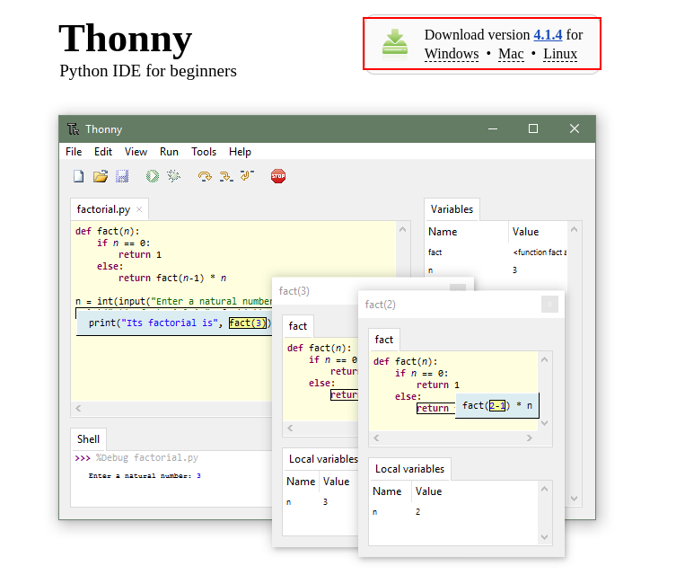
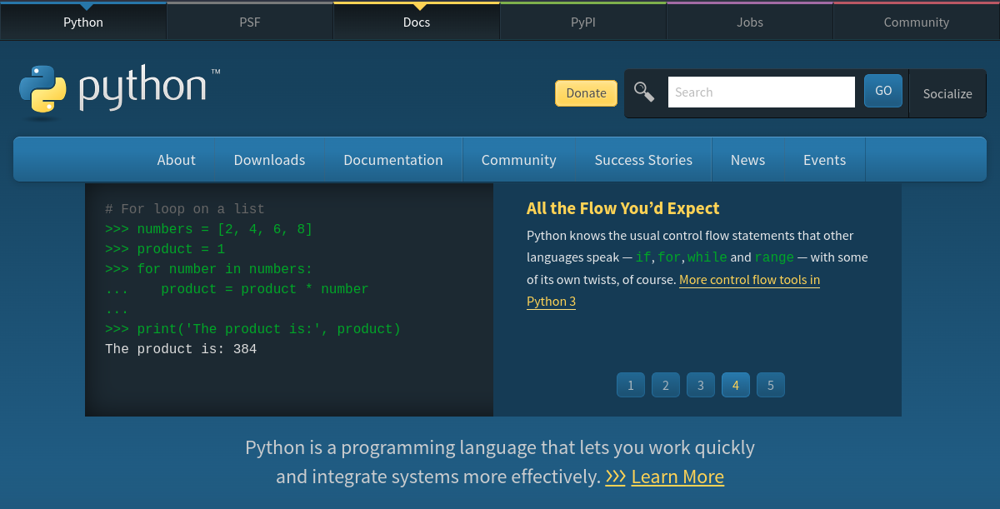
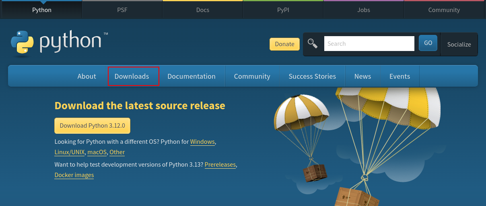
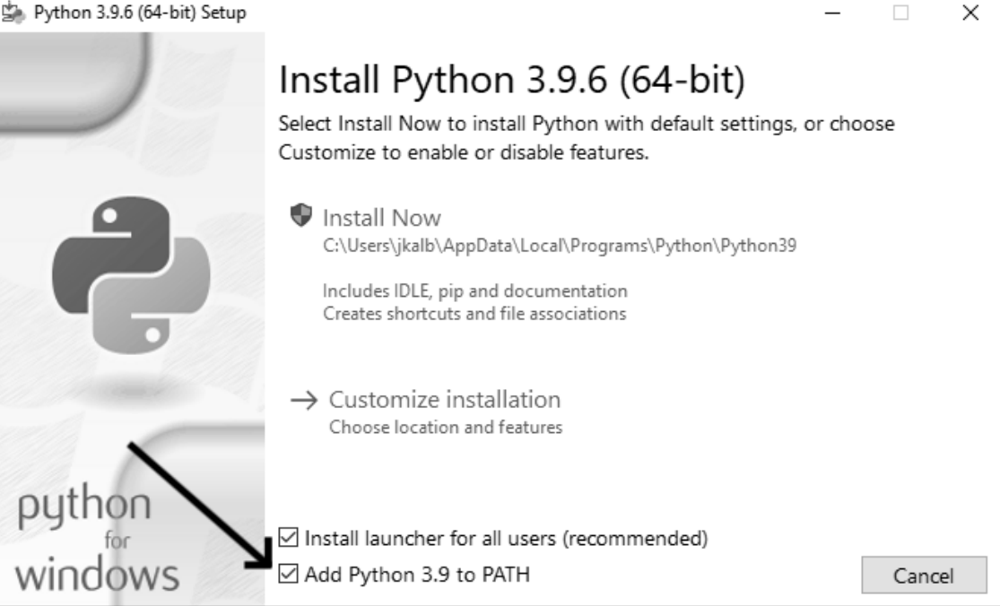
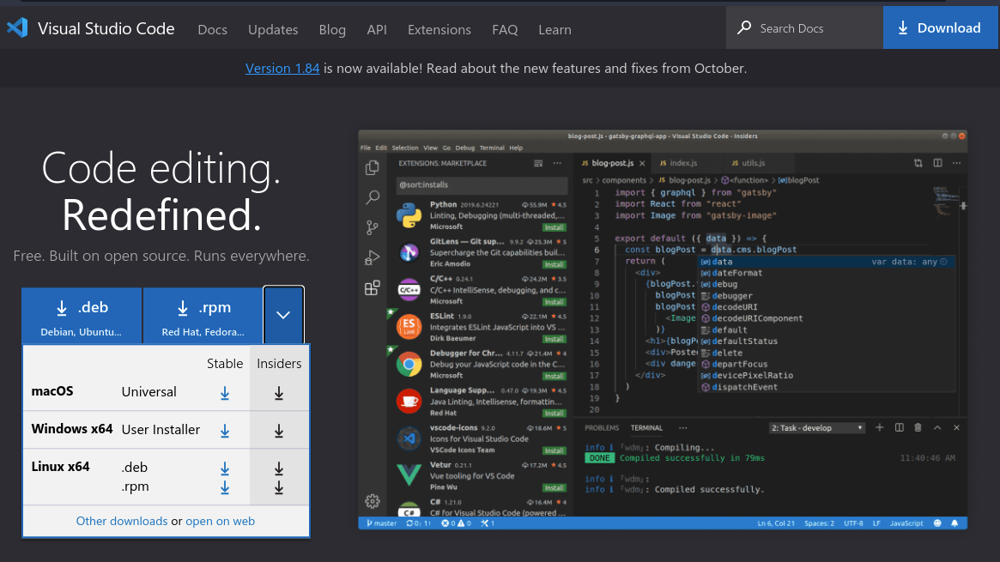

When starting with programming, one of the first things you need to do is set up your programming environment. This involves installing the necessary tools and software to write and run your code. In this section, I'll walk you through how to install Python and set it up on both Linux and Windows operating systems. I'll also provide tips on running Python code in a terminal session.

A robust Python development environment typically includes the language interpreter, the pip package manager, a virtual environment, a Python-oriented code editor, and static analyzers to identify code errors and issues.

* toc
{:toc}

## Installing Python

---

Before you can do anything, you have to install Python itself, along with a couple of essential tools. As outlined in the [Getting Started with Python Programming tutorial](/workspace/python/getting-started), Python is an interpreted language. Hence, the installation involves obtaining its interpreter and the pip package manager for additional tools and libraries. The steps may vary by platform, but the major platforms are covered here.

### The Easiest Way to Run Python

For a quick start, leverage online platforms like [Replit](https://replit.com/){:target='_blank'}, providing an interactive Python environment without local installations.

For beginners, Thonny IDE is recommended. It's bundled with the latest Python version, offering a beginner-friendly interface with code highlighting, autocomplete, and simplicity.

  

- Download [Thonny IDE](https://thonny.org/){:target='_blank'}.
- Run the installer and create a new Python file (e.g., `hello.py`).
- Write your code, save it, and run by clicking _Run_ or pressing _F5_.

If you prefer an alternative, install Python separately by visiting the [Official Python Website](https://www.python.org/){:target='_blank'}.

  

For detailed installation instructions, refer to the [Official Python Documentation](https://docs.python.org/3/using/){:target='_blank'}.

### Installing on Windows

If you're on Windows, Python isn't pre-installed, here's how you can install Python on your computer:

1. Visit the official Python website, go to downloads, and download the appropriate version for your OS.
2. During installation, ensure to check "Install the launcher for all users" and "Add Python to PATH".
3. Run the installer and follow the instructions to install Python.

  
  

Check Python version with `python --version` in Command Prompt. If you encounter issues, revisit the installation steps or consult the [Official Python Documentation](https://docs.python.org/3/){:target='_blank'}.

After installation, create a new Python file in any text editor or IDE, write your code, and run it. Python is available on Windows, macOS, and Linux, with minor installation differences.

### Installing on macOS

Python is not installed by default on the latest versions of macOS, so you'll need to install it if you haven't already done so. Follow these steps:

1. Visit the official Python website and locate and click on the Download link to get the latest Python installer.
2. Run the downloaded installer.
3. In the Finder window that appears after installation, double-click the Install Certificates.command file. This step facilitates the installation of additional libraries needed for real-world projects.

You can also use MacPorts or Homebrew for installation.

**Using MacPorts**:


 $ sudo port install python38 py39-pip
 $ sudo port select --set python python39
 $ sudo port select --set pip py39-pip


**Using Homebrew**:


 $ brew install python


Open a terminal window (Applications ▶ Utilities ▶ Terminal or ⌘-spacebar, type terminal, and press ENTER). Check your Python version by entering `python3`. If the output indicates Python 3.x.x, you can now start using Python

**Note**: On macOS, use the `python3` command instead of `python` to ensure Python 3 usage. 

### Installing on Linux

If you're a Linux user, you're in luck as Python comes pre-installed on most Linux systems. Follow these steps to check and install if necessary:

1. Open a terminal window.
2. Check the installed Python version:


 $ python3 --version
 Python 3.10.6


The output indicates that Python 3.10.6 is currently the default version of Python installed on this computer.

3. If Python is not installed or you need a specific version, use your package manager:

- **Ubuntu, Debian, or related**:


 $ sudo apt install python3 python3-pip python3-venv


- **Fedora, RHEL, or CentOS**:


 $ sudo dnf python3 python3-pip


- **Arch Linux**:


 $ sudo pacman -S python python-pip


For other distributions, you'll need to search for the Python 3 and pip packages yourself.

### Verifying Python Installation

After installing Python, it's crucial to verify the installation to ensure everything is set up correctly. You can do this by running the following command in your terminal:


 $ python --version


If you have Python 3 installed and it is set as your default version, you should see output similar to the following:


 Python 3.x.x


If you have Python 2 installed and it is your default version, you will see output like this:


 Python 2.x.x


In the event that you have Python 3 installed but `python --version` outputs a Python 2 version, it indicates that Python 2 is also installed. This situation is common on MacOS and many Linux distributions. To explicitly use the Python 3 interpreter, use the `python3` command:


 $ python3 --version


This ensures that you are working with Python 3 and helps avoid any potential conflicts with Python 2.

### The Python Interpreter

Now that Python is installed, the interpreter allows you to run Python scripts and projects. Python is an interpreted scripting language, and it comes with a Python Shell for executing commands and viewing results.

#### Interactive Session

You can try running snippets of Python code by opening a new terminal window and typing `python3`:

**On MacOs**:


 $ python3
 Python 3.x.x (v3.11.0:eb0004c271, Jun . . . , 10:03:01)
 [Clang 13.0.0 (clang-1300.0.29.30)] on darwin
 Type "help", "copyright", "credits" or "license" for more information.
 >>>


On linux:


 $ python3
 Python 3.x.x (main, Jan 03 2023, 11:10:38) [GCC 11.3.0] on linux
 Type "help", "copyright", "credits" or "license" for more information.
 >>> 


This command starts a Python terminal session. You should see a Python prompt (`>>>`), which means macOS has found the version of Python you just installed. Exit the session using `exit()`.

This session is useful for testing code snippets and will be extensively used in this tutorial series.


 $ python3
 Python 3.x.x (main, Jan 03 2023, 11:12:18) [GCC 11.3.0] on linux
 Type "help", "copyright", "credits" or "license" for more information.
 >>> 1+1
 2
 >>> 1-1
 0
 >>> 1/2
 0.5
 >>> 2**3
 8
 >>> print('Hello, Python!')
 Hello, Python!
 >>> exit()
 $ 


It's advisable to specify `python2` or `python3` instead of using the `python` command, as the latter may refer to the wrong version (which comes preinstalled on many systems, even today). You can always check the exact version of Python invoked by any of those three commands with the `--version` flag (for example, `python3 --version`).

## Packages and Virtual Environments

---

In Python, a package is a collection of code, akin to a library in many other programming languages. While Python's "batteries included" philosophy facilitates basic functionality with a simple import statement, more advanced tasks, like creating a sophisticated user interface, often require installing additional packages. This process is simplified through the pip package manager tool.

Managing multiple third-party packages demands finesse due to dependencies, conflicts, and version-specific requirements. Virtual environments offer a solution by creating isolated sandboxes for each project. These sandboxes, labeled with names like `env` or `venv`, allow you to install only the necessary Python packages for a specific project, preventing clashes with other projects or the system.

### Creating and Activating a Virtual Environment

To create a virtual environment named `venv` in the current working directory, run:


 $ python3 -m venv venv


The first `venv` is a command that creates a virtual environment, and the second `venv` is the desired path to the virtual environment. You can customize the path and name, such as creating a virtual environment called `myenv` in the `/opt` directory:


 $ python3 -m venv /opt/myenv


To activate the virtual environment:

- On UNIX-like systems:


 $ source venv/bin/activate


- On Windows:


 C:\> venv\Scripts\activate.bat


Once activated, your command prompt should display `(venv)`, indicating the use of the virtual environment. Inside it, you can install packages specific to the project without affecting the global system.

To deactivate the virtual environment:

- On UNIX-like systems:


 $(venv) deactivate


- On Windows:


 C:\>(venv) venv\Scripts\deactivate.bat


### Managing Dependencies with pip

Use `pip` to handle Python package installation, upgrades, and management within your virtual environment. For example, to install numpy:


 $ python3 -m pip install numpy


To upgrade an installed package, run:


 $ python3 -m pip install --upgrade numpy


To uninstall a package:


 $ pip uninstall package


Replace `package` with the specific package name. Managing dependencies in this manner ensures a clean and organized development environment tailored to your project's requirements.

## Configuring Your Development Environment

---

Before diving into my recommendations, let's first clarify the difference between a text editor and an IDE. A text editor is a basic application that allows you to write and edit plain text files, including code. It's like a digital notebook for your code. On the other hand, an IDE is a more comprehensive application that includes additional features like syntax highlighting, code completion, and debugging tools. Think of an IDE as a Swiss Army Knife for programming.

Selecting the right tools significantly impacts your productivity and workflow. While technically not mandatory, installing an editor or integrated development environment (IDE) for Python can greatly enhance your coding experience. Python comes with its IDE called [IDLE](https://docs.python.org/3/library/idle.html){:target='_blank'}, a basic yet functional IDE with an editor and an interactive shell. For those not ready to explore other editors, starting with IDLE is a solid choice. However, consider exploring other options as many editors and IDEs offer advanced features that IDLE lacks.

### Choosing an Editor or IDE for Python

Numerous options exist for Python editing. The Python website lists various editors and IDEs:

- For enthusiasts of [Emacs](https://www.gnu.org/software/emacs/){:target='_blank'} and [Vim](https://www.vim.org/){:target='_blank'}, both editors offer excellent Python support, but configuring them can be complex. You can find tutorials for both online.

- If you're familiar with JetBrains IDEs, [PyCharm](https://jetbrains.com/pycharm/){:target='_blank'}  is a robust choice. It demands more resources but provides powerful features. Explore the Community Edition before opting for the paid version.

- [Sublime Text](https://sublimetext.com/){:target='_blank'} is a fast, customizable code editor. The Anaconda plug-in transforms Sublime Text into a Python IDE, offering autocompletion, navigation, static analysis, autoformatting, and more. Download Sublime Text [here](https://sublimetext.com/){:target='_blank'} and the Anaconda plug-in [here](https://damnwidget.github.io/anaconda/){:target='_blank'}.

- For scientific programming or data analysis, consider [Spyder](https://spyder-ide.org/){:target='_blank'}, a free and open-source Python IDE. It integrates with common Python libraries and offers features like a code profiler and variable explorer.

At the end of the day, the editor or IDE you choose should depend on your personal preference and workflow. However, if you're just starting with Python, I recommend a beginner-friendly option that's easy to use and offers a range of features to support your growth as a programmer.

#### My Top Pick: Visual Studio Code

Visual Studio Code (VS Code) is a powerful, professional-quality, free, and beginner-friendly text editor. It's suitable for both simple and complex projects, making it an excellent choice for Python programming. You can easily transition from learning Python to working on larger and more intricate projects within the same editor. VS Code is compatible with all modern operating systems and supports multiple programming languages, including Python.

  

After testing various editors and IDEs, I recommend Visual Studio Code as the best tool for Python programming, and here's why:

- **Free and Open-Source**: VS Code is a powerful, professional-quality text editor that's free and open-source.
- **Language Support**: It supports most programming languages, including Python.
- **Customization**: Highly customizable with a range of extensions and themes.
- **Feature-Rich**: Offers features like debugging tools, code completion, and version control integration.
- **Active Community**: Large and active developer community with regular updates and support.

If you're convinced to use VS Code, the next step is to install it.

#### Installing VS Code

Download and install VS Code from the [Official Website](https://code.visualstudio.com/){:target='_blank'}. Installation is straightforward:

  - For Windows: Click "Download for Windows" and follow the installation prompts.
  - For Ubuntu Linux: Install VS Code directly from the Ubuntu Software Center.
    - Click the Ubuntu Software icon, search for "vscode", click Visual Studio Code, and then click Install.
  - For MacOS: Click the Download button, drag the installer to your Applications folder, and double-click to run it.

VS Code works with many programming languages; to enhance it for Python programming, install the Python extension:

  - Click the Manage icon (gear icon) in the lower-left corner of VS Code.
  - In the menu, click Extensions, search for "python", and install the Python extension supplied by Microsoft.
  - Install any additional tools required to complete the installation.

Once installed, launch the app and start coding. For a video guide, follow this [Visual Studio Code for Python Video tutorial](https://www.youtube.com/watch?v=bn7Cx4z-vSo){:target='_blank'}.

Explore customization options in your chosen editor or IDE to tailor the environment to your needs.

### Setting Up Code Linters and Formatters

In a programmer's toolkit, a reliable static analyzer is a valuable asset. These tools scrutinize your source code for potential issues, errors, and style inconsistencies. If you haven't used one before, now is the time to incorporate it into your workflow. Among the widely used static analyzers for Python are linters and formatters, each serving a specific purpose.

#### Linters: Pylint and PyFlakes

Linters, such as [Pylint](https://pypi.org/project/pylint/){:target='_blank'} and [PyFlakes](https://pypi.org/project/pyflakes/){:target='_blank'}, examine your code for common mistakes, errors, and style issues. Pylint, a versatile static analyzer, allows extensive customization according to your preferences. Install Pylint using pip within a virtual environment and analyze a file with:


 $ pylint python_file.py


PyFlakes, part of the Flake8 tool, is a faster alternative focused on avoiding false positives. It works alongside pycodestyle, a style checker, and mccabe, which assesses code complexity. To analyze a file using Flake8:


 $ flake8 python_file.py


#### Formatters: autopep8 and Black

Formatters like [autopep8](https://pypi.org/project/autopep8/){:target='_blank'} and [Black](https://pypi.org/project/black/){:target='_blank'} automatically adjust your Python code to comply with PEP 8 standards, addressing spacing, indentation, and style preferences.

Autopep8, leveraging pycodestyle, fixes whitespace issues by default. For more extensive changes, use the `--aggressive` argument. To apply changes to a file in place:


 $ autopep8 --in-place --aggressive --aggressive python_file.py


Black is a straightforward formatter assuming full PEP 8 compliance. Install it with pip (Python 3.6 or later) and format a file with:


 $ black python_file.py


Explore additional options using:


 $ black --help


Integrating these tools into your workflow ensures code consistency and quality, contributing to an efficient and error-free development process.

## Running a Python Program

---

Once you've set up your Python environment, including the installation of Python, a text editor or IDE, virtual environment, linters, and formatters, the next step is to create and run a Python program within a project folder.

Select a location on your computer to store your project. Create a new folder with a descriptive name for your project. This folder will house all related files, including Python scripts, data files, and configurations.

### Writing Your First Python Program

It won't feel like a proper introduction to the language without the classic "Hello World" program. With your programming environment and project folder set up, create a new file within the folder. Open your text editor or IDE, start a new file, and save it as `hello.py` (the `.py` extension denotes a Python file). Write a simple "Hello World" program:


print('Hello, World!')


There's nothing novel here. You call the `print()` function to write text to the console, and you pass data in a string, wrapped in quotes as an argument. You can pass whatever sort of data you like, and it will be output on the console.

### Running Your Python Program

To run your program in your text editor or IDE, you can simply select _Run > Run Without Debugging_ or press _CTRL-F5_. Your program's output will be displayed in the console.

In your text editor or IDE, select _Run > Run Without Debugging_ or press _CTRL-F5_. View the program's output in the console.

Sometimes, you might prefer to run your Python program from a terminal. This can be useful when you want to execute an existing program without making further edits. Follow these steps to run your Python program from a terminal:

1. Open a terminal window.
2. Use the `cd` command to navigate to your project directory.
3. Enter `python3 hello.py` in the terminal and press Enter.
4. Observe the program's output in the terminal.
              
It's that simple!

Your Python program is up and running! The provided `hello.py` program prints "Hello, World!", but feel free to modify it with other phrases.

#### Running Your Python Program from a Terminal

You'll run most of your programs directly in your text editor. However, sometimes it's useful to run programs from a terminal instead. For example, you might want to run an existing program without opening it for editing.

You can do this on any system with Python installed if you know how to access the directory where the program file is stored. To try this, make sure you've saved the `hello.py` file in the `python_stuff` folder on your desktop.

First, use the `cd` command to navigate to the `python_stuff` folder, which is in the Desktop folder. Next, use the `dir` or `ls` command to make sure `hello.py` is in this folder. Then run the file using the command `python3 hello.py`. Most of your programs will run fine directly from your editor. However, as your work becomes more complex, you'll want to run some of your programs from a terminal.

**On windows**: You can use the terminal command `cd`, for change directory, to navigate through your filesystem in a command window. The command `dir`, for directory, shows you all the files that exist in the current directory. Open a new terminal window and enter the following commands to run `hello.py`:


 C:\> cd Desktop\python_stuff
 C:\Desktop\python_stuff> dir
 hello.py
 C:\Desktop\python_stuff> python hello.py
 Hello, World!


**On macOS and Linux**: Running a Python program from a terminal session is the same on Linux and macOS. You can use the terminal command `cd`, for change directory, to navigate through your filesystem in a terminal session. The command `ls`, for list, shows you all the nonhidden files that exist in the current directory. Open a new terminal window and enter the following commands to run `hello.py`:


 $ cd Desktop/python_stuff/
 /Desktop/python_stuff$ ls
 hello.py
 /Desktop/python_stuff$ python3 hello.py
 Hello, World!


Running a Python program from the terminal allows quick execution without further edits, offering flexibility in various scenarios. Experiment with different words or phrases to see your computer display diverse outputs. 

If you're curious about how "Hello World" looks in other programming languages, visit [The Hello World Collection](http://helloworldcollection.de/){:target='_blank'}.

## Troubleshooting Common Programming Errors

---

Encountering errors in your Python program is a common part of the learning process. When faced with issues, the following steps can help you troubleshoot and resolve them:

1. **Traceback Examination:**
   - Python provides a traceback when an error occurs. Carefully analyze the traceback, as it acts as a guide to identify the problem in your code. Understanding the traceback can provide valuable insights into the root cause of the issue. For more information on reading tracebacks, refer to [Python's Error Messages Documentation](https://docs.python.org/3/tutorial/errors.html){:target='_blank'}.

2. **Syntax Review:**
   - Pay close attention to syntax details, such as matching quotation marks and parentheses. Syntax errors are common, and even a small mistake can hinder your program's execution. If you're unfamiliar with Python syntax, consider revisiting the syntax section of the [Official Python Documentation](https://docs.python.org/3/tutorial/index.html){:target='_blank'}.

3. **Code Revision:**
   - Review the relevant chapters of your learning materials. Carefully examine your code, looking for any discrepancies or mismatches. A thorough review may help you spot the mistake causing the error.

4. **Restarting from Scratch:**
   - If persistent issues arise, consider starting over. Deleting the problematic file and recreating it from scratch can sometimes eliminate hidden errors. Ensure you save your progress before taking this step.

5. **Pair Programming:**
   - Collaborate with someone experienced in Python. Let them follow the steps on your computer or use a different one. Observing their actions might reveal a missed detail or step in your process. Sharing experiences and learning from others is a powerful way to troubleshoot effectively.

6. **Seek Assistance:**
   - Don't hesitate to seek help from the Python community or someone knowledgeable in the language. The Python community is known for its friendliness towards beginners. You can ask for help on forums like [Stack Overflow](https://stackoverflow.com/){:target='_blank'}, [Python Community Forum](https://discuss.python.org/), or [Reddit's r/learnpython](https://www.reddit.com/r/learnpython/){:target='_blank'}.

Remember that encountering challenges is a natural part of programming, and seeking help is a valuable skill. The Python community is diverse and supportive, making it an excellent resource for assistance.

### Common Errors and Solutions:

- **Syntax Errors:**
  - Verify correct Python syntax by checking quotes, parentheses, and semicolons. Refer to the [Official Python Syntax Guide](https://docs.python.org/3/reference/lexical_analysis.html){:target='_blank'} for details.

- **Naming Errors:**
  - Ensure consistency in variable and function names between your code and the terminal or IDE. Adopting a standardized naming convention can help avoid naming errors.

- **Indentation Errors:**
  - Correct code indentation according to Python's requirements. Review the [Python Style Guide (PEP 8)](https://pep8.org/){:target='_blank'} for best practices.

- **Module Not Found Errors:**
  - Confirm the installation of required libraries/modules using tools like `pip`. Resolve "Module not found" errors by installing the necessary packages. Explore the [Python Package Index (PyPI)](https://pypi.org/){:target='_blank'} for available packages.

- **File Not Found Errors:**
  - Ensure you run the program from the correct directory. Address "File not found" errors by verifying the file's existence in the specified directory.

By following these steps and being persistent in your troubleshooting efforts, you'll gain valuable problem-solving skills that will contribute to your growth as a programmer.

## Python Learning Ecosystem

---

For beginners looking to dive deeper into Python programming, there are several online resources, tutorials, and courses available. Here are a few recommendations:

### Websites and Documentation

- **[Python.org](https://www.python.org/){:target='_blank'}**:
   - *Description:* The official website of Python is a comprehensive hub for learners at all levels. It houses extensive documentation, tutorials, and guides, making it an indispensable resource for understanding the language and its features.

### Interactive Learning Platforms

- **[Codecademy](https://www.codecademy.com/learn/learn-python){:target='_blank'}**:
   - *Description:* Codecademy offers interactive Python courses tailored for beginners. The hands-on approach allows learners to practice coding directly in their browser, reinforcing concepts through practical exercises.

- **[Kaggle](https://www.kaggle.com/learn/python){:target='_blank'}**:
   - *Description:* Kaggle, known for its data science community, provides a Python course geared towards data science applications. It covers Python fundamentals with a focus on real-world data analysis tasks.

### Online Course Platforms

- **[Coursera](https://www.coursera.org/){:target='_blank'}**:
   - *Recommendations:*
     - "Python for Everybody" by the University of Michigan: This specialization covers Python fundamentals and their application in various domains.
     - "Programming for Everybody" by the University of Washington: An introductory course offering a solid foundation in Python programming.

- **[edX](https://www.edx.org/){:target='_blank'}**:
   - *Recommendations:*
     - "Introduction to Python for Data Science" by Microsoft: Tailored for aspiring data scientists, this course delves into Python's role in data analysis.
     - "Introduction to Computer Science and Programming Using Python" by MIT: An MIT classic, this course provides a deep understanding of computer science concepts using Python.

- **[Udacity - Programming with Python](https://www.udacity.com/course/programming-with-python--ud801){:target='_blank'}**:
   - *Description:* This Udacity course covers Python programming basics and serves as a great starting point for beginners.

- **[Google's Python Class](https://developers.google.com/codelabs/python-training){:target='_blank'}**:
   - *Description:* Google's Python Class offers a free, self-paced course with a focus on Python as a scripting language.

- **[Real Python](https://realpython.com/){:target='_blank'}**:
    - *Description:* Real Python provides a variety of tutorials and articles catering to different skill levels. Their content covers both fundamental concepts and advanced Python topics.

### YouTube Channels

- **[Corey Schafer](https://www.youtube.com/user/schafer5){:target='_blank'}**:
   - *Description:* Corey Schafer's Python tutorials on YouTube cover a wide range of topics, from beginner to advanced. His clear explanations and practical examples make learning Python enjoyable.

### Books

- **[ "Automate the Boring Stuff with Python" by Al Sweigart](https://automatetheboringstuff.com/){:target='_blank'}**:
   - *Description:* This book is a fantastic resource for beginners, focusing on practical Python applications for automating everyday tasks.

### Community and Forums

- **[Stack Overflow](https://stackoverflow.com/){:target='_blank'}**:
    - *Description:* Stack Overflow is a vibrant community where programmers can seek assistance, share knowledge, and engage with a vast network of Python enthusiasts.

### Podcasts

- **[Talk Python To Me](https://talkpython.fm/){:target='_blank'}**:
    - *Description:* A podcast that explores Python and its applications, featuring interviews with experts and discussions on various Python-related topics.

### Blogs and News

- **[Real Python Blog](https://realpython.com/blog/){:target='_blank'}**:
    - *Description:* Real Python's blog offers a wealth of articles covering Python best practices, tips, and in-depth explorations of various Python-related subjects.

Remember, learning Python is a journey, and continuous learning is key to mastery. Explore these resources, practice regularly, and engage with the Python community for a well-rounded learning experience. Happy coding!

## Summary

---

Congratulations on configuring your development environment! You've installed Python, set up your text editor or IDE, and created a virtual environment. Troubleshooting common errors and exploring valuable learning resources are essential steps in your Python journey.

In the upcoming section, [Python Definitions and Concepts](/workspace/python/definitions-and-concepts), delve into fundamental Python structures, covering variables, data types, and syntax. This knowledge will serve as a solid foundation for more advanced Python concepts.